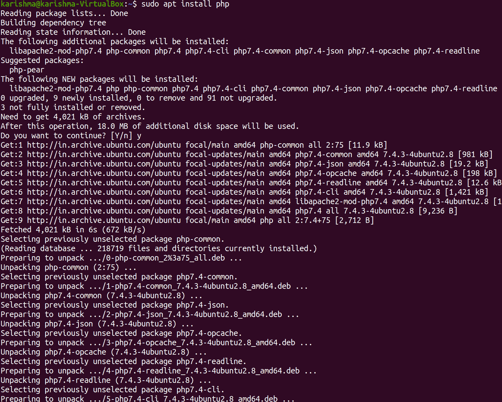
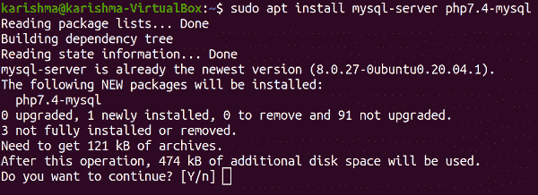
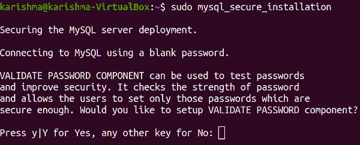
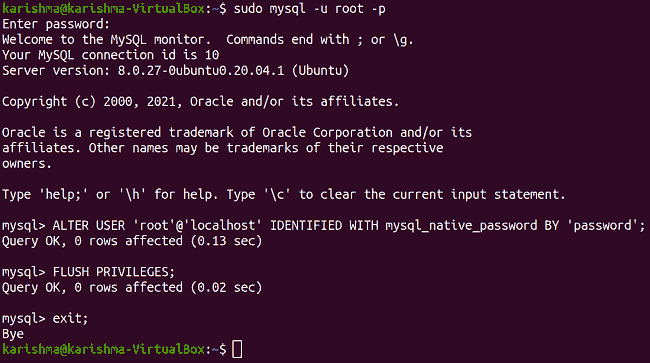

# 在 Ubuntu 20.04 中安装 WordPress

> 原文：<https://www.javatpoint.com/installing-wordpress-in-ubuntu-20-04>

## WordPress 简介

WordPress 是一个开源的免费内容管理系统，与 MariaDB 和 MySQL 数据库配对，用 PHP 编写。特性包括模板系统和插件架构，在 WordPress 中称为主题。

最初，WordPress 是作为一个博客发布系统开发的，尽管它已经发展为支持其他类型的网络内容，如媒体画廊、更经典的邮件论坛和列表、在线商店、学习管理系统和会员网站。

作为应用中非常著名的内容管理系统解决方案之一，截至 2021 年 10 月，WordPress 在排名前 2000 万的网站中的使用率为 42.8%。2003 年 5 月 27 日，WordPress 由它的创始人、英国开发者迈克·利特尔和美国开发者马特·莫楞威格以 b2/cafelog 分叉的形式发布。软件以 GPLv2 或更高版本的许可证发布。

WordPress 要求安装在任何网络服务器上，以作为互联网托管服务的一部分，如 WordPress，或执行 WordPress 软件包的系统，作为网络主机。本地计算机可能用于学习目的和单用户测试。

WordPress 要求安装在任何网络服务器上，以作为互联网托管服务的一部分，如 WordPress，或系统执行 WordPress 软件包，作为网络主机的权利。本地计算机可能用于学习目的和单用户测试。

## 概观


为澄清 WordPress 功能而创建的一个核心类比是***“WordPress 是制作网页的工厂”*** 。它可以存储内容，并使用户能够创建和发布网页，除了托管服务和域之外，不需要任何东西。WordPress 包括一个带有模板处理器的网络模板系统。

WordPress 的架构是一个前端控制器，可以将每个非静态 URIs 的请求路由到一个 PHP 文件，该文件可以解析 URI 并识别目标页面。它支持人类可读的永久链接。

### 插件

WordPress 的插件架构允许用户扩展博客或网站的功能和特性。截至 2021 年 5 月，WordPress.org 包含 58，463 个可用插件，所有这些插件都提供定制功能，使用户能够根据自己的特定需求定制自己的产品。但是，它不包含现有的高级插件(大约 1500 个以上)，这可能不会在存储库中提到，即 WordPress.org。

这些定制的范围从搜索引擎优化，到用于向登录用户显示个人详细信息的客户端门户，到显示功能的内容，再到内容管理系统，如包含导航栏和小部件。并不是每一个已经存在的插件都在升级的旁边，结果，它们可能无法正常工作或者根本无法正常工作。

### 主题

WordPress 的用户可能会安装不同的主题并在它们之间切换。这些主题允许用户在不改变网站内容或核心代码的情况下修改 WordPress 网站的功能和外观。所有的 WordPress 网站至少需要一个单一的主题才能存在。主题可以使用 WordPress 管理工具直接安装，即仪表板中的 ***【外观】*** ，或者主题的文件夹可以直接复制到主题的目录中。

一般来说，WordPress 的主题分为两个不同的类别:*和 ***免费*** 。WordPress 的主题目录(也称为存储库)中提到了几个免费主题，高级主题也可以从各个市场的 WordPress 开发人员那里购买。此外，WordPress 的用户创建和改进他们的自定义主题。*

 *### 易接近

WordPress 的可访问性团队一直致力于提高核心 WordPress 的可访问性，并支持明确的可访问主题标识。WordPress 的可访问性团队提供关于包容性设计和网页可访问性的持续教育帮助。WordPress 的可访问性编码标准规定“WordPress 中发布的每一个更新的或新的代码都应该符合 AA 级网页内容的可访问性指南 2.0”。

### 移动应用

WordPress 的各种应用程序可用于黑莓、Windows Phone。iOS、安卓和网络操作系统。这些由*开发的应用程序，除了查看统计数据之外，还包括评论审核、评论、回复评论、添加新的博客页面和帖子等选项。*

 *### 其他功能

此外，WordPress 提供了发达的链接管理；帖子标签支持，能够为帖子分配多个类别，以及清晰的永久链接结构。此外，还包括自动过滤器，在帖子中提供标准化的文本样式和格式。

WordPress 支持 Pingback 和 Trackback 标准，以显示到另一个网站的链接，该网站本身已经连接到一篇文章或一篇帖子。WordPress 的帖子可以在 HTML 中修改，可以借助可视化编辑器，也可以借助允许一系列定制编辑方面的插件。

## 多博客和多用户

在版本 3 之前，WordPress 支持单个博客/安装，尽管当配置为应用数据库的独立表时，可能会从不同的目录中执行多个同步副本。WordPress 的多站点(以前称为***【WPMU】、WordPress MU*** 或 ***WordPress 多用户*** )是 WordPress fork 开发的，允许在单个安装中有多个博客可用，但可以由维护人员管理(集中)。

## 使用 MySQL 和 PHP 在 20.04 版本的 Ubuntu 中安装 WordPress

在本文中，我们将解释如何在 20.04 版本的 Ubuntu 中安装 WordPress。

但是，有几种方法可以开始设置 WordPress。但是，在本教程中，我们将通过安装 MySQL 和 PHP，并通过内置的 PHP 服务器启动 WordPress，从而采用最简单的方法开始使用 WordPress。

### 安装 PHP

如果我们的系统中已经安装了一个 PHP 服务器，我们可以完全跳过这个方法。此外，我们可以通过在终端窗口中执行以下命令来确认:

```

php -v

```

20.04 版本的 Ubuntu 在上游存储库中附带了 7.4 版本的 PHP。我们只能更新这些存储库，并执行 apt install 命令来安装最新版本的 PHP。

```

$ sudo apt update

```


```

$ sudo apt install php

```



安装后，我们可以通过检查最新版本来确保:

```

php -v

```


### 安装 MySQL

我们的 WordPress 应用程序需要一个后端数据库来存储几种类型的配置和数据。因此，我们需要在本地机器上安装一个 MySQL 服务器，我们将在其中为 WordPress 应用程序建立一个新的数据库。我们需要按照以下步骤在我们的机器上安装 MySQL 服务器。

首先，我们需要执行以下命令来安装 PHP MySQL 连接器和 MySQL 服务器:

```

$ sudo apt install mysql-server php7.4-mysql

```



如果我们在安装了我的 SQL 之后正在为我的 MySQL 连接设置一个可靠的密码，那么我们可以通过在终端窗口中运行下面的命令来配置安全选项:

```

$ sudo mysql_secure_installation

```



如果我们对 MySQL 的空白密码没有意见，那么我们可以完全跳过这个特定的步骤。

之后，为了能够将 MySQL 服务器连接到客户端(如****PHPMyAdmin***)，我们要求能够在没有任何 sudo 权限的情况下连接到 MySQL 服务器。*

 *我们需要在终端窗口中运行以下命令:

```

$ sudo mysql -u root -p

```

一旦出现提示，我们需要输入密码，它就会让我们登录 MySQL 控制台。

我们需要运行以下查询:

```

mysql> ALTER USER 'root'@'localhost' IDENTIFIED WITH mysql_native_password BY 'password';

```

请确保将密码修改为我们的 MySQL 密码，或者如果我们没有为 MySQL 设置密码，我们可以将其留空。

```

mysql> FLUSH PRIVILEGES;
exit;

```



### 建立数据库

*   在开始安装 MySQL 之前，我们需要在 MySQL 中建立一个空白数据库。
*   我们可以使用****PHPMyAdmin***等 MySQL 客户端连接到我们的 MySQL 服务器，用软件建立数据库。*
**   我们还可以通过登录 MySQL 运行命令行查询来建立数据库。*

 *```

mysql> create DATABASE wordpress;

```

## 下载和安装 WordPress

*   我们需要前往[https://wordpress.org/download/](https://wordpress.org/download/)网站，开始将最新的 WordPress 版本下载到我们本地的 Ubuntu 机器上。
*   提取 WordPress 的 zip 文件，并将这个文件夹放在我们想要的目录中。
*   我们需要打开终端窗口，在 WordPress 文件夹中导航。
*   然后，我们需要在终端窗口中运行以下命令来启动一个内置的 PHP 服务器:

```

php -S localhost:4000

```

我们可以根据自己的方便选择端口号。

我们需要打开浏览器窗口，导航到 ***本地主机:4000 网址*** 。它应该开始 WordPress 的安装过程。

* * *****