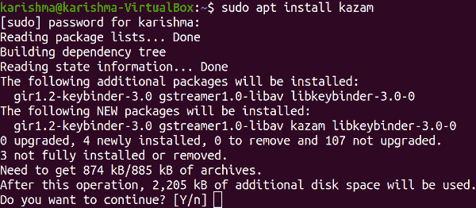
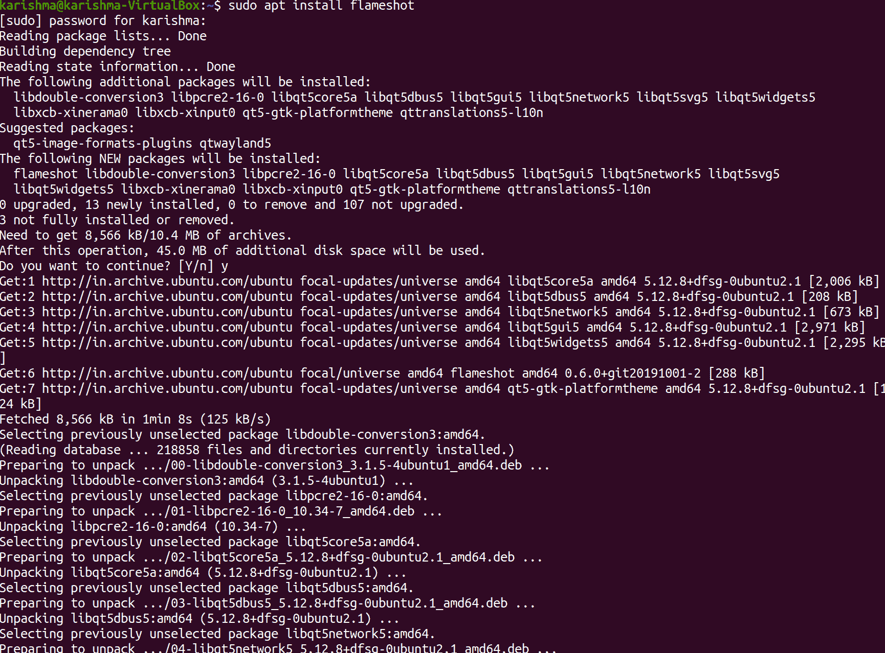
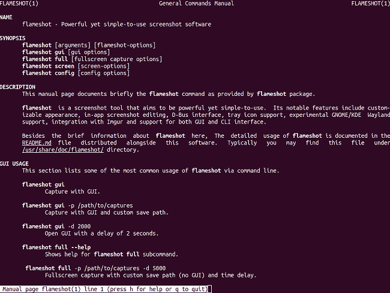

# 狙击工具 Ubuntu

> 原文：<https://www.javatpoint.com/snipping-tool-ubuntu>

截取工具对于捕捉监视器屏幕的图像并存储图像以供将来参考是必要的。此外，它还可以捕捉电脑的整个屏幕、所需区域和窗口选项卡。鼠标可以在屏幕上拖动来指定区域。此外，它还提供了突出显示和指示许多工具，如矩形、箭头和笔，用于在图像中进行指示。

在 Ubuntu 上，这些狙击工具是免费安装的。它提供了一个模糊工具来隐藏图像上的私人数据。这些工具包含一个选项，即几秒钟后截屏的时间延迟。几乎每一个截图工具都有屏幕录制和截图的双重用途。剪切工具有助于提交演示文稿或报告以及流程图像。此外，它可以用来解释软件功能使用截图。

## Ubuntu 的内置截图工具

截图的默认应用通常被称为 Gnome 桌面上的截图。默认情况下，该实用程序在后台执行并监听击键，即 ***PrtSc。*** 点击我们键盘上的按钮，即 ***PrtSc*** (打印屏幕)会说明拍摄我们屏幕截图并将图像存储在文件夹中的程序，即我们主目录内的图片。

我们会听到相机快门的声音，其他屏幕也会闪烁。是截屏程序提醒我们它只捕捉到了截屏。我们需要打开图片文件夹才能看到它。

请记住，它总是会截图我们的整个桌面。如果我们取而代之的是一个特定窗口的截图，我们可以突出显示该窗口，然后同时单击键盘上的 ***Alt+PrtSc*** 快捷键。

如果我们想选择屏幕的某个特定区域进行截图，而键盘组合，即 ***Alt+PrtSc*** 并不便于足够的调谐控制，我们可以从 Ubuntu 的“应用”菜单中打开实用程序“截图”。

在截图窗口内，我们需要按下 ***“选择区域抓取”*** 选项和 ***“截图”。*** 在存储图像之前，我们将能够通过拖动鼠标来选择要捕捉的区域。

在本文中，我们将讨论 Ubuntu 中可用的一些狙击工具。

## 运输工具列表


*   ScreenCloud
*   GIMP
*   喀山
*   ScreenRec
*   景象
*   火焰射击
*   Ksnip
*   Gnome 屏幕快照
*   简介
*   快门

### ScreenCloud

在 Ubuntu 上， ***ScreenCloud*** 是拍摄新鲜截图的绝佳狙击工具。我们可以在任何电脑上免费安装这个工具，因为它是一个开源工具。它使用户能够选择捕获图像的文件位置。此外，它可以与云存储链接，并立即将图像分发到云中。截图可以通过复制链接到剪贴板从电子邮件中分发。它只提供了一个 ***选择*** 和 ***拖动*** 选项进行截图。

### GIMP

***GIMP****代表 ***GNU 图像操控程序。*** 是 Ubuntu 中比较理想的狙击工具。这是一个开源工具，附带了许多编辑工具。这个工具包含三个不同的截图选项:特定区域、整个屏幕和单个窗口。*

 *此外，它还提供了删除或添加窗口装饰的选项，鼠标指针放在屏幕截图上。它提供了一个颜色配置文件，用于通过监视器的设置来捕获图像。此外，我们可以将图像转换为传统的 RGB 配置文件。

***【GIMP】***包含两种延时: ***延时前选择要捕捉的区域，延时后选择要捕捉的区域。***

### 喀山

***【卡赞】*** 是一个惊人的录屏工具，也可以用来截图。该工具提供了屏幕截图和图像视频录制的屏幕广播。此外，它还包含窗口全屏幕、全屏和可供剪切选择的区域。

鼠标光标可以被移除或包含在截图中。它提供了几秒钟后捕获的时间延迟。它可以使用麦克风录制任何声音，也可以使用网络摄像头录制视频。此工具也用于捕捉没有或有窗口边框的图像。

### 在 Ubuntu 中安装 Kazam

这是 Ubuntu 20.04 版本截图的另一个适用特权。我们可以通过打开终端并输入以下命令来安装该工具:

```

$ sudo apt install kazam

```



我们需要在应用窗口中将其拉起，然后启动它:

***【卡赞】*** 的一个关键点就是它提供了记录我们屏幕的能力。仅确保如果我们希望拍摄图像，则选择 ***【截图】*** ，如果我们希望录制任何视频，则选择 ***【屏幕截图】*** 。

### ScreenRec

在 Ubuntu 上， ***ScreenRec*** 是屏幕录制和截图的最佳工具之一。它包括一个非常快速和简单的设置来捕捉图像。它还可以在图像中包含文本，并可以绘制任何矩形框来识别必要的片段。 ***屏幕提示*** 可以突出显示重要短语，并使用箭头显示按钮、选项卡和图标。

这个工具可以立即分发截图，并将任何图像复制到剪贴板，以添加到电子邮件中。它包含云存储，用于存储捕获的视频和图像。此外，屏幕录制可以将网络摄像头和麦克风输入保存在视频中。

### 景象

***奇观*** 是一个优秀的狙击工具，可以免费进入 Ubuntu 系统。它可以用鼠标拖动捕捉整个电脑屏幕或所需的区域。此外，该工具包含用于定义屏幕截图部分的捕获模式，并且它包括用于在准确时间捕获图像的延迟选项。

该工具可以将捕获的图像导出到所需的应用或网站。此外，我们可以复制任何截图，并粘贴到我们想要的位置。该工具包含编辑图像的基本工具。此外，它可以隐藏屏幕截图上的鼠标光标。

### 在 Ubuntu 中安装眼镜

这是另一个截图选项。这是 KDE 等离子桌面环境截图的默认工具。然而，当我们使用 GNOME 时，我们可能需要安装它。如果我们还没有终端窗口，我们需要打开它并输入下面的命令:

```

$ snap install spectacle

```


安装后，我们将在应用窗口中找到该工具。

眼镜工具非常简单，但包括一些方便的选项，例如只捕捉特定显示器上的桌面的能力。

### 火焰射击

***火焰射击****是乌班图上另一个惊人的狙击工具。它提供 ***一支笔*** 用于在图像上进行绘制， ***一个箭头*** 用于指示特定的点， ***一条线*** 用于给点加下划线。该工具可以同时拍摄图像，并且可以在编辑过程中扩展图像。*

 *它包括用于返回或删除编辑内容的重做和撤消选项。荧光笔有多种颜色，用于突出显示图像，也可以模糊截图中的特定位置。图像可以直接从*存储在云中，我们可以和其他人一起分发。*

 *### 火焰射击的优点

*   有用的编辑选项
*   时尚的设计
*   PDF 编辑

### 火焰射击的缺点

*   无法包含文本
*   不支持屏幕录制

### 在 Ubuntu 中安装火焰射击

*工具是一个我们可以应用的替代程序，尤其是当我们想通过在截图上设计箭头并对其他简单功能进行验证来注释截图时。*

 *默认情况下，Ubuntu 中不安装 flameshot。我们需要打开终端窗口，输入以下命令来安装该工具:

```

$ sudo apt install flameshot

```



安装后，我们可以在 ***应用启动器中使用它。*** 我们也可以使用以下命令通过终端交替启动:

```

$ flameshot gui

```


当火焰射击工具打开时，我们只需要考虑屏幕上的说明。我们可以拖动鼠标，非常方便地调整窗口大小，以便在屏幕上准确捕捉我们想要的内容。我们将看到几个工具，我们可以用来注释我们的上传截图。

此外，我们可以配置弗拉门戈的界面和配置菜单中的许多选项:

```

$ flameshot config

```


有几个命令行选项，我们也可以应用于火焰射击。我们可以查看手册页，了解它能做什么的完整列表:

```

$ man flameshot

```



### Ksnip

***Ksnip*** 是 Ubuntu 中最好的狙击工具，装载了优秀的特性。使用鼠标捕捉图像很容易，它可以拍摄窗口截图、全屏等。这个工具提供了许多标记，如矩形框、箭头和钢笔，用于在屏幕截图中表示。

此外，它可以在图像中绘制多个形状并定义文本。它有一个水印，用于在图像上压印名称或标志。***【Ksnip】***可以通过一个选项，即时间延迟来抓取截图，并且支持命令行。此外，它还有几种变换图像的效果，著名的效果是灰度和阴影。

### Ksnip 的优点

*   直接上传到 ***Imgur***
*   通用版本选项
*   支持 Gnome Wayland 和 X11 桌面环境

### Ksnip 的缺点

*   过时且混乱的用户界面
*   不支持屏幕录制

### GNOME 屏幕快照

它是 Ubuntu 中最好的免费狙击工具。它在 GNOME 的桌面环境中提供了一个内置工具。该工具为捕捉整个屏幕和特定选项卡提供了许多选项。此外，它可以抓取特定区域的截图。

添加到图像中有几种效果。它提供了一个时间工具，可以在几秒钟后捕捉图像。图像可以在没有或有窗口边框的情况下拍摄。此外，我们可以在截图中包含一个指针。它可以使用屏幕广播记录屏幕，并且很容易分发视频。

### GNOME 截图的优点

*   内置于 GNOME 环境
*   使用方便

### GNOME 截图的缺点

*   无法自动共享
*   不支持编辑功能

### 简介

***ImageMagick*** 是 Ubuntu 中一个开源的优秀的狙击工具。它支持几乎所有类型的图像格式。该工具可以根据需要翻转、裁剪、旋转和调整图像大小。它可以在图像中包含文本，还可以在截图上绘制形状。

这个工具包括一个锐化和模糊工具，集中在想要的区域。它为混合图像形状的两种或多种颜色提供图像渐变。 ***图像检查*** 工具显示图像以及便于识别的格式。它可以建立动画 gif 连同一组图像，并添加两个重叠的图像。

### ImageMagick 的优点

*   对齐整页或任何窗口
*   使用方便
*   全面的编辑选项

### ImageMagick 的缺点

*   不支持屏幕录制
*   无法自动共享

### 快门

它是 Ubuntu 中最好的狙击工具之一，可以免费安装在 Ubuntu 系统上。它可以在网站、全窗口和带有可移动标记的电脑上拍摄任何大小的截图。它提供了几个编辑截图的辅助工具，包括矩形、线条和箭头来定义基本部分。

它提供了一个荧光笔，用于显示屏幕截图中的重要文本。该工具还可以隐藏图像上的必要信息，并将图像裁剪到基本尺寸。从社交媒体应用向他人分发图像很容易，它也可以通过任何网站上传图像。

### 快门的优点

*   自动将图像复制到剪贴板
*   立即与即时消息或电子邮件共享

### 快门的缺点

*   过时且杂乱的界面
*   不支持屏幕录制

### 在 Ubuntu 20.04 中安装快门

快门工具是用 Perl 语言编写的，它作为开源工具存在于 ***GNU GPLv3 许可证上。*T3】**

我们可以在 ***Linux Mint*** 和 ***Ubuntu*** 上安装这个工具，使用 apt-get 命令如下:

```

$ sudo apt-get install shutter

```

要使用快门截图，我们可以通过启动快门应用来打开一个新的会话，或者只通过通知栏内的 ***【快门】*** 图标来选择捕捉窗口。

* * *****