# Linux 文本编辑器

> 原文：<https://www.javatpoint.com/linux-text-editors>

Linux 文本编辑器可用于**编辑文本文件、编写代码、更新用户指令文件、**等。一个 Linux 系统支持多个文本编辑器。Linux 中有两种类型的文本编辑器，如下所示:

*   **命令行文本编辑器**，如 Vi、nano、pico 等。
*   **GUI 文本编辑器**，如 gedit(用于 Gnome)、Kwrite 等。

文本编辑器在编码时起着重要的作用。所以，选择最好的文本编辑器很重要。一个文本编辑器不仅应该简单，而且应该是功能性的，并且应该是好用的。

一个具有 IDE 特性的*文本编辑器*被认为是一个不错的文本编辑器。

在本节中，我们将讨论 [Linux](https://www.javatpoint.com/linux-tutorial) 的前 20 名文本编辑器。此外，我们将谈论最新的文本编辑器，并将它们与传统的文本编辑器进行比较，如 **Vi** 和 **nano** 。这将帮助您选择您选择的编辑器。

1.  [Vi/VIM 编辑器](#Vi-VIM)
2.  [纳米编辑器](#Nano)
3.  [Gedit 编辑器](#Gedit)
4.  [崇高文本编辑器](#Sublime-text)
5.  [VSCode](#VSCode)
6.  [GNU emacs](#GNU-emacs)
7.  [原子编辑器](#Atom)
8.  [括号编辑器](#Brackets)
9.  [Pico 编辑器](#Pico)
10.  [蓝鱼](#Bluefish)
11.  凯特/Kwrite
12.  [记事本++](#Notepad++)
13.  [日食](#Eclipse)
14.  [gVIM 编辑器](#gVIM)
15.  [杰德编辑](#Jed)
16.  [Geany 编辑](#Geany)
17.  [叶垫](#Leaf)
18.  [灯台](#Light-Table)
19.  [Medit 文本编辑器](#Medit-text)
20.  [编码 Lite](#CodeLite)

* * *

### 1 . VI/vie 编辑

Vim 编辑器是 Linux 系统中最常用和最强大的基于命令行的编辑器之一。默认情况下，大多数 Linux 发行版都支持它。它增强了旧的 Unix Vi 编辑器的功能。它是一个用户友好的编辑器，为所有 Linux 发行版提供了相同的环境。它也被称为**程序员编辑器**，因为大多数程序员更喜欢 Vi 编辑器。

Vi 编辑器有一些特殊的功能，如 Vi 模式和语法突出显示，使其比其他文本编辑器更强大。一般有两种模式:

**命令模式:**命令模式允许我们对文件执行动作。默认情况下，它在命令模式下启动。在这种模式下，所有类型的单词都被视为命令。我们可以在这种模式下执行命令。

**插入模式:**插入模式允许在文件上插入文本。要从命令模式切换到插入模式，按下 **Esc** 键退出激活模式，按下**的“I”**键。

要了解关于 Vi 编辑器的更多信息，请访问带有命令的 Vi 编辑器。

要调用 vi 编辑器，请执行文件名如下的 vi 命令:

```

vi <file name>

```

如下图所示:

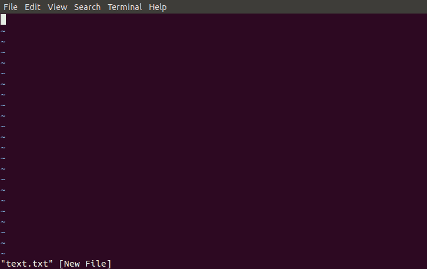

* * *

### 2.纳米编辑器

Nano 是一个直截了当的编辑器。它是为初学者和高级用户设计的。它有许多定制功能。

nano 文本编辑器的一些高级功能如下:

*   它具有高度可定制的键绑定
*   它支持语法高亮显示
*   它有撤消和重做选项
*   它在标准输出上提供全行显示
*   它支持寻呼机从标准输入中读取

要使用 nano editor 打开文件，请执行以下命令:

```

nano <file name>

```

纳米编辑器看起来像:

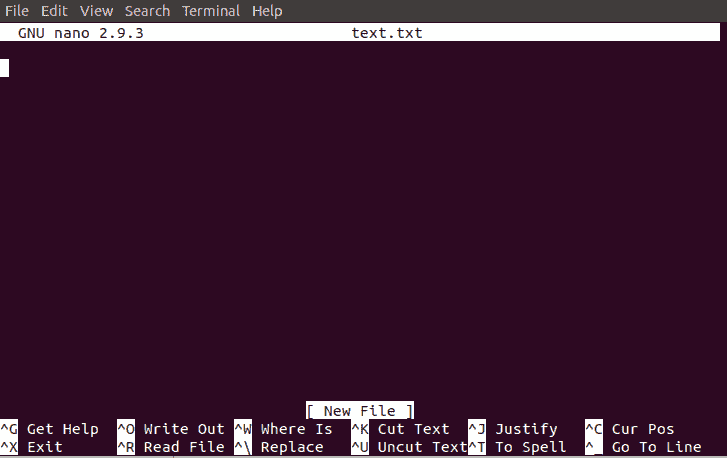

在纳米编辑器中，底部给出了有用的选项，使用 **CTRL+选项**执行操作。例如，要退出编辑器，使用 **CTRL +X** 键。要了解更多关于纳米编辑器的信息，请访问 [Linux 纳米编辑器](https://www.javatpoint.com/linux-nano-editor)。

* * *

### 3.Gedit 编辑器

Gedit 编辑器是 GNOME 桌面环境的默认编辑器。当我们打开一个文件时，它会用 Gedit 编辑器打开。它像任何基本的文本编辑器一样提供简单的功能。这是一个轻量级的编辑器，具有直接的用户界面。它是在 2000 年与 GNOME 桌面环境一起公开发布的。使用 [C 编程语言](https://www.javatpoint.com/c-programming-language-tutorial)开发，支持所有字体系列。

gedit 文本编辑器的一些关键特性如下:

*   它提供语法高亮显示。
*   它支持国际化文本。
*   它支持几种编程语言。

要从终端调用 gedit 编辑器，请执行以下命令:

```

gedit <file name>

```

看起来像是:

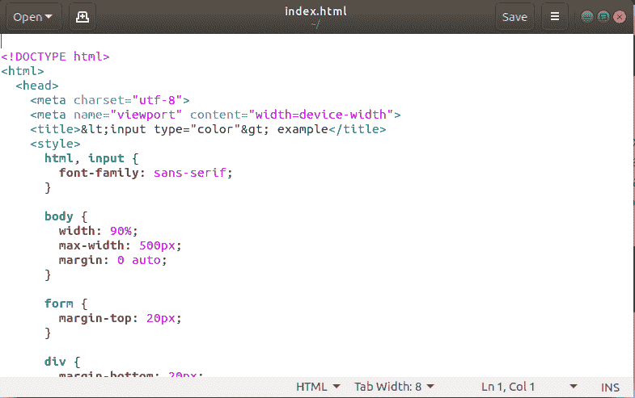

* * *

### 4.崇高的文本

崇高的文本编辑器也是最流行的基于 IDE 的文本编辑器之一。与其说它是文本编辑器，不如说它是一个开发环境工具。它有几个特性来支持许多编程和标记语言。此外，它支持许多插件，使其不仅仅是一个文本编辑器。

卓越文本编辑器的一些关键特性如下:

*   它有一个出色的命令面板。
*   这是一个基于 python 的插件应用编程接口。
*   它支持代码的并行编辑。
*   它提供特定于项目的首选项。

执行以下命令安装崇高文本编辑器:

```

wget -qO - https://download.sublimetext.com/sublimehq-pub.gpg | sudo apt-key add -
sudo apt-add-repository "deb https://download.sublimetext.com/ apt/stable/"
sudo apt install sublime-text

```

要了解安装的更多信息，请访问[在 ubuntu](https://www.javatpoint.com/how-to-install-sublime-text-editor-in-ubuntu) 上安装崇高文本编辑器。

我们可以通过浏览应用来打开崇高的编辑器。另外，我们可以从终端打开它。要从终端访问崇高编辑器，请执行以下命令:

```

subl

```

如下图所示:


* * *

### 5.虚拟代码编辑器

VSCode 编辑器是一个现代的、广泛使用的文本编辑器。由微软打造，支持 Linux、Mac、 [Windows OS](https://www.javatpoint.com/windows) 。它通过许多强大的功能来支持多种编程语言和标记语言。

要安装 VSCode，从[这里](https://code.visualstudio.com/docs/setup/linux)下载二进制包。并且，对于基于 Debian 和 Ubuntu 的系统，执行以下命令:

```

sudo apt install ./<file>.deb

```

VSCode 编辑器的一些关键特性如下:

*   它完全支持使用交互式控制台、断点、调用堆栈等进行调试。
*   它内置了对 Git 和 Git 命令的支持。
*   它有助于智能感知。
*   它提供了许多定制选项。
*   它对语言有大量的支持。
*   它支持可缩放的布局。
*   它提供了一个内置终端。

VSCode 编辑器如下图所示:


* * *

### 6.GNU emacs(GNU emacs)

GNU Emacs 是 Linux 系统中最古老、最简单的文本编辑器。这是 GNU 项目的一部分。由于其简单性，它仍然是成千上万用户使用的流行文本编辑器。用 **C 和 LISP** 编程语言编写。

GNU Emacs 的一些关键特性如下:

*   它有邮件和新闻选项。
*   它提供了调试器接口扩展。
*   它有大量的文档和支持。

执行以下命令安装 GNU Emacs:

```

sudo apt-get update
sudo apt-get install emacs

```

要从终端访问它，请执行以下命令:

```

emacs <file name>

```

如下图所示:

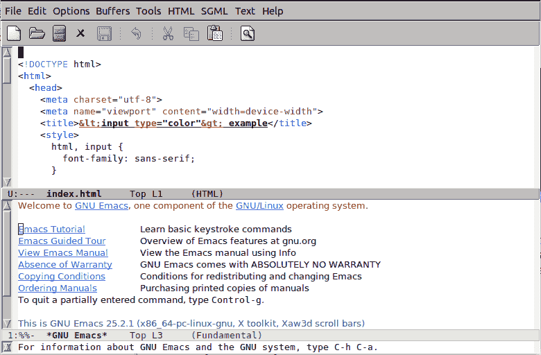

* * *

### 7.原子编辑器

Atom 是由 **GitHub Inc** 开发的免费开源代码编辑器。它是跨平台的，支持多种编程语言。它也被称为“面向 21 世纪的**可黑客文本编辑器**”。它是为开发目的而开发的。它是完全可定制的使用网络技术，如 [JavaScript](https://www.javatpoint.com/javascript-tutorial) 和 [HTML](https://www.javatpoint.com/html-tutorial) 。它便于使用基于 Node.js 的插件和 [Git](https://www.javatpoint.com/git) 控件。

原子编辑器的一些关键特性如下:

*   它是开源的。
*   它有一个现代化的，可定制的布局。
*   它有助于吸引人的主题。
*   它提供嵌入式 Git 支持。
*   它提供了与远程同步的实时协作。
*   它有智能自动完成和智能感知。
*   它有一个内置的包管理器。

要安装 Atom，请从 Atom 的[官方网站下载二进制包，并执行以下命令:](https://atom.io/)

```

sudo dpkg -i Downloads/atom-amd64.deb 

```

要了解更多关于安装的信息，请访问这里的。

如下图所示:

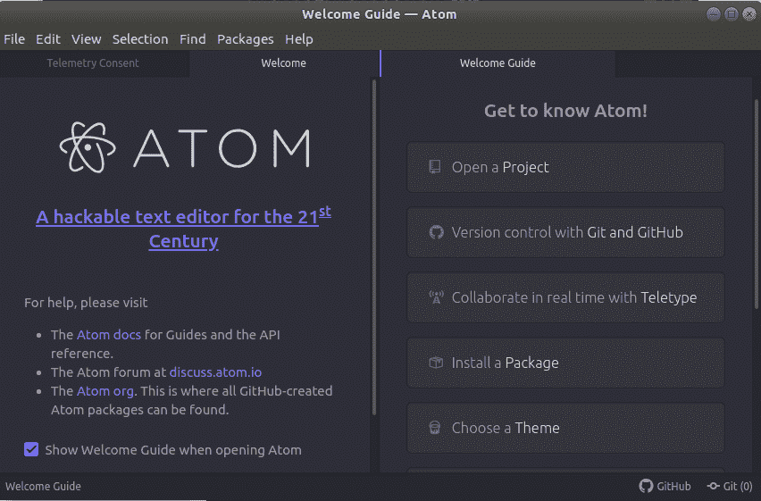

* * *

### 8.括号编辑器

括号编辑器是由 **Adobe** 开发的免费开源文本编辑器。它主要关注网络开发。它通过几个免费扩展提供了丰富的代码编辑体验。是用 HTML、 [CSS、](https://www.javatpoint.com/css-tutorial)和 JS 写的。

括号编辑器的一些关键特性如下:

*   它提供了一个吸引人的用户界面。
*   它为 SCSS 和 LESS 提供了预处理器支持。
*   它便于使用内联编辑器。
*   它提供了实时预览。
*   它支持多标签编辑。
*   它有 PHP 支持。
*   它支持语言服务器协议。
*   它支持插件扩展。

要安装括号编辑器，请执行以下命令:

```

sudo add-apt-repository ppa:webupd8team/brackets
sudo apt-get update
sudo apt-get install brackets

```

它看起来像:

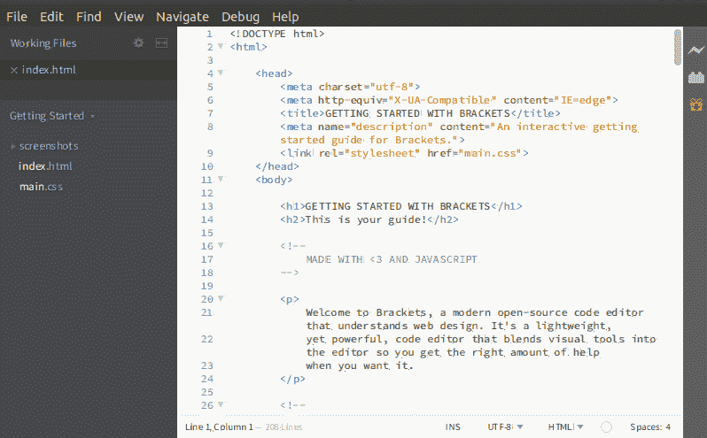

* * *

### 9.微微编辑

Pico 编辑器是一个基于终端的 Linux 文本编辑器。它内置了对松树新闻和电子邮件客户端的支持。它使用起来非常简单，并且有一些有用的功能，比如**对齐、剪切/粘贴、拼写检查**等等。然而，它只是一个简单的文本编辑器，因此不像其他 Linux 文本编辑器那样提供许多功能。

它不是纯粹的自由文本编辑器，所以大多数 Linux 发行版都不提供 pico 作为文本编辑器。

它不支持同时处理多个文件。此外，它不能跨多个文件执行查找和替换操作。

要使用 pico 文本编辑器打开文件，请执行以下命令:

```

pico <file name>

```

它看起来像下面的命令:

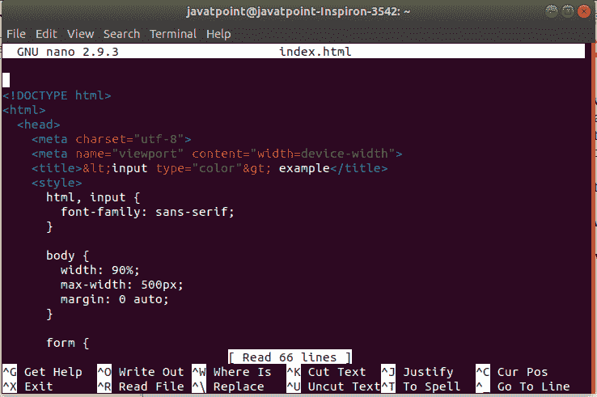

* * *

### 10.蓝鱼

Bluefish 是一个免费的开源的 Linux 系统文本编辑器。这是一个高级文本编辑器，有很多编程工具。有利于开发动态网站。它支持多种语言和工具，如 **PHP、C、C++、JavaScript、 [Java](https://www.javatpoint.com/css-tutorial) 、Google Go、**等。

Bluefish 文本编辑器的一些关键特性如下:

*   它重量轻，速度快。
*   它允许与 make、sed、awk、lint、weblint 等外部 Linux 程序集成。
*   它有助于拼写检查。
*   它允许我们从事多个项目。
*   它有远程文件编辑功能。
*   它提供了查找和替换功能。
*   它有撤销和重做选项。
*   它提供了修改文件的自动恢复。

要安装 Bluefish，请执行以下命令:

```

sudo add-apt-repository ppa:klaus-vormweg/bluefish
sudo add-apt-repository ppa:klaus-vormweg/bluefish-gtk2
sudo apt-get update
sudo apt-get install bluefish

```

要了解更多关于安装的信息，请访问[在 Ubuntu](https://www.javatpoint.com/how-to-install-bluefish-in-ubuntu) 上安装蓝鱼编辑器。

要使用 bluefish 打开文件，请执行以下命令:

```

bluefish <file name>

```

它看起来像:

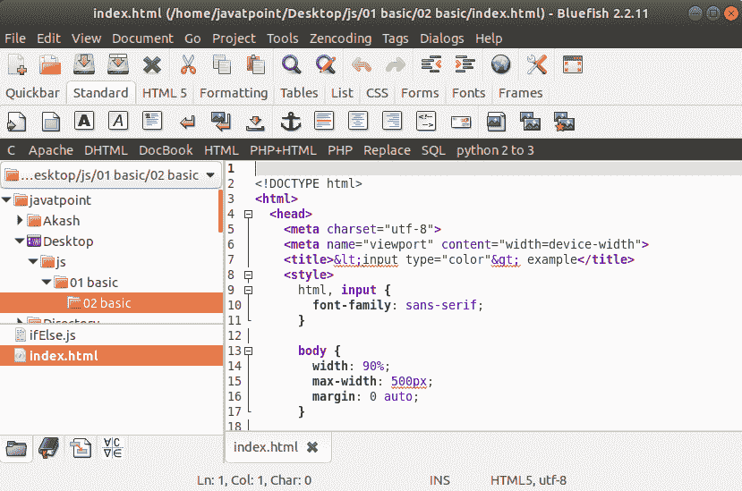

* * *

### 11 .凯特/Kwrite

kate 是一个高级的多文档编辑器。自 2.2 版本发布以来，它就是 KDE 的一部分。Kubuntu 桌面环境将其作为默认编辑器提供。如果你熟悉 Kubuntu 环境，那么你一定知道 kate editor。它提供同时处理多个文件。它被认为是一个IDE，因为它具有类似IDE的强大功能。它非常适合编辑配置文件、查看来自 Konqueror 的 HTML 源、创建新应用以及许多其他任务。

凯特编辑器的一些主要功能如下:

凯特的一些独特之处包括:

*   这是一个强大的IDE。
*   它支持多种语言。
*   它具有自动语言检测功能。
*   它自动为文档设置缩进。

要安装 kate 编辑器，请执行以下命令:

```

sudo apt-get install kate

```

要使用 kate 编辑器打开文件，请执行以下命令:

```

kate <file name>

```

如下图所示:

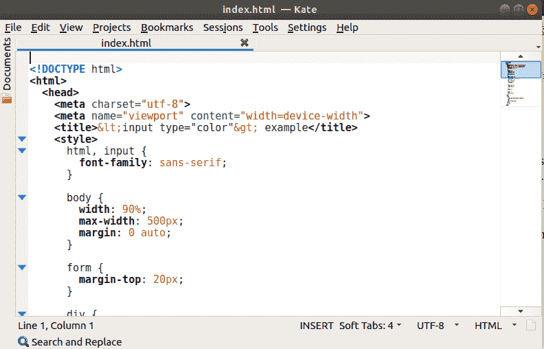

* * *

### 12.记事本++

记事本++是一个基本的文本编辑器，有很多自定义选项。它主要关注速度和最小程序大小。主要是 Windows 用户使用。它支持几个插件来增加它的功能。

记事本++的一些关键特性如下:

*   它支持选项卡式编辑。
*   它提供代码折叠。
*   它支持书签。
*   它有一个文档图。
*   它为 **Perl 兼容正则表达式提供支持。**

要安装记事本++,请执行以下命令:

```

sudo apt-get install snapd snapd-xdg-open
sudo snap install notepad-plus-plus

```

要了解更多安装过程，请访问[如何在 Ubuntu 上安装记事本++。](https://www.javatpoint.com/how-to-install-notepad-plus-plus-in-ubuntu)

要使用记事本++打开文件，请执行以下命令:

```

notepad-plus-plus <file name>

```

它看起来像下图:

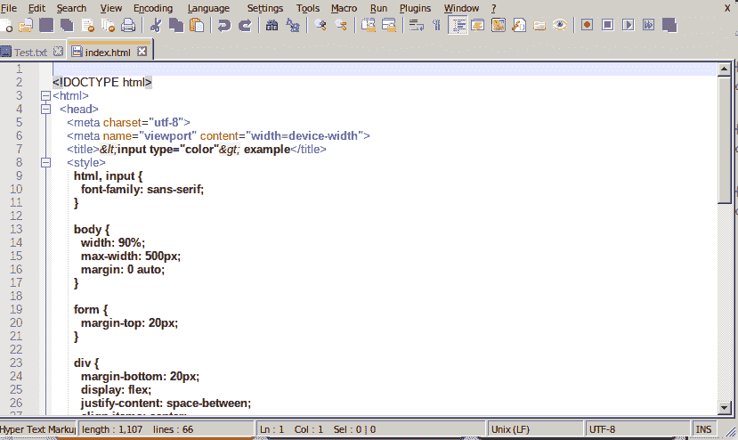

* * *

### 13.黯然失色

Eclipse 是开发中最常用的IDE之一。它是 java 开发人员的首选，因为它是用 Java 开发的，并且为开发高级 Java 应用提供了几个特性。它也为其他编程语言提供了支持，我们需要安装额外的插件来用其他编程语言编写代码，比如 [PHP](https://www.javatpoint.com/php-tutorial) 、 [Python](https://www.javatpoint.com/python-tutorial) 、C、C++、Ruby on Rails、COBOL 等等。

日食的一些主要特征如下:

*   这是一个免费的开源代码编辑器。
*   它为 Java 开发人员提供了 Java 开发工具。
*   它有大量的插件支持。
*   它提供了一个 eclipse 市场来下载其他工具。

要安装 Eclipse，请执行以下命令:

```

sudo apt update
sudo apt install eclipse

```

要了解更多安装过程，请访问[如何在 Ubuntu](https://www.javatpoint.com/how-to-install-eclipse-in-ubuntu) 上安装 Eclipse。

它看起来像下图:


* * *

### 第 14 个 gVim 编辑器

gVim 编辑器是流行的 Vim 编辑器的 GUI 版本。它具有与命令行编辑器 Vim 相似的功能和模式。它可以很容易地从软件商店下载。要从终端安装，请执行以下命令:

```

sudo apt-get update -y
sudo apt-get install -y gvim

```

要从终端打开带有 gVim 的文件，请执行以下命令:

```

gvim

```

它看起来像下图:

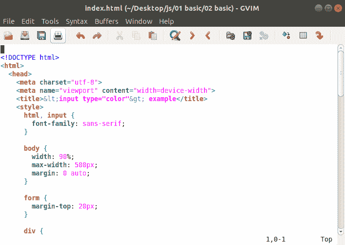

* * *

### 15.杰德编辑

Jed 是一个命令行编辑器，支持对 S-Lang 库的广泛使用。杰德支持不同操作系统的所有风格，如 Linux 和 Windows。它是一个轻量级编辑器，这使得它成为低配置系统的理想编辑器。

杰德编辑器的一些关键特性如下:

*   它在彩色终端上提供彩色语法高亮显示。
*   它支持代码折叠。
*   它在终端上提供下拉菜单。
*   它有仿真编辑器的支持，如 Emacs，EDT，WordStar，Borland，Brief 等。
*   它在类似 C 语言的 S-Lang 中是可扩展的，使其具有高度的可定制性。
*   它支持多种编程语言的多种编程模式。

要安装 Jed 编辑器，请执行以下命令:

```

sudo apt-get update -y
sudo apt-get install -y jed

```

它看起来像下图:

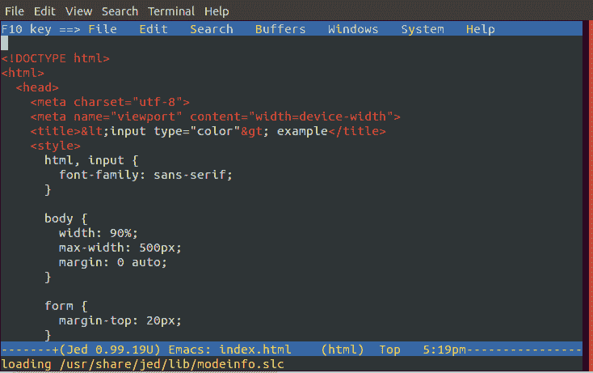

* * *

### 16.Geany 编辑

Geany 是一个功能强大的轻量级 Linux 系统编辑器。它很稳定，支持大量功能，因此很有用。它内置了对几种编程语言的支持。其他操作系统如 **Windows 和 Mac** 也支持。

Geany 编辑器的一些关键功能如下:

*   它提供语法高亮功能。
*   它提供了一个可插拔的接口。
*   它支持许多文件类型。
*   它提供代码折叠和代码导航选项。
*   它提供了一个自动完成选项。
*   它支持自动关闭 HTML 和 XML 标签。

要安装 Geany 编辑器，请执行以下命令:

```

sudo apt-get update
sudo apt-get install geany

```

它看起来像下面的命令:


* * *

### 17.叶垫

Leafpad 是一个直接基于 GTK 的文本编辑器。由于它的简单和轻便，它是 Linux 用户中流行的文本编辑器。

叶板的主要特点如下:

*   它提供了一个代码集选项。
*   它提供自动代码集检测(UTF-8 和一些代码集)。
*   它有助于无限制的撤消/重做操作。
*   它提供自动/多行缩进。
*   它显示当前行号。
*   它提供了拖放功能。
*   它允许打印文件。

要安装 Leafpad，请执行以下命令:

```

sudo apt-get update -y
sudo apt-get install -y leafpad

```

它看起来像下面的命令:

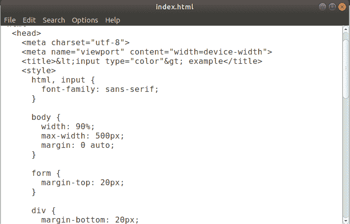

* * *

### 18.看版台

灯表是一种现代的基于开源 IDE 的文本编辑器。它是 Linux 系统中最好的文本编辑器之一。

Light table 的一些关键特性如下:

*   它是免费和开源的。
*   它是跨平台和轻量级的。
*   它提供了现代、智能的用户界面和极简的界面。
*   它在编码时提供自动完成功能。
*   它支持内联评估。
*   它有许多带有主题和插件的定制选项。
*   它提供分离视图和即时反馈。
*   它有一个命令面板。
*   它便于使用模糊查找器。
*   它支持自动更新。

我们可以简单地从它的官方网站下载灯表。要从终端安装，请执行以下命令:

```

sudo add-apt-repository ppa:dr-akulavich/lighttable
sudo apt-get update
sudo apt-get install lighttable-installer

```

它看起来像下图:

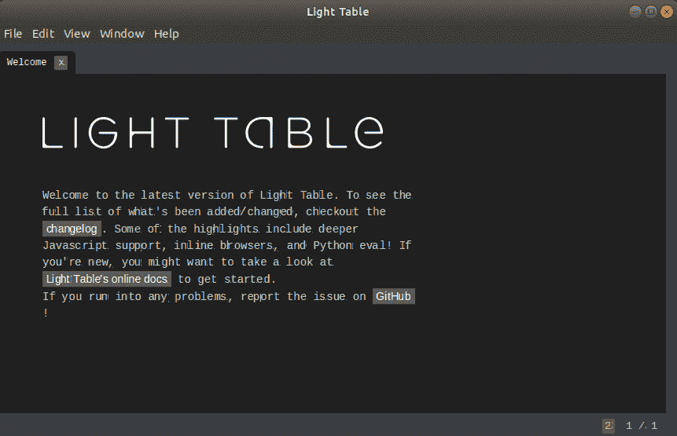

* * *

### 19.Medit 文本编辑器

medit 文本编辑器是一个轻量级的开源文本编辑器。它适用于所有主要的操作系统，如 Linux、Mac 和 Windows。它是从 CGAP 的一个简单的内置组件开始的，但是现在升级为一个独立的文本编辑器。

Medit 的一些关键特性如下:

*   它提供语法高亮显示。
*   它为几种编程语言提供了许多插件。
*   它支持正则表达式。
*   它便于使用可配置的键盘加速器。

要安装 medit，请执行以下命令:

```

sudo add-apt-repository ppa:anton+/miscellaneous
sudo apt-get update
sudo apt-get install medit -y

```

它看起来像下图:

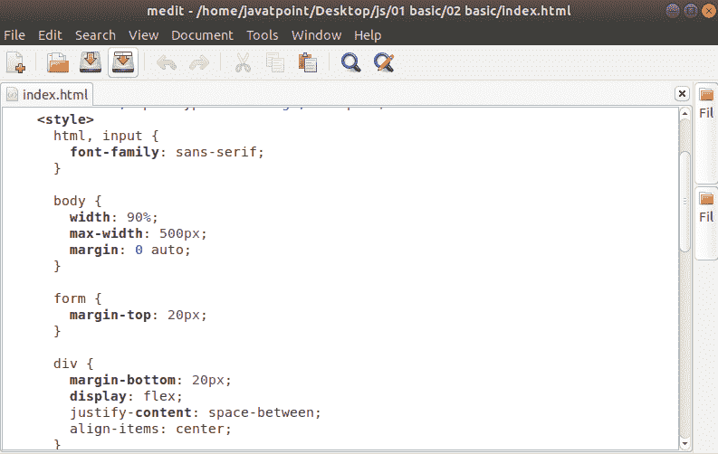

* * *

### 20.代码简化版

CodeLite 是一个支持跨平台的开源 IDE。它支持几种最常用的编程语言，如 C、 [C++](https://www.javatpoint.com/cpp-tutorial) 、PHP 和 JavaScript。它支持所有主要平台，如 Linux、Mac 和 Windows。

要安装 CodeLite，请执行以下命令:

```

sudo add-apt-repository ppa:eugenesan/ppa
sudo apt-get update
sudo apt-get install codelite -y

```

它看起来像下图:

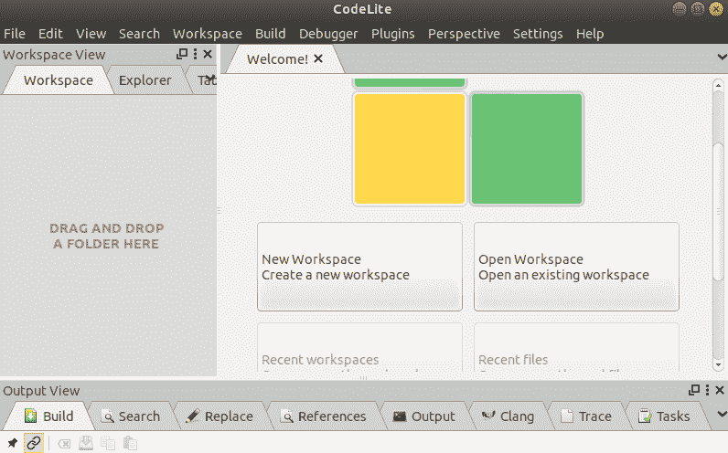

* * *