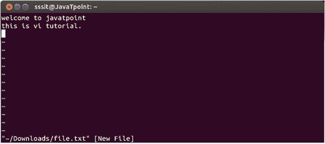
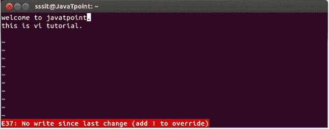
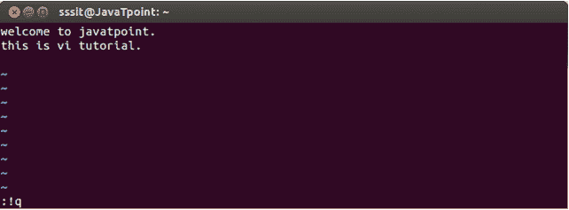

# 带命令的 Vi 编辑器

> 原文：<https://www.javatpoint.com/vi-editor>

* * *

## 什么是虚拟仪器

vi 编辑器阐述为 **vi** sual 编辑器。它安装在每个 Unix 系统中。换句话说，它在所有 Linux 发行版中都可用。它是用户友好的，并且在不同的发行版和平台上工作相同。这是一个非常强大的应用。vi 编辑器的改进版本是 **vim** 。

**VI 编辑器有两种模式:**

*   **命令模式:**在命令模式下，对文件进行操作。vi 编辑器在命令模式下启动。在这里，键入的单词将作为 vi 编辑器中的命令。要传递命令，您需要处于命令模式。
*   **插入模式:**在插入模式下，输入的文本将被插入到文件中。 **Esc** 键将带您从插入模式进入命令模式。

默认情况下，vi 编辑器以命令模式启动。要输入文本，您必须处于插入模式，只需键入**‘I’**，您将处于插入模式。虽然，在输入**后，我**屏幕上将不会出现任何内容，但您将处于插入模式。现在你可以打字了。

要退出插入模式，按下 **Esc** 键，您将被引导至命令模式。

如果您不确定您处于哪种模式，请按两次 Esc 键，您将处于命令模式。

* * *

## 使用 vi

vi 编辑器工具是一个交互式工具，当您编辑文件时，它会在屏幕上显示文件中所做的更改。

在 vi 编辑器中，当光标在文件中移动时，您可以插入、编辑或删除一个单词。

命令是为每个函数指定的，比如删除它的 x 或 dd。

vi 编辑器区分大小写。例如 **p** 可以粘贴在当前行之后，而 **P** 可以粘贴在当前行之前。

**vi 语法:**

```
vi <fileName>

```

在终端中，当您键入带有文件名的 vi 命令时，终端将变得清晰，并且文件的内容将被显示。如果没有这样的文件，那么将创建一个新文件，并且一旦完成，文件将以所提到的文件名保存。

* * *

## Linux vi 示例

让我们通过一个例子来理解 vi:

要启动 vi，请打开您的终端，键入 vi 命令，后跟文件名。如果您的文件在其他目录中，您可以指定文件路径。如果您的文件不存在，它将在给定的位置创建一个具有指定名称的新文件。

**示例:**

```
vi /home/sssit/Downloads/file.txt

```


看上面的快照，我们正在创建一个新文件 **file.txt** (因为这个文件不存在)，并且已经输入了目录 **Downloads 的完整路径。**

## 命令模式

这是您在上述命令后按 enter 时将看到的内容。如果您开始键入，当您处于命令模式时，将不会出现任何内容。默认情况下，vi 以命令模式打开。


看上面的快照，它是空白的，因为它是一个新文件。要开始键入，您必须进入插入模式。在终端窗口的末尾，显示目录名和文件名。

## 插入模式

要移动到插入模式，请按**即**尽管如此，也有其他命令可以移动到插入模式，我们将在下一页研究。



看上面的快照，按下 **i** 后，我们已经进入插入模式。现在我们可以写任何东西。要移到下一行，请按回车键。

完成输入后，按下 **esc** 键返回命令模式。

* * *

## 保存并退出

您可以从命令模式保存并退出 vi 编辑器。在编写保存或退出命令之前，您必须按下冒号**(:)。**冒号可以让你给 vi 下达指令。

**退出 vi 表:**

| 命令 | 行动 |
| :wq | 保存并退出 |
| :w | 救援 |
| :q | 放弃 |
| ：w fname | 另存为 fname |
| 锯齿形 | 保存并退出 |
| :q！ | 停止放弃所做的更改 |
| :w！ | 保存(并写入不可写文件) |

要退出 vi，首先确保您处于命令模式。现在，键入:wq 并按回车键。它会保存并退出 vi。

键入 **:wq** 保存并退出文件。


看上面的快照，命令:wq 将保存并退出 vi 编辑器。当你在命令模式下输入时，它会自动出现在左下角。

如果您想退出而不保存文件，请使用 **:q.** 该命令仅在您没有对文件进行任何更改时有效。



看上面的快照，这个文件被修改了，因此在输入 **:q** 时，它在左下角显示这个消息。

以上文件可以用**命令保存:！q.** 它丢弃文件中所做的更改并保存。



看上面的快照，我们已经打出**:！q、**它会通过丢弃所做的更改来保存我们的文件。

* * *

## 六命令

Linux vi 编辑器不同于其他编辑器。你必须使用不同的按键才能使用不同的功能。尽管如此，使用 vi 编辑器还是非常简单和有趣的。

vi 编辑器命令区分大小写。

请看下表中的 vi 命令。

## 要从命令模式切换到插入模式:

| 命令 | 行动 |
| 我 | 在当前字符之前开始键入 |
| 我 | 从当前行的开头开始键入 |
| a | 在当前字符后开始键入 |
| A | 在当前行的末尾开始键入 |
| o | 在当前行之后的新行上开始键入 |
| O | 在当前行之前的新行上开始键入 |

## 要在文件中移动:

| 命令 | 行动 |
| j | 向下移动 |
| k | 向上移动 |
| h | 向左移动 |
| l | 向右移动 |

## 要跳转行:

| 命令 | 行动 |
| G | 会指引你到文件的最后一行 |
| `` | 会指引你到文件中的最后一个位置 |

## 要删除:

| 命令 | 行动 |
| x | 删除当前字符 |
| X | 删除光标前的字符 |
| r | 替换当前字符 |
| 加快费已付（Express Paid 的缩写） | 切换两个字符 |
| 截止日期（Deadline Date 的缩写） | 删除当前行 |
| D | 从当前字符到行尾删除当前行 |
| 德意志留声机公司 | 从当前行删除到文件结尾 |

## 要重复和撤销:

| 命令 | 行动 |
| u | 撤消最后一个命令 |
| 。 | 重复最后一个命令 |

## 剪切、复制和粘贴命令:

| 命令 | 行动 |
| 截止日期（Deadline Date 的缩写） | 删除一行 |
| 尤尼克斯 | 复制一行 |
| p | 粘贴在当前行之后 |
| P | 粘贴在当前行之前 |

## 在块中剪切、复制和粘贴的命令:

| 命令 | 行动 |
| <n>dd</n> | 删除指定的 n 行 |
| <n>yy</n> | 复制指定的 n 行 |

## 行的开始和结束:

| 命令 | 行动 |
| θ碞琌 | 放在当前行的开头 |
| ^ | 放在当前行的开头 |
| $ | 放在当前行的末尾 |
| dθ | 删除直到一行的开始 |
| d$ | 删除到行尾 |

## 连接线:

| 命令 | 行动 |
| J | 连接两条线 |
| 车言论 | 重复当前行 |
| 数字数据处理器 | 交换两行 |

## 向前或向后移动:

| 命令 | 行动 |
| w | 向前移动一个单词 |
| b | 向后移动一个单词 |
| <n>西经</n> | 向前移动指定的字数 |
| 发展的宽度（Developed Width 的缩写） | 删除一个词 |
| 硬质合金 | 抄一个字 |
| <n>dw</n> | 删除指定的字数 |

## 搜索字符串:

| 命令 | 行动 |
| /string | 向前搜索给定字符串 |
| ？线 | 给定字符串的向后搜索 |
| /^string | 在行首向前搜索字符串 |
| /string$ | 行尾的正向搜索字符串 |
| n | 转到搜索字符串的下一个匹配项 |
| /\ | 搜索单词 he(而不是那里、这里等。) |
| /pl[abc]ce | 搜索地点、plbce 和 plcce |

## 全部替换

**语法:**

```
:<startLine,endLine> s/<oldString>/<newString>/g

```

**示例:**

| 命令 | 行动 |
| :1 美元/可读/已更改/ | 将从第一行到最后一行的向前替换为向后 |
| :3，6 s/letters/neww/g | 将从第三行到第九行的向前替换为向后 |

## 文本缓冲区:

| 命令 | 行动 |
| “补充 | 删除当前行并将文本放入缓冲区 a |
| 美联社 | 粘贴缓冲区 a 中的行 |

## 缩写

**语法:**

```
:ab <abbreviation> <abbreviatedWord>

```

**示例:**

| 命令 | 行动 |
| :ab au 缩写和缩写 | 缩写 au 为“缩写和不缩写” |
| :一个 au〔t0〕 | Un -缩写为 |

## 六、编辑索引

* * *

**Vi 编辑器**

*   [Vi 编辑器](vi-editor)
*   [1)开关](linux-vi-switch)
*   [2)移动](linux-vi-move)
*   [3)跳跃](linux-vi-jump)
*   [4)删除](linux-vi-delete)
*   [5)撤销并重复](linux-vi-undo-and-repeat)
*   [6)剪切、复制、粘贴](linux-vi-cut-copy-paste)

*   [7)剪切、复制、粘贴块](linux-vi-cut-copy-paste-blocks)
*   [8)开始和结束](linux-vi-start-and-end)
*   [9)连接](linux-vi-joining)
*   [10)字](linux-vi-word)
*   [11)搜索](linux-vi-searhing)
*   [12)全部更换](linux-vi-replace-all)
*   [13)文本缓冲区](linux-vi-text-buffers)
*   [14)缩写](linux-vi-abbreviations)

* * *