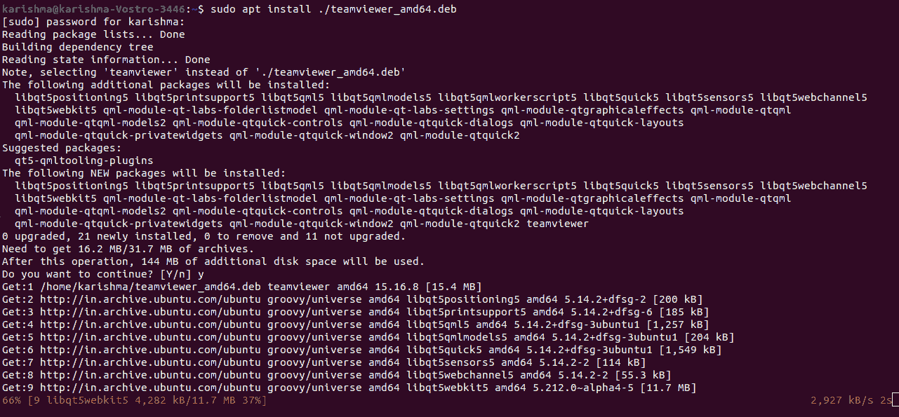
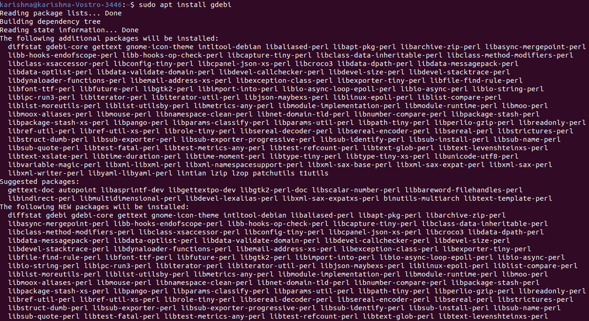
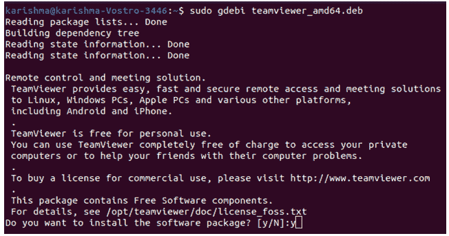
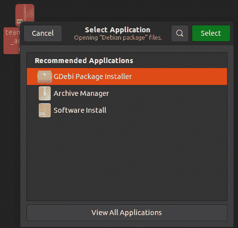
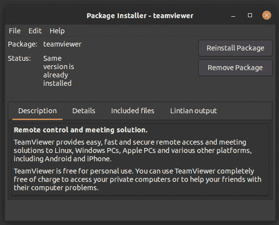
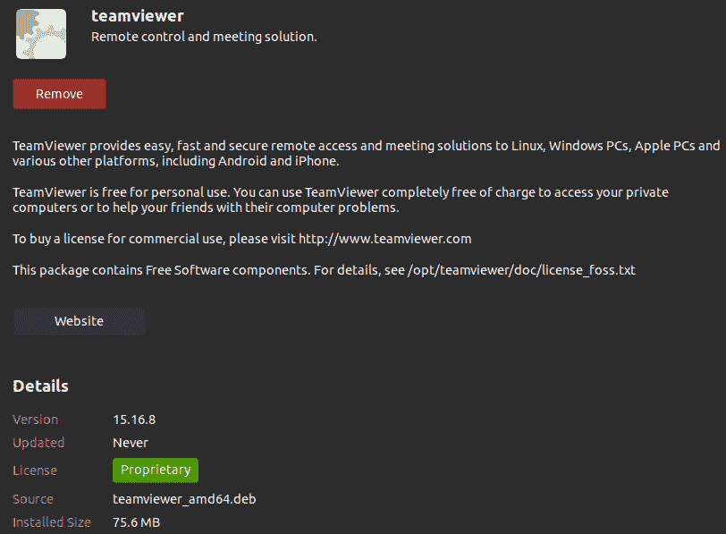
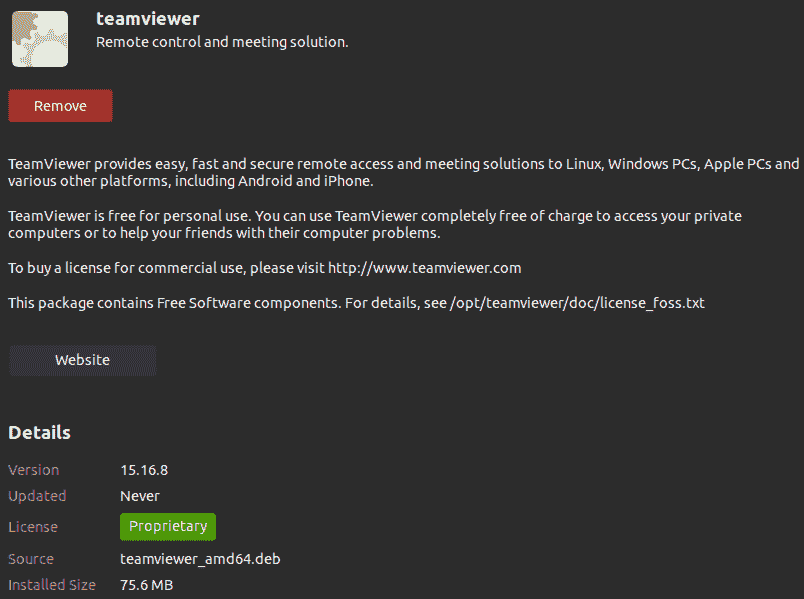

# 如何在 Ubuntu 中安装 deb 文件

> 原文：<https://www.javatpoint.com/how-to-install-deb-file-in-ubuntu>

Deb 是一种安装包格式，每个基于 Debian 的发行版都使用它。

Ubuntu 的存储库包括许多 deb 包，这些包可以通过命令行借助 **apt-get** 和 **apt 实用程序**安装，也可以通过 **Ubuntu 软件中心**安装。

有几个应用程序没有添加到 Ubuntu 或第三方存储库中。这些应用程序需要通过开发人员的网站下载并手动安装。在通过任何非官方来源或网站安装此类软件包时，我们需要小心。

## Ubuntu 中 Deb 文件介绍

有些软件是通过 deb 包存在的。这些包是以扩展名结尾的归档文件，即。 ***deb*** 。

我们可以假设一个 ***。deb*** 文件为 ***。exe*** 文件在 Windows 内。当我们双击。exe 文件，它将在 Windows 中启动安装过程。在 Ubuntu 中，deb 包是完全一样的。

**故障排除:**双击 20.04 版本 Ubuntu 中软件中心内部没有打开的 deb 文件。

这很奇怪，但很容易解决。我们必须右键单击该 deb 文件并选择选项，即 ***【打开方式】*** 。我们可以选择打开 ***软件安装*** 选项作为默认选择。

## 下载 deb 文件

为了演示的目的，我们正在下载并安装 TeamViewer deb 文件。TeamViewer 可以定义为**电脑间文件传输、在线会议、桌面共享、**和**远程支持**的一体机按键。

启动我们的网络浏览器，连接到团队浏览器，查看 Linux 的下载页面。我们可以通过按下 Debian 和 Ubuntu 的下载链接来下载 deb 的包。

如果我们更喜欢命令行，我们可以通过使用 **curl** 或者 **wget** 来下载我们的 deb 文件。

```

$ wget --no-check-certificate https://download.teamviewer.com/download/linux/teamviewer_amd64.deb

```


或者，

```

$ curl -k -O -L https://download.teamviewer.com/download/linux/teamviewer_amd64.deb

```

## 使用命令行安装 deb 文件

如果我们想通过命令行安装 deb 包，我们有各种工具可以使用。我们将展示如何应用 dpkg、gdebi 和 apt 实用程序来安装 deb 包。

### 1.使用 apt 实用程序安装 deb 文件

**apt** 可以定义为命令行的一个实用工具，用于**安装、更新、删除**，否则**管理 **Ubuntu、Debian** 以及 [Linux](https://www.javatpoint.com/linux-tutorial) 其他相关发行版上的**各种 deb 包。

apt 实用程序是在 14.04 版本的 Ubuntu 中发布的，包括通过 apt-cache 和 apt-get 使用最广泛的命令。

为了使用 apt 安装 deb 的本地包，我们需要给出 deb 文件的完整路径。

当文件被放在我们当前的工作目录中时，我们可以不提供绝对路径。/ prepend 放在包的名称前面。否则，apt 实用程序将试图通过 Ubuntu 的存储库安装和检索包。

```

$ sudo apt install ./teamviewer_amd64.deb

```

我们将被要求输入***【Y】***继续。

之后，apt 的包管理器将修复并安装每个包依赖项。



### 2.使用 gdebi 安装 deb 文件

gdebi 可以描述为安装本地 deb 包的工具。默认情况下，它不会安装在 Ubuntu 中，但是，我们可以使用以下命令安装这些包:

```

$ sudo apt install gdebi 

```



为了使用 gdebi 安装 deb 包，我们需要键入:

```

$ sudo gdebi teamviewer_amd64.deb

```

当提示时，键入 y 和 gdebi 将为我们修复和安装 deb 文件和所有依赖项。



### 3.使用 dpkg 安装 deb 文件

**dpkg** 可以定义为所有基于 Debian 的系统的包管理器(低级)。我们可以使用 dpkg 应用-i 选项或- install 选项来安装 deb 包。

```

$ sudo apt install./teamviewer_amd64.deb

```


与 gdebi 和 apt 不同，dpkg 不解析依赖关系。如果我们在 deb 包的安装过程中发现任何依赖错误，我们可以应用 apt 的以下命令来解决和安装每个包依赖:

```

$ sudo apt install -f

```

### 4.用图形用户界面安装 deb 包

简单地说，如果我们更喜欢应用图形界面，我们可以下载 deb 文件，并通过双击启动它。

它将打开默认发行版图形软件中心:

按下**安装**按钮，将打开一个对话框，即**认证**:

我们必须输入**管理密码**并按下**认证**按钮。

### 图形用户界面模式

如果我们希望应用图形用户界面 GDebi，我们可以遵循以下步骤:

*   打开文件管理器并定位包。在大多数情况下，我们可以在**下载**中看到。
*   右键单击 deb 文件，选择**“用其他应用程序打开”**
    
*   完成上述步骤后，将会打开一个新的对话框以及一组**推荐应用程序**。选择 **GDebi 套装安装工具**并按下**选择**。
    

这个安装程序将加载所有的 deb 包，并显示软件描述(如果存在的话)以及是否满足每个依赖关系。按下**安装包**，输入内部密码，按下**认证**按钮开始安装过程。

根据文件的大小及其其他依赖关系，安装过程可能需要一些时间。

安装 deb 文件时， **Ubuntu 软件中心**内的**【安装】**按钮会修改为**【删除】**。

就这样，我们的应用程序已经成功安装在我们的系统上，我们可以开始使用它了。



## 正在删除 deb 文件

考虑以下方法来删除 deb 文件。

### 1.使用软件中心卸载 deb 文件

我们可以通过打开终端窗口来删除软件包，即使我们已经成功地用软件中心安装了软件包并执行了以下命令:

```

sudo apt remove [software_name]

```

### 2.按 dpkg 删除软件

删除 dpkg 软件包安装的软件包时，我们可以在下面的命令中使用该软件包的正式名称:

```

sudo dpkg -r [software_name]

```

### 3.Gdebi 删除软件

要用 Gdebi 卸载软件，我们必须打开 Gdebi 的**软件包安装程序**，按下**移除软件包**。



* * *