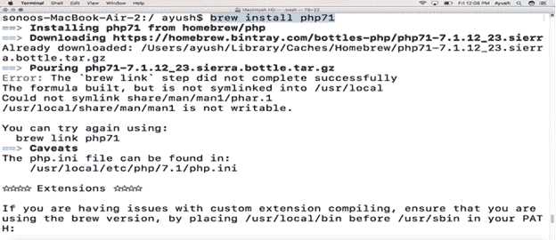
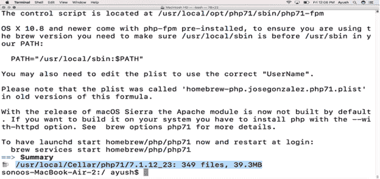

# 如何在 macOS 上安装 PHP

> 原文：<https://www.javatpoint.com/how-to-install-php-on-mac>

### 介绍

PHP 是一种服务器端脚本语言。最初它是为 web 开发而设计的，但也可以用作通用语言。它是由拉斯马斯·勒德尔夫于 1994 年在 T2 创造的。原本代表**个人主页**，现在代表**超文本预处理器**。PHP 代码可以嵌入到 HTML 中。PHP 基本上是一种由 web 服务器或 CGI 可执行文件实现的解释语言。在本教程中，我们将学习在 macOS 上安装 PHP 的步骤。

### 先决条件

1.  苹果
2.  以管理员身份登录终端
3.  自制软件包安装程序必须在系统上配置。

## 装置

1)**PHP 的安装包括以下步骤**。

更新自制软件包安装程序的本地存储库索引

以下命令可用于更新自制软件包安装程序的本地存储库索引。

```

$ brew update 

```

2) **安装 PHP**

PHP 的最新版本是 PHP 7.1。它可以很容易地用一个命令安装，如下所示。

```

$ brew install php71

```

在没有找到类似公式的情况下，我们需要通过运行以下命令来进入其他 PHP 存储库。

```

 $ brew tap homebrew/php 

```




PHP 7.1 安装在**/usr/local/Cell**内部。为了全局执行 php，我们需要在**中设置路径。bash_profile** 存储在用户的主目录中。使用 VI 编辑器打开文件，并添加以下行。

```

export PATH=/usr/local/Cellar/php71/7.1.12_23/bin:$PATH

```

## 验证 PHP

为了验证我们的系统上安装了正确版本的 PHP，我们可以执行以下命令。

```

$ php -v

```


因此，我们已经成功安装并开始使用 PHP 7 . 1 . 12 版本。