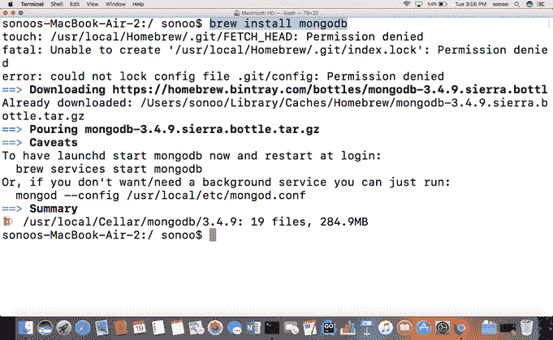
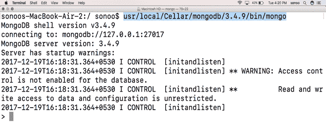
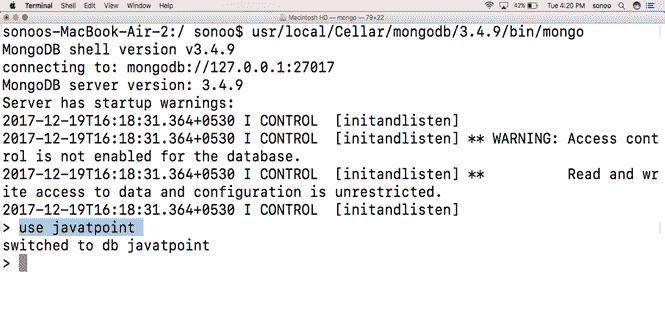

# 如何在 MacOS 上安装 MongoDB

> 原文：<https://www.javatpoint.com/how-to-install-mongodb-on-mac>

MongoDB 是一个开源的、跨平台的面向文档的数据库管理系统。这是一个 **NoSQL** 数据库，将数据和模式存储为 JSON 对象。Mongodb 由**Mongodb Inc .**开发，以 **GNU affero** 通用公共许可证和 Apache 发布。

本教程描述了在 MacOS 上安装 MongoDB 所涉及的步骤

### 先决条件

*   苹果
*   以管理员身份登录终端。
*   自制程序必须安装在系统上。

* * *

## 装置

以下步骤用于在 MacOS 上安装 MongoDB。

1) **更新自制安装包**

要开始在 MacOS 上安装 MongoDB，我们需要更新**自制软件包安装程序**的存储库索引。这将通过以下命令完成。

```

$ brew update 

```

2) **安装蒙戈布**

在更新存储库索引后，我们需要安装 MongoDB，这将在**自制程序**安装程序的帮助下完成。它只是在位置**/usr/local/cell/MongoDB**上安装 MongoDB

```

$ brew install mongodb

```



3) **启动蒙戈布**

要启动 MongoDB，我们需要运行以下命令。

```

$ launchctl load /usr/local/Cellar/mongodb/3.4.9/homebrew.mxcl.mongodb.plist

```


4) **在命令行工作**

MongoDB shell 可以通过运行名为 mongo 的文件来访问，这是一个位于安装目录下 bin 文件夹中的可执行脚本。



为了创建数据库，我们在 MongoDB 外壳上使用以下命令。

```

$use <database-name>

```



5) **停止数据库**

要停止数据库，我们必须使用**启动**命令指定**卸载**选项，如下所示:

```

$ launchctl unload /usr/local/Cellar/mongodb/3.4.9/homebrew.mxcl.mongodb.plist

```


嗯，我们已经在我们的 MacOS 上成功安装了 MongoDB 3 . 4 . 9 版本。