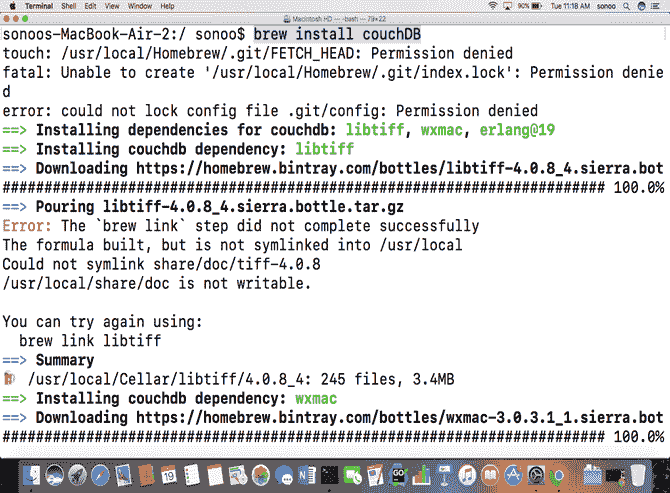
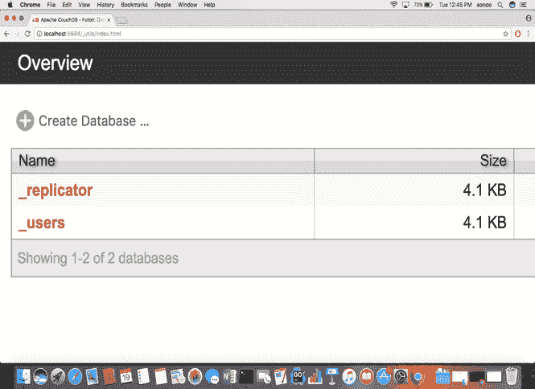
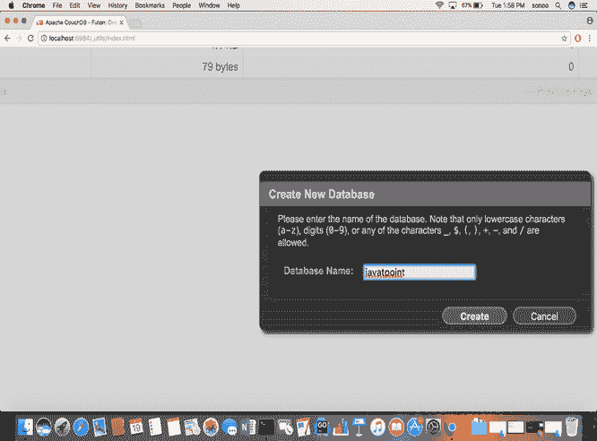
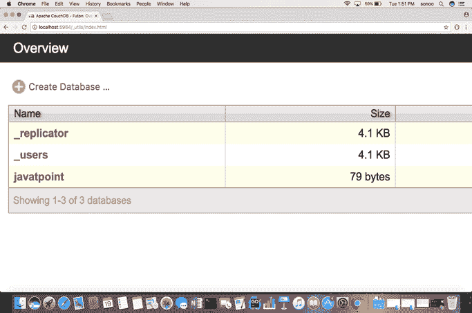

# 如何在苹果电脑上安装 CouchDB

> 原文：<https://www.javatpoint.com/how-to-install-couchdb-on-mac>

### 介绍

Apache CouchDB 是一个开源数据库软件，它注重易用性，并且具有可扩展的架构。它具有面向文档的数据库体系结构，并以面向并发的语言 **Erlang 实现。**它将数据存储为 JSON 对象。

它最早于 2005 年发布，后来在 2008 年成为 T2 阿帕奇软件基金会的一部分。在本教程中，我们将学习在 MacOS 上安装 CouchDB 所涉及的过程。

### 先决条件

*   苹果
*   以管理员身份登录终端。
*   自制程序必须安装在系统上。

* * *

## 装置

以下步骤用于在 MacOS 上安装 CouchDB。

1) **更新自制软件包安装程序的本地存储库索引**

我们首先需要更新**自制软件包安装程序**的存储库索引，该索引用于在 Mac 操作系统上安装新的软件包。

使用以下命令更新

```

$ brew update

```

2) **使用自制**安装

在更新家酿之后，我们需要安装 CouchDB。这将安装它的所有依赖项和资源。

```

$ brew install couchDB 

```



3) **启动 CouchDB**

为了运行 CouchDB，我们需要启动安装在路径**/usr/local/cell/CouchDB**上的 CouchDB 服务器。为此，我们需要用**启动**命令指定安装目录的路径

```

$ launchctl load /usr/local/Cellar/couchdb/1.6.1_13/homebrew.mxcl.couchdb.plist

```


启动 CouchDB 后，我们需要检查服务器是否正常运行。使用以下命令进行操作。

```

$ curl http://127.0.0.1:5984

```

其中 5984 是 CouchDB 的默认端口。


我们也可以在浏览器中通过在浏览器的搜索栏中键入 **localhost:5984** 来实现。

4) **创建数据库**

我们可以通过在浏览器中打开 CouchDB 来创建数据库。为此，我们将键入[。这看起来像下面这样。](http://127.0.0.1:5984/_utils)



要创建数据库，我们可以点击**创建数据库**。这将提示弹出窗口询问数据库名称。键入名称，然后按回车键。



这将创建名为 JavaTPoint 的数据库。我们新创建的数据库 javatpoint 现在可以在数据库列表中看到。



5) **停止数据库**

要停止数据库，launchctl 命令与**卸载**选项一起使用。

```

$ launchctl unload /usr/local/Cellar/couchdb/1.6.1_13/homebrew.mxcl.couchdb.plist

```


嗯，我们已经成功地在我们的苹果电脑上安装了 CouchDB。