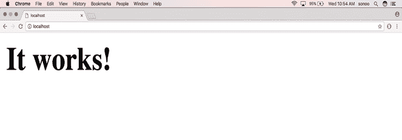

# 如何在 MacOS 上安装 Apache 网络服务器

> 原文：<https://www.javatpoint.com/how-to-install-apache-on-mac>

### 介绍

Apache HTTP 服务器是在 **Apache 2.0 许可下发布的开源跨平台 web 服务器。**由 apache 软件基金会下的开放开发者社区开发维护。

在本教程中，我们将学习在 MacOS 上安装 Apache 过程中涉及的步骤。

### 先决条件

*   苹果
*   以管理员身份登录终端。
*   自制程序必须安装在系统上。

* * *

## 装置

在 MacOS 上安装 Apache web 服务器包括以下步骤。

1) **更新家酿**的库索引

要在我们的 MacOS 上安装 Apache，首先需要更新**自制软件包安装程序**的索引。这可以通过以下方式实现:

```

$brew update

```

2) **安装 apache 2.0**

自制软件包安装程序可用于在 MacOS 上安装 Apache 2.0。安装人员将 Apache HTTP 服务器安装在**/usr/local/Cell/httpd**位置。


3) **启动阿帕奇**

Apache 提供名为 **apachectl** 的服务，需要启动该服务才能启动 Apache。该命令需要超级用户权限才能执行，因此我们必须使用 **sudo** 来执行该命令。

```

$ sudo apachectl start

```


这将启动 Apache HTTP 服务器，可以通过访问浏览器上的 localhost 进行测试。本地主机给出如下响应:



4) **停止阿帕奇**

要停止 Apache，我们需要以超级用户权限停止 **apachectl** 服务，如下图所示。

```

$ sudo apachectl stop 

```


当您停止 Apache 时，本地主机将停止监听端口 8080，并且不会给出任何响应。

我们已经成功安装并测试了 apache，它在我们的 MacOS 上运行良好。