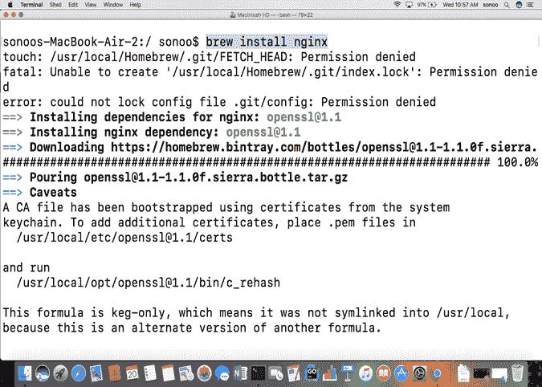

# 如何在 MacOS 上安装 Nginx

> 原文：<https://www.javatpoint.com/how-to-install-nginx-on-mac>

### 介绍

Nginx 是一个 web 服务器，也可以作为 **HTTP 缓存、负载均衡器和反向代理。这是由**伊戈尔·塞索耶夫**首次创建的，并于 2004 年根据类似 BSD 的许可条款发布。**

在本教程中，我们将学习在 MacOS 上安装 Nginx 所涉及的步骤。

### 先决条件

*   苹果
*   以管理员身份登录终端。
*   自制程序必须安装在系统上。

* * *

## 装置

在 MacOS 上安装 Nginx 涉及以下几个步骤:

1) **更新家酿**的库索引

要在 MacOS 上安装 Nginx，首先需要更新**自制软件包安装程序**的存储库索引。这可以通过 brew update 命令来完成。

```

$ brew update 

```

2) **安装 engine**

自制软件包安装程序在 MacOS 上安装 Nginx 网络服务器。要安装 Nginx，将执行以下推荐操作:

```

$ brew install nginx

```

这将在**/usr/local/Cell**位置安装 Nginx 网络服务器。所有与启动和停止 Nginx 相关的可执行服务都存储在安装目录的 bin 文件夹中。



默认情况下，网络服务器将监听端口号 8080。要启动 Nginx，要么执行 **Nginx** 要么启动服务，如下图所示。


要检查 Nginx 是否正确安装在计算机上，我们可以访问浏览器上的本地主机，或者使用以下命令进行检查。

```

$ curl http://127.0.0.1:8080 

```

浏览器将显示如下内容:


现在，我们已经确认 Nginx 已正确安装在我们的系统上。要停止 Nginx 的服务，我们可以使用以下命令:

```

$ launchctl unload /usr/local/Cellar/nginx/1.12.1/homebrew.mxcl.nginx.plist

```


现在，我们已经成功地在 MacOS 上安装了 Nginx。