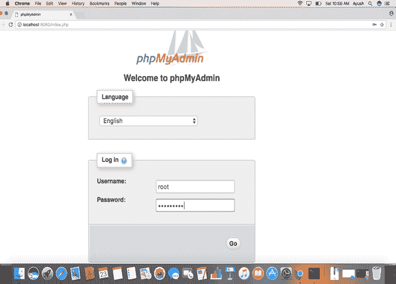
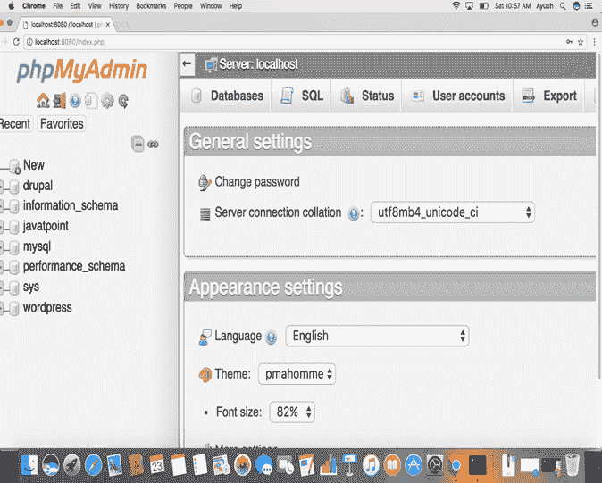

# 如何在 MacOS 上安装 phpMyAdmin

> 原文：<https://www.javatpoint.com/how-to-install-phpmyadmin-on-mac>

### 介绍

PhpMyAdmin 是管理 **MySQL** 和 **MariaDB** 的免费开源工具。作为一个用 **PHP** 编写的可移植网络应用程序，它已经成为 MySQL 最流行的管理工具之一。

在本教程中，我们将学习在 MacOS 上安装 phpMyAdmin 所涉及的步骤。

### 先决条件

*   苹果
*   以管理员身份登录终端。
*   自制程序必须安装在系统上。
*   PHP 5.x 或更高版本

* * *

## 装置

phpMyAdmin 的安装包括以下步骤

1) **下载文件**

要在 MacOS 上安装文件，我们需要从 phpMyAdmin [官网下载一个压缩文件 https://files . phpMyAdmin . net/phpMyAdmin/4 . 7 . 6/phpMyAdmin-4 . 7 . 6-all-languages . tar . gz](https://files.phpmyadmin.net/phpMyAdmin/4.7.6/phpMyAdmin-4.7.6-all-languages.tar.gz)

2) **提取文件**

```

$ tar xvfz Downloads/phpMyAdmin-4.7.6-all-languages.tar.gz

```

3) **启动开发服务器**

要从 localhost 访问 phpMyAdmin，我们需要启动开发服务器。首先，我们需要通过键入以下命令来更改我们的工作目录:

```

$ cd Downloads/phpMyAdmin-4.7.6-all-languages

```

开发服务器将在 phpmyadmin 目录下启动根服务器。现在，键入 **localhost:8080** 在 localhost 上访问 phpmyadmin。它会这样出现。



窗口将提示我们填写我们的 MySQL 用户名和密码。填写所需的详细信息，然后按 **GO** 。



现在我们已经成功地在 MacOS 上安装了 phpMyAdmin。