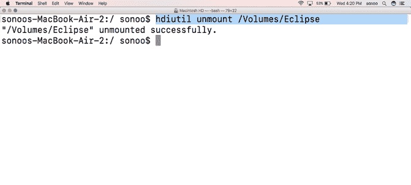

# 如何在 MacOS 上安装 Eclipse

> 原文：<https://www.javatpoint.com/how-to-install-eclipse-on-mac>

### 介绍

Eclipse 是一个集成开发环境，它为计算机编程提供了平台。它是最常用的 java 编程平台，包含一个基本工作空间，并通过外部插件为其他语言(如 C、C++)提供编程环境。

在本教程中，我们将学习在 MacOS 上安装 eclipse 所涉及的步骤。

### 先决条件

*   苹果
*   以管理员身份登录终端。

* * *

## 装置

在 MacOS 上安装 Eclipse 包括以下几个步骤。

1) **下载最新版本**

这一步包括下载最新版本，即 eclipse oxygen(通过编写本教程)。要在我们的 MacOS 上安装 eclipse，我们必须通过访问 eclipse 的官方网站或简单地点击链接[http://www.eclipse.org/downloads/download.php?来下载最新版本的 eclipsefile =/technology/EPP/downloads/release/oxygen/1a/eclipse-Java-oxygen-1a-macosx-cocoa-x86 _ 64 . dmg](https://www.eclipse.org/downloads/download.php?file=/technology/epp/downloads/release/oxygen/1a/eclipse-java-oxygen-1a-macosx-cocoa-x86_64.dmg)。下载的文件存在于**磁盘映像文件(dmg)** 格式中，该文件将首先被安装以开始安装。

2) **挂载 dmg 文件**

从 eclipse 官网下载的 **dmg** 文件需要先挂载到 volumes 目录。 **Hdiutil** 命令可以与 **mount** 选项一起使用，将文件挂载到 volumes 文件夹中。该过程显示在图像中。

3) **将 Eclipse.app 复制到应用中**

安装文件后，在**/卷/Eclipse** 中创建 **Eclipse.app** 。这是一个需要复制到应用目录的应用文件。文件部署到应用目录后，需要将其卸载。

4) **卸载文件**

卸载文件只需要弹出安装程序。为此，**卸载**选项与 **hdiutil** 命令一起使用。

嗯，我们已经成功地在我们的苹果电脑上安装了 Eclipse 氧气。