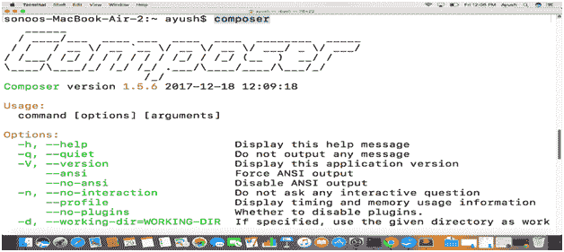

# 如何在苹果电脑上安装 Composer

> 原文：<https://www.javatpoint.com/how-to-install-composer-on-mac>

### 介绍

Composer 是 PHP 编程语言的应用程序级包管理器。它为 PHP 软件和所需库的依赖关系管理提供了标准格式。它是由尼尔萨德曼和约迪博加尼亚诺开发的。2012 年 3 月 1 日上映。在本教程中，我们将学习 Composer 在 MacOS 上的安装过程。

### 先决条件

1.  苹果
2.  以管理员身份登录终端
3.  服务器端编程语言（Professional Hypertext Preprocessor 的缩写）

## 装置

composer 的安装包括以下步骤。

1) **下载**

运行以下命令在 MacOS 上下载 Composer 安装程序。

```

$ sudo php -r "copy('https://getcomposer.org/installer','composer-setup.php');"

```


2) **检查安装人员进行验证**

为了验证安装程序，需要验证 Composer 安装程序的哈希文件代码。


3) **运行编写器-设置**

需要执行一个名为 composer-setup.php 的文件来开始在我们的 MacOS 上安装 composer。它将 Composer 安装在当前目录中，当前目录是我们的主目录。将创建一个名为 **composer.phar** 的文件，需要将其移动到 **/usr/bin/composer** 才能在全球范围内运行 composer。


4) **将 Composer.phar 移动到/usr/bin/composer**

Composer.phar 需要移动到 **/usr/bin/Composer** ，以便在终端上全局运行 composer。为此，将执行以下命令。

```

$ sudo mv composer.phar /usr/local/bin/composer

```

5) **跑作曲**

现在 composer 安装在我们的系统上，要让它在系统上运行，只需在终端上输入 **composer** 。窗口将如下所示。



因此，我们已经成功地在 MacOS 上安装并检查了 composer。现在我们可以在它的帮助下安装其他依赖项或包。