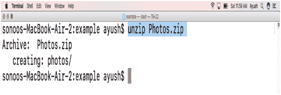

# 如何在 MacOS 中压缩和解压缩目录。

> 原文：<https://www.javatpoint.com/how-to-zip-unzip-folder-on-mac>

### 介绍

Zip 是一种支持无损数据压缩的归档文件格式。一**。zip** 文件可以包含任意数量的压缩文件。该格式由**菲利普·卡兹**在 **1989 年创建。**在传输大量数据时，Zipping 非常有用。大多数操作系统内置了对。以类似的方式拉上拉链。

### 压缩目录

首先，让我们看看当前目录**示例中存在的文件数量。**


现在，我们可以使用以下命令压缩当前目录中的这个**照片**目录

```

$ zip photos.zip photos

```


现在，检查当前目录中存在的文件，我们将得到一个**。zip** 文件呈现在那里。


### 解压缩目录

以下命令用于解压缩目录。

```

$ unzip Photos.zip

```



### 额外信息

Zip 命令可以与各种标签一起使用。要获得这些旗帜的所有细节，我们可以寻求帮助。

```

$ zip -help 

```

这就是我们在 MacOS 上压缩和解压缩文件的方法。