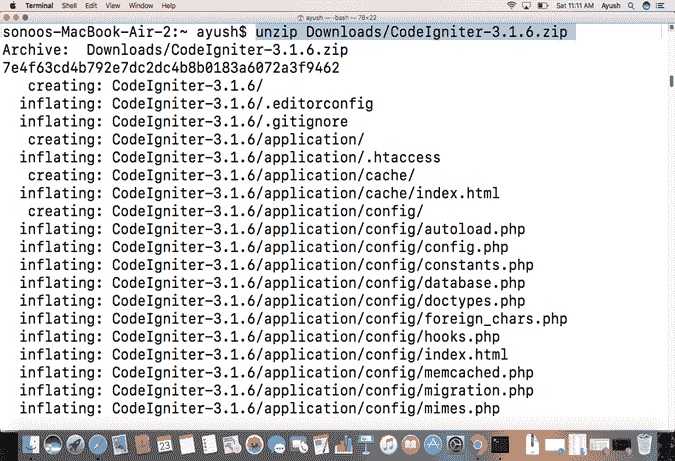
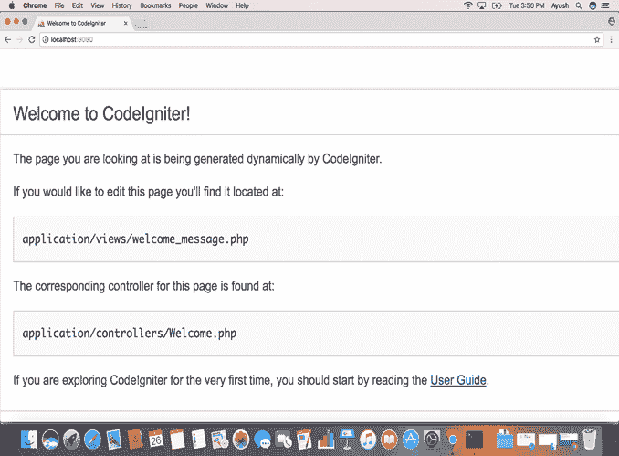

# 如何在苹果电脑上安装 CodeIgniter

> 原文：<https://www.javatpoint.com/how-to-install-codeigniter-on-mac>

### 介绍

CodeIgniter 是一个开源软件，负责用 PHP 快速开发动态网站。这是一个基于流行的模型视图控制器 **(MVC)** 开发模式的强大的 web 框架。CodeIgniter 的第一个公开版本由 **EliisLab** 于**2006 年 2 月 28 日**发布。

在本教程中，我们将学习 macOS 上 CodeIgniter 的安装过程。

### 先决条件

*   苹果操作系统
*   正常运行的 MySQL
*   PHP 5 . x 版或更高版本

* * *

## 装置

在 macOS 上安装 CodeIgniter 涉及以下步骤。

1) **下载存档文件**

访问 CodeIgniter[https://github.com/bcit-ci/CodeIgniter/archive/3.1.6.zip](https://github.com/bcit-ci/CodeIgniter/archive/3.1.6.zip)官网下载最新版本(撰写本教程时为 3.1.6)。将下载压缩格式的存档文件。

2) **提取文件**

要提取文件，我们需要运行以下命令。

```

$ unzip Downloads/CodeIgniter-3.1.6.zip

```



3) **启动开发服务器**

我们需要将我们的目录更改为提取下载文件的目录，然后启动 PHP 的开发服务器，以便从浏览器通过 localhost 访问 CodeIgniter。

```

$ php -S 127.0.0.1:8080 

```


4) **通过浏览器**访问 CodeIgniter

要在浏览器上访问 CodeIgniter，我们只需在浏览器栏中键入 localhost:8080。



因此，我们成功地安装了 macOS 的 CodeIgniter。