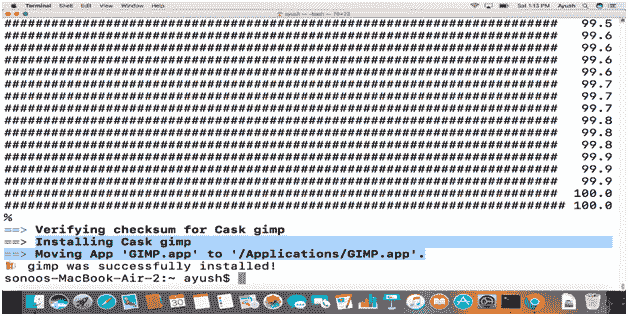
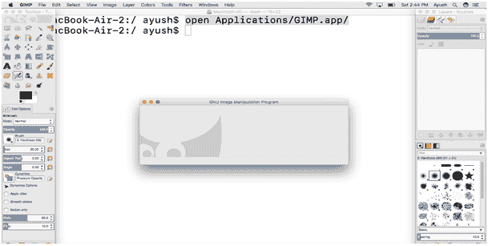

# 如何在 MacOS 上安装 GIMP

> 原文：<https://www.javatpoint.com/how-to-install-gimp-on-mac>

### 介绍

GIMP 是 **GNU 图像处理程序**的首字母缩写。它是一个免费的开源光栅图形编辑器，用于图像修饰和编辑、自由格式绘制、图像格式之间的转换以及许多其他任务。它是在 GPL3 许可下发布的，可用于 Linux、微软 Windows 和 MacOS。在本教程中，我们将在 MacOS 上安装 GIMP。

### 先决条件

1.  苹果
2.  以管理员身份登录终端
3.  自制程序必须安装在系统上。

## 装置

安装包括以下步骤。

1) **更新家酿**的库索引

为了用自制程序在 MacOS 上安装 GIMP，我们需要先更新自制程序的存储库索引。这可以通过使用以下命令来完成。

```

$ brew update 

```

2) **安装 GIMP**

GIMP 可以用**自制软件包安装程序**简单安装。然而，它在当前的自制程序库中是不可用的，因此我们必须使用下面的命令进入另一个库。

```

$ brew tap caskroom/cask 

```

然后使用以下命令安装 GIMP。

```

$ brew cask install gimp 

```




GIMP 可以通过命令行或在应用程序目录中搜索来打开。为此，可以使用以下命令。

```

$ open Applications/GIMP.app

```



因此，我们已经成功地在 MacOS 上安装了 GIMP。