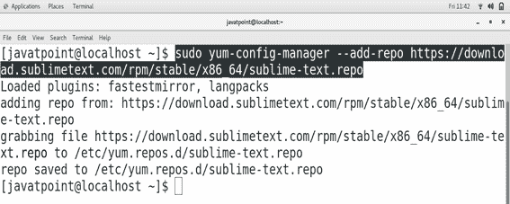
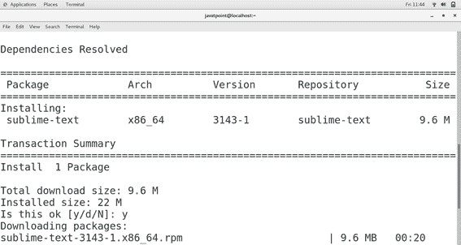
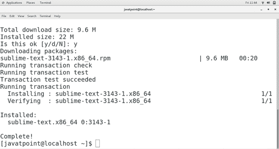
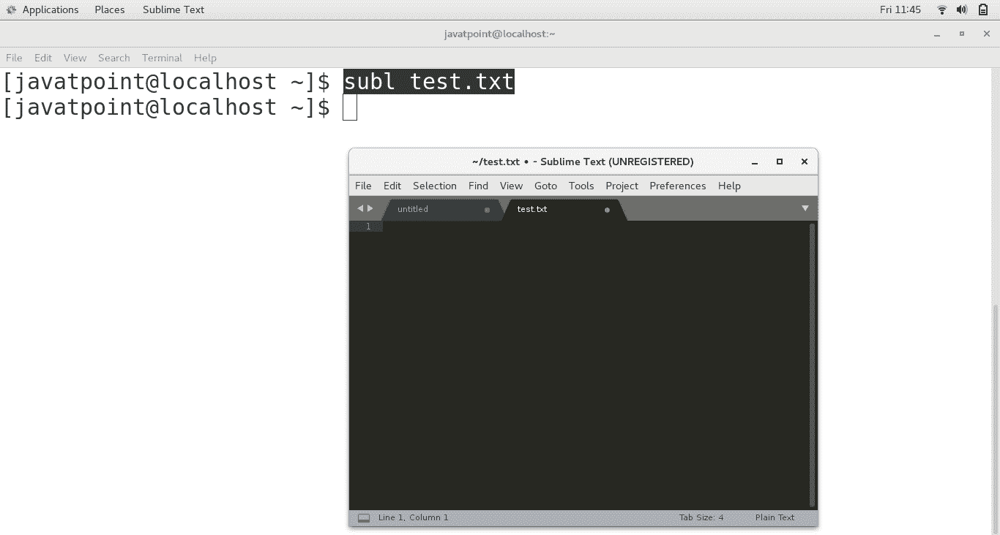

# 如何在 CentOS 上安装高级文本

> 原文：<https://www.javatpoint.com/how-to-install-sublime-text-on-centos>

## 介绍

崇高文本是跨平台的源代码编辑器，有 22 个不同的视觉主题，如果需要，可以选择下载额外的主题。它本身支持许多编程和标记语言。主要用 C++和 Python 编写。崇高文本 2.0.2 于 2013 年 7 月 8 日发布。在本教程中，我们将在 CentOS 上安装崇高文本。

### 先决条件

*   CentOS
*   以管理员身份登录终端

## 装置

安装包括以下步骤。

1) **导入崇高文本库**

默认情况下，CentOS7 Yum 存储库不会导入升华文本存储库。我们必须使用以下命令来导入。

```

$ sudo rpm ?v ?import https://download.sublimetext.com/sublimehq-rpm-pub.gpg

```


2) **添加存储库**

导入的存储库需要添加到 Yum 包管理器中。使用以下命令完成此任务。

```

$ sudo yum-config-manager ?add-repo https://download.sublimetext.com/rpm/stable/x86_64/sublime-text.repo 

```



3) **安装崇高文字**

使用以下命令在 CentOS 上安装高级文本

```

$ sudo yum install sublime-text

```





4) **验证崇高文本**

现在，崇高文本安装在我们的 CentOS 上。我们可以通过在终端上输入**子文件<文件名>T1 来检查工作是否正常。**



因此，我们已经成功安装并开始使用崇高的文本。