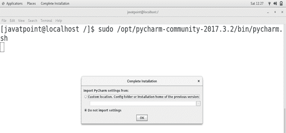
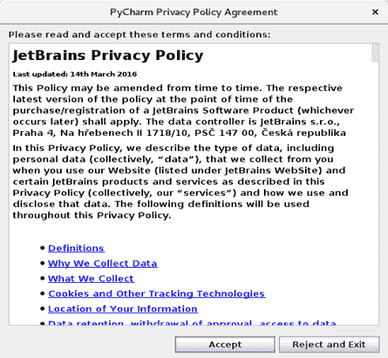
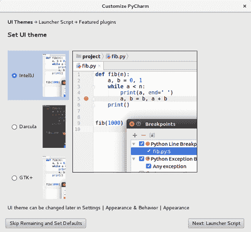
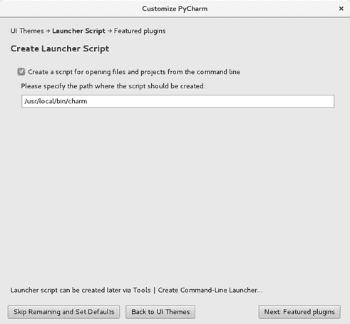
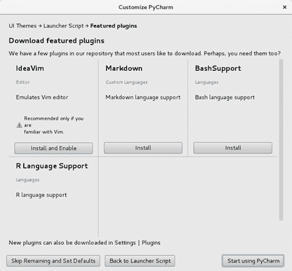
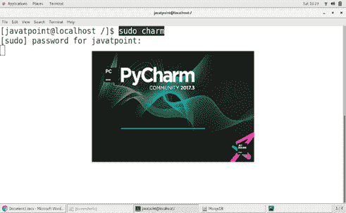

# 如何在 CentOS 上安装 PyCharm

> 原文：<https://www.javatpoint.com/how-to-install-pycharm-on-centos>

## 介绍

PyCharm 是一个集成开发环境，主要用于 Python 语言的计算机编程。它是由**喷气大脑**开发的。PyCharm 支持 Windows、MacOS 和 Linux 版本。PyCharm 的测试版于 2010 年 7 月在**发布。Pycharm 开源版，Pycharm 社区版于**2013 年 10 月 22 日**发布。在本教程中，我们将在 CentOS 上安装 PyCharm。**

### 先决条件

*   CentOS7
*   以管理员身份登录终端

## 装置

安装包括以下步骤。

1) **下载 PyCharm 社区版**

点击链接[https://www . jet brains . com/py charm/download/download-thanks . html？平台=linux &代码=PCC](https://www.jetbrains.com/pycharm/download/download-thanks.html?platform=linux&code=PCC) 下载 PyCharm 社区版。


2) **提取文件**

使用以下命令提取从互联网下载的文件。这将在/ **选项**中提取。为此，请使用以下命令:

```

$ sudo tar xvfz pycharm-community-2017.3.2.tar.gz -C /opt/

```


3) **运行安装程序脚本**

为了在 CentOS 上安装 PyCharm，我们需要运行位于**/opt/py charm-community-2017 . 3 . 2/bin/**内部的安装程序脚本

```

$ sudo /opt/pycharm-community-2017.3.2/bin/pycharm.sh

```



如果需要，导入设置，点击**确定**



点击**接受**接受在 CentOS 上安装 PyCharm 所必需的软件隐私政策。



PyCharm 提供了各种主题来使用。选择任意主题，点击**下一步**。



这一步创建了一个可以在终端上全局执行的启动器脚本，以便从命令行打开 Pycharm。只需点击**下一步**继续。



选择需要安装的插件，点击**开始使用 PyCharm** 。

4) **验证 PyCharm**

只需在终端上键入 **sudo charm** 即可验证 PyCharm 是否在系统上全局安装。



点击**新建项目**开始使用 PyCharm。


因此，我们已经在 CentOS 上成功安装并开始使用 PyCharm 社区版。