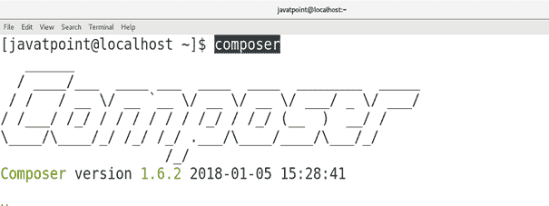
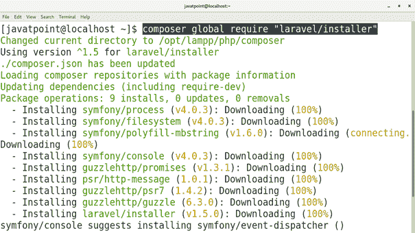
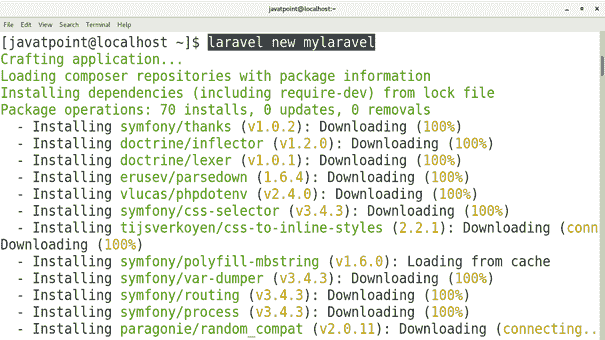
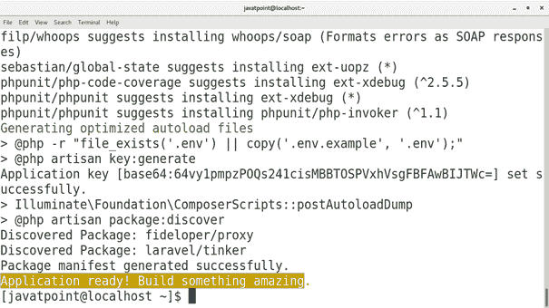
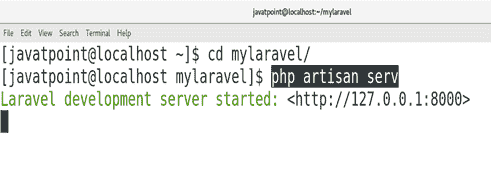

# 如何在 CentOS 上安装 Laravel

> 原文：<https://www.javatpoint.com/how-to-install-laravel-on-centos>

Laravel 是一个用 **PHP** 编写的免费开源 web 框架。它是由**泰勒·奥特韦尔**创造的。它遵循 MVC 开发方法。截至 2015 年 3 月，Laravel 被认为是**最流行的基于 PHP 的框架**之一。它提供了 CodeIgniter 的高级替代方案，CodeIgniter 不打算内置用户授权。在本教程中，我们将在 CentOS 上安装 Laravel。

## 介绍

### 先决条件

*   CentOS 7
*   以管理员身份登录终端

## 装置

安装包括以下步骤。

1.**验证作曲者**

<p.just type="">composer on the terminal to check whether composer is globally installed on the system or not. 

2.**安装 Laravel**

使用 composer 执行以下命令安装 Laravel。

```

$ composer global require "laravel/installer"

```



3.**编辑 bash 配置文件**

打开**。在 VI 编辑器中选择 bashrc** 并在文件中添加以下行。

**导出 PATH = "/opt/lampp/PHP/composer/厂商/bin:$PATH"**

然后执行以下命令获取**。bashrc** 文件

```

$ source .bashrc 

```

4.**创建新应用程序**

在我的例子中，执行以下命令创建名为**my ravel**的新应用程序。

```

$ laravel new mylaravel 

```



现在，应用程序准备好了。我们现在可以建造一些令人惊奇的东西。



5.**启动 Laravel 服务器**

Laravel 使用自己的开发服务器，只需一个简单的命令就可以启动。首先，我们必须通过在终端上键入**CD mylarvel**来更改当前的工作目录，然后执行以下命令。

```

$ php artisan serv 

```



6.**在浏览器上访问**

只需在浏览器的搜索栏中键入 **localhost:8000** 即可在浏览器上访问 Laravel。


因此，我们已经安装并开始使用 Laravel。</p.just>