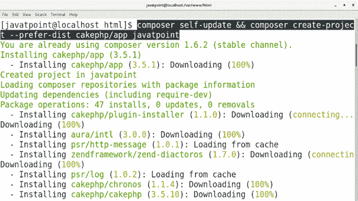
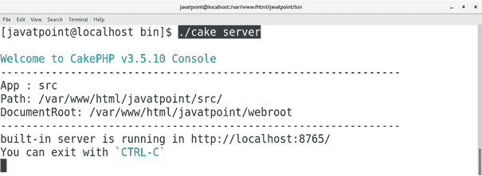

# 如何在 CentOS 上安装 CakePHP

> 原文：<https://www.javatpoint.com/how-to-install-cakephp-on-centos>

## 介绍

CakePHP 是一个遵循模型-视图-控制器方法的开源网络框架。它是用 PHP 编写的，并在麻省理工学院许可下分发。它是由一位波兰程序员米歇尔·塔塔塔特劳维茨于 2005 年 4 月在 T2 启动的。它的第一个版本于 2006 年 5 月发布。在本教程中，我们将在 CentOS 上安装 CakePHP。

### 先决条件

*   CentOS 7
*   以管理员身份登录终端
*   PHP 5.6 版或更高版本
*   PHP mbstring 扩展
*   PHP 国际扩展
*   设计者

## 装置

安装包括以下步骤。

1.**使用 composer** 安装 CakePHP

执行以下命令在 CentOS 上安装 CakePHP。

```

$ composer self-update && composer create-project ?prefer-dist cakephp/app javatpoint

```



2.**编辑 httpd.conf 文件**

用 VI 编辑器打开 **httpd.conf** 文件，这是 Apache 配置的主配置文件，替换如下代码

```

<Directory />   
Options Indexes FollowSymLinks  
AllowOverride None  
Require all granted  
</Directory> 

```

使用以下代码

```

<Directory />   
Options Indexes FollowSymLinks  
AllowOverride All  
Require all granted  
</Directory>

```

使用以下命令启动 Apache 服务器。

```

$ sudo apachectl restart 

```

3.**启动 CakePHP 服务器**

运行位于**/var/www/html/javatpoint/bin**内的二进制可执行文件 **cake** 。

```

$ ./cake server  

```



4.**在浏览器上访问 CakePHP**

我们只需要在浏览器的搜索栏中键入 **localhost:8765** 即可在浏览器上访问 CakePHP。


因此，我们已经安装并开始使用 CakePHP。