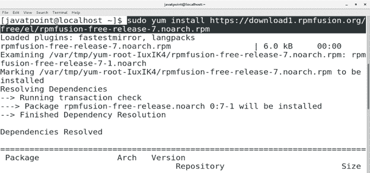
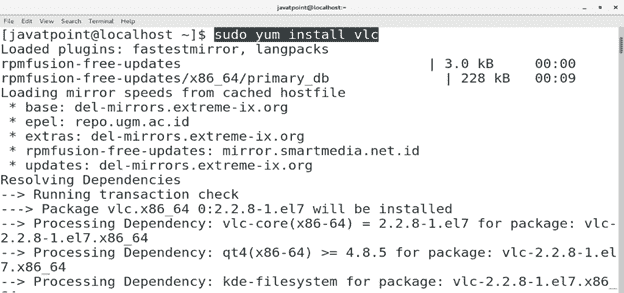
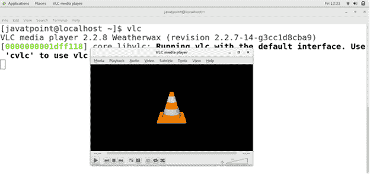
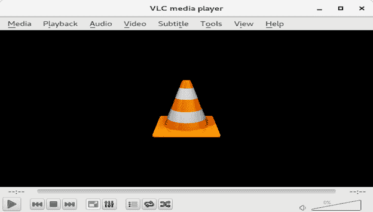

# 如何在 CentOS 上安装 VLC

> 原文：<https://www.javatpoint.com/how-to-install-vlc-on-centos>

## 介绍

VLC 是一个开源的，跨平台的媒体播放器，支持许多视频和音频压缩方法和文件格式。它由 VideoLan 开发，并于 2001 年 2 月在 GNU 公共许可下首次发布。在本教程中，我们将学习在 CentOS 上安装 VLC 的过程。

### 先决条件

*   CentOS 7
*   必须在系统上配置 Yum。
*   必须在系统上配置 EPEL 存储库。

## 装置

安装包括以下步骤。

1.**安装转速融合**

为了在 CentOS 上安装 VLC，我们需要首先通过执行以下命令来安装 RPM Fusion 存储库。

```

$ sudo yum install https://download1.rpm.rpmfusion.org/free/el/rpmfusion-free-release-7.noarch.rpm  

```



2.安装 VLC

执行以下命令在 CentOS 上安装 VLC。

```

$ sudo yum install vlc 

```



3.**VLC 测试**

我们可以通过在终端上输入 **vlc** 来检查 VLC 是否已经成功安装在我们的 CentOS 上。

 

因此，我们已经在 CentOS 7 上安装并开始使用 VLC。现在我们可以用 VLC 媒体播放器播放音乐和视频。