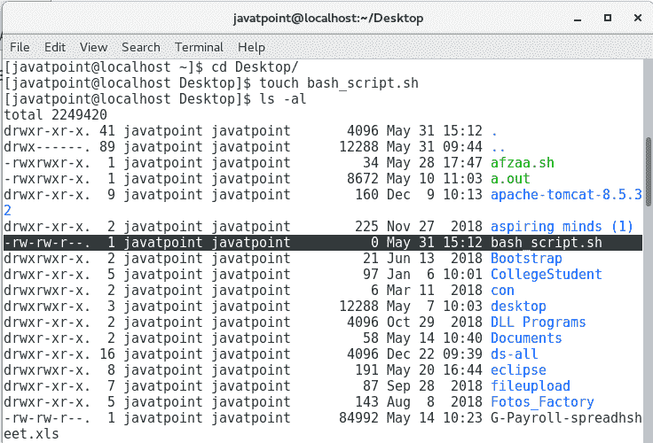

# 你好世界！Bash 脚本

> 原文：<https://www.javatpoint.com/hello-world-bash-script>

根据前面主题中的讨论，让我们使用给定的步骤创建第一个基本的 Bash 脚本:

**第一步:**打开终端。使用 cd 命令导航桌面文件夹或目录。

**步骤 2:** 使用 touch 命令创建一个空文件作为 shell 脚本，并将其命名为 bash_script.sh 来执行。在下图中，您可以看到已创建的文件，所有权限属性都在暗行中。



**步骤 3:** 使用任意编辑器或 visual studio 打开文件。要使用编辑器 gedit，请键入

```

gedit bash_script.sh/ 

```

**第四步:**现在为想要的剧本编码，也就是《你好，世界》！

```

#! /bin/bash

# This is the basic bash script

echo " Hello World! "

```

其中，第 1 行代表#！(shebang)并指定 bash shell 位置。

第 2 行代表注释行。

第 3 行表示打印输出的 echo 命令。

**步骤 5:** 执行前缀为的脚本。/.


它将抛出拒绝权限错误。因为文件只有读写权限，没有执行权限，所以可以在下面看到:


因此，我们使用带有 **+x** 选项的 **chmod** 命令将执行权限添加到文件中

```

chmod +x bash_script.sh 

```

最后，执行脚本。


* * *