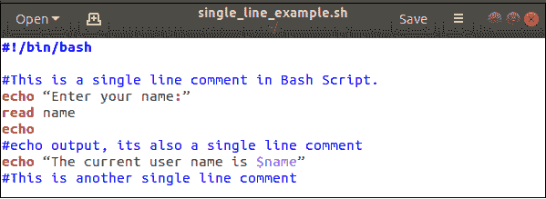
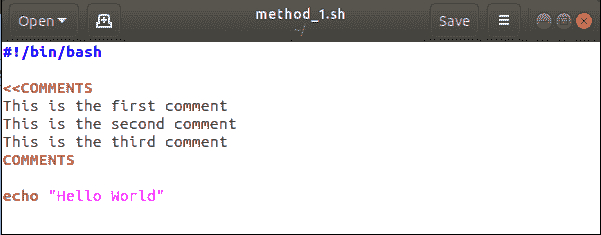
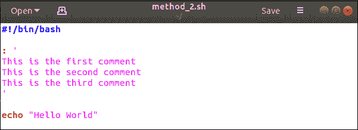

# Bash 注释

> 原文：<https://www.javatpoint.com/bash-comments>

在本主题中，我们将了解如何在 Bash Script 文件中插入注释。

注释是任何编程语言的必要部分。它们用于定义任何代码或函数的用法。注释是帮助程序可读性的字符串。当我们执行 Bash 脚本文件中的命令时，它们不会被执行。

Bash 脚本支持两种类型的注释，就像其他编程语言一样。

*   单行注释
*   多/多行注释

## Bash 单行注释

要在 bash 中编写单行注释，我们必须在注释的开头使用 **hash (#)** 符号。下面是 Bash 脚本的一个例子，它在命令之间包含单行注释:

**痛击脚本**

```
#!/bin/bash

#This is a single-line comment in Bash Script.
echo "Enter your name:"
read $name
echo
#echo output, its also a single line comment
echo "The current user name is $name"
#This is another single line comment

```

**Bash 控制台视图**

上面的脚本在 Bash 控制台中看起来像下面的图像:



**输出**

如果我们输入一个名称作为 javatpoint，那么输出将如下所示:


在这里，可以清楚地看到，在执行命令的过程中，注释被忽略。

## Bash 多行注释

在 bash 脚本中插入多行注释有两种方法:

*   我们可以在 bash 脚本中编写多行注释，方法是将注释放在 **< <【注释 T1】和**注释**之间。**
*   我们还可以通过将注释括在(: ')和单引号(')之间来编写多行注释。

阅读以下示例，这些示例将帮助您理解多行注释的两种方式:

**方法 1:**

**痛击脚本**

```
#!/bin/bash

<
```

**Bash 控制台视图**



**输出**


**方法二:**

**痛击脚本**

```
#!/bin/bash

: '
This is the first comment
This is the second comment
This is the third comment
'

echo "Hello World"

```

**Bash 控制台视图**



**输出**


## 结论

在本主题中，我们讨论了如何在 Bash Script 文件中插入单行和多行注释。

* * *