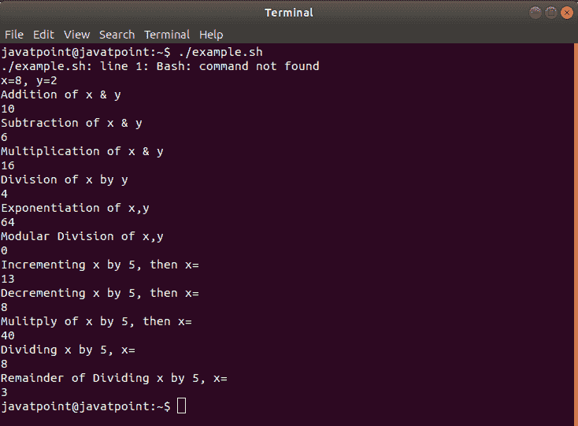

# Bash 算术运算符

> 原文：<https://www.javatpoint.com/bash-arithmetic-operators>

在本主题中，我们将了解如何在 Bash 中使用算术运算符。

根据我们希望通过脚本得到的结果类型，我们可能需要在某个时候应用算术运算符。像变量一样，它们也相当容易应用。在 bash 脚本中，我们可以对数值执行算术运算以获得所需的结果。

Bash Shell 支持 11 种算术运算符。

请看下表，该表演示了每种算术运算符的语法、描述和示例:

| 操作员 | 描述 | 例子 |
| + | 加法，测量数字(操作数)的加法 | 

```
$(( 10 + 3 )), result=13
```

 |
| - | 减法，测量从第一个操作数减去第二个操作数 | 

```
$(( 10 - 3 )), result=7
```

 |
| * | 乘法，度量操作数的乘法。 | 

```
$(( 10 * 3 )), result=30
```

 |
| / | 除法，度量第一个操作数除以第二个操作数，并返回商。 | 

```
$(( 10 / 3 )), result=3
```

 |
| ** | 求幂，测量第二个操作数的结果，其幂等于第一个操作数的幂。 | 

```
$((  10 ** 3 )), result=1000
```

 |
| % | 模，当第一个操作数除以第二个操作数时测量余数。 | 

```
$(( 10 % 3 )), result=1
```

 |
| += | 用常量增加变量-用于用提供的常量增加第一个操作数的值。 | 

```
x=10
let "x += 3"
echo $x
result=13
```

 |
| -= | 用常量减少变量-用于用提供的常量减少第一个操作数的值。 | 

```
x=10
let "x -= 3"
echo $x
result=7
```

 |
| *= | 变量乘以常数-用于将第一个操作数的值乘以提供的常数。 | 

```
x=10
let "x *= 3"
echo $x
result=30
```

 |
| /= | 变量除以常数-用于计算(变量/常数)的值，并将结果存储回变量。 | 

```
x=10
let "10 /= 3"
echo $x
result=3
```

 |
| %= | 变量除以常数的余数-用于计算(变量%常数)的值并将结果存储回变量。 | 

```
x=10
let "10 %= 3"
echo $x
result=1
```

 |

## 在 Bash 中执行算术运算

有许多选项可以在 bash shell 上执行算术运算。下面给出了一些我们可以用来执行算术运算的选项:

### 双圆括号

双圆括号是在 Bash shell 中执行基本算术运算最简单的机制。我们可以使用这个方法，通过使用带或不带前导$。

**语法**

```

((expression))

```

我们可以采用四种不同的方法来实现所需的目标。请看下面给出的方法，了解如何使用双圆括号机制(**假设我们要将数字 10 和 3** 相加) :

**方法 1**

```

Sum=$((10+3))
echo "Sum = $Sum"

```

**方法二**

```

((Sum=10+3))
echo "Sum = $Sum"

```

**方法 3**

```

Num1=10
Num2=3
((Sum=Num1+Num2))
echo "Sum = $Sum"

```

**方法 4**

```

Num1=10
Num2=3
Sum=$((Num1+Num2))
echo "Sum = $Sum"

```

所有这些方法将提供与以下相同的输出:

```
Sum = 13

```

下面是一个演示在 Bash shell 脚本中使用双括号进行算术运算的示例:

**痛击脚本**

```

#!/bin/bash

x=8
y=2
echo "x=8, y=2"
echo "Addition of x & y"
echo $(( $x + $y ))
echo "Subtraction of x & y"
echo $(( $x - $y ))
echo "Multiplication of x & y"
echo $(( $x * $y ))
echo "Division of x by y"
echo $(( $x / $y ))
echo "Exponentiation of x,y"
echo $(( $x ** $y ))
echo "Modular Division of x,y"
echo $(( $x % $y ))
echo "Incrementing x by 5, then x= "
(( x += 5 )) 
echo $x
echo "Decrementing x by 5, then x= "
(( x -= 5 ))
echo $x
echo "Multiply of x by 5, then x="
(( x *= 5 ))
echo $x
echo "Dividing x by 5, x= "
(( x /= 5 ))
echo $x
echo "Remainder of Dividing x by 5, x="
(( x %= 5 ))
echo $x

```

**输出**



### 让建筑

Let 是 Bash 的内置命令，允许我们执行算术运算。它遵循基本格式:

**语法**

```

let <arithmetic expression>

```

下面给出了一个例子，解释如何在 Bash 脚本中使用 let 命令:

**Bash 脚本**

```

#!/bin/bash

x=10
y=6
z=0
echo "Addition"
let "z = $(( x + y ))"
echo "z= $z"

echo "Substraction"
let "z = $((x - y ))"
echo "z= $z"

echo "Multiplication"
let "z = $(( x * y ))"
echo "z = $z"

echo "Division"
let "z = $(( x / y ))"
echo "z = $z"

echo "Exponentiation"
let "z = $(( x ** y ))"
echo "z = $z"

echo "Modular Division"
let "z = $(( x % y ))"
echo "z = $z"

let "x += 5"
echo "Incrementing x by 5, then x= "
echo $x

let "x -= 5"
echo "Decrementing x by 5, then x= "
echo $x

let "x *=5"
echo "Multiply of x by 5, then x="
echo $x

let "x /= 5"
echo "Dividing x by 5, x= "
echo $x

let "x %= 5"
echo "Remainder of Dividing x by 5, x="
echo $x

```

**输出**


### 倒勾

在 bash 脚本中，也可以使用**倒勾**和 expr(称为通用表达式计算器)来执行算术扩展。“expr”类似于“let”，但它不会将结果保存到变量中。它直接打印结果。与 let 不同，我们不需要将表达式括在引号内。我们需要在表达式的各项之间使用空格。需要注意的是，我们应该在命令替换中使用“expr”来将输出保存到变量中。

我们也可以使用不带“倒勾”的“expr”。

**语法**

```

`expr item1 operator item2`
or
expr item1 operator item2

```

下面给出了一个例子，解释如何在 Bash 脚本中使用倒勾和 expr:

**Bash 脚本程序**

```

#!/bin/bash
#Basic arithmetic using expr

echo "a=10, b=3"
echo "c is the value of addition c=a+b"
a=10
b=3
echo "c= `expr $a + $b`"

```

**输出**


## 结论

在本主题中，我们讨论了如何使用算术运算符来执行算术运算。

* * *