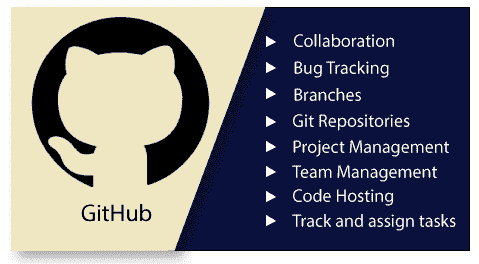

# 什么是 GitHub？

> 原文：<https://www.javatpoint.com/what-is-github>

GitHub 是一个 Git 存储库托管服务。GitHub 还通过它的许多功能提供便利，例如访问控制和协作。它提供了一个基于网络的图形界面。

GitHub 是一家美国公司。它以不同编程语言的形式托管项目的源代码，并跟踪程序员所做的各种更改。

它提供了 Git 的分布式版本控制和源代码管理功能。它还提供了一些协作功能，如错误跟踪、功能请求、每个项目的任务管理。

## GitHub 的特性

GitHub 是程序员和设计师一起工作的地方。他们一起协作、贡献和修复 bug。它拥有大量的开源项目和各种编程语言的代码。

它的一些重要特征如下。

*   合作
*   集成的问题和错误跟踪
*   分支的图形表示
*   Git 存储库托管
*   项目管理
*   小组管理
*   代码宿主
*   跟踪和分配任务
*   会话
*   维基百科

## GitHub 的优势

GitHub 可以分为 Git 和 Hub。GitHub 服务包括访问控制以及协作功能，如任务管理、存储库托管和团队管理。

GitHub 的主要优势如下。

*   通过 GitHub 很容易为开源项目做贡献。
*   它有助于创建一个优秀的文档。
*   你可以通过炫耀你的工作来吸引招聘人员。如果你在 GitHub 上有个人资料，你被招募的几率会更高。
*   它能让你的作品展现在公众面前。
*   您可以跨版本跟踪代码中的更改。

* * *