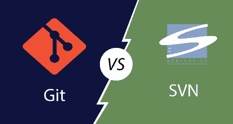

# 去 vs SVN

> 哎哎哎:# t0]https://www . javatppoint . com/git-vs-SVN

Apache Subversion 或 **SVN 是最流行的集中式版本控制系统之一**。现在，SVN 的受欢迎程度在下降，但仍有数百万个项目存储在其中。它可以继续由开源社区积极维护。在 SVN，您可以签出该存储库的单个版本。它将数据存储在中央服务器中。SVN 的缺点是，它有一个本地存储库的整个历史，这限制了你。您只能进行提交、区分、日志、分支、合并、文件注释等操作。

而 **Git 是一个流行的分布式版本控制系统**，这意味着你可以克隆你的存储库。这样你就可以得到一份你整个项目历史的完整拷贝。这意味着您可以访问所有提交。

**Git 比 SVN** 更有优势。对于那些不总是连接到主存储库的开发人员来说，这要好得多。而且，它比 SVN 快得多。

为了更好地理解 Git 和 Subversion 的区别。让我们来看看下面的意义点。

| 饭桶 | 版本控制 |
| 这是一个分布式版本控制系统。 | 这是一个集中式版本控制系统 |
| Git 是一个 SCM(源代码管理)。 | SVN 是版本控制。 |
| Git 有一个克隆的存储库。 | SVN 没有克隆的存储库。 |
| Git 分支工作起来很熟悉。Git 系统有助于快速合并文件，也有助于找到未合并的文件。 | SVN 分支是存储库中的一个文件夹。合并分支需要一些特殊的命令。 |
| Git 没有全局修订号。 | SVN 有一个全球修订号。 |
| Git 具有加密散列的内容，可以保护内容免受由于网络问题或磁盘故障导致的存储库损坏。 | SVN 没有任何加密散列的内容。 |
| Git 将内容存储为元数据。 | SVN 将内容存储为文件。 |
| Git 比 SVN 有更多的内容保护。 | SVN 的内容不如 Git 安全。 |
| Linus Torvalds 为 Linux 内核开发了 git。 | CollabNet 公司开发了 SVN。 |
| Git 是在 GNU(通用公共许可证)下分发的。 | SVN 是在开源许可下发布的。 |

* * *