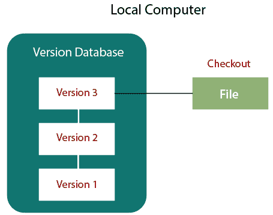
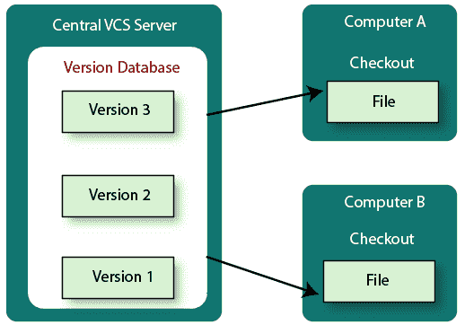
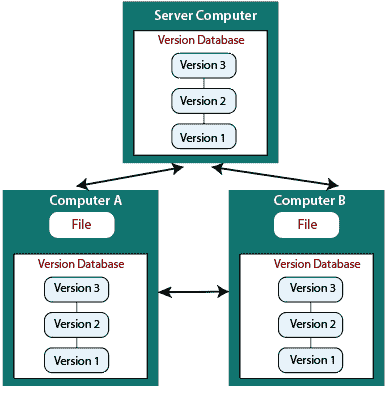

# Git 版本控制系统

> 原文：<https://www.javatpoint.com/git-version-control-system>

版本控制系统是一种软件，它跟踪文件或文件集随时间的变化，以便您可以在以后调用特定的版本。它还允许您与其他程序员一起工作。

版本控制系统是软件工具的集合，帮助团队管理源代码中的更改。它使用一种特殊的数据库来跟踪代码的每次修改。

开发人员可以将早期版本的代码与早期版本的代码进行比较，以修复错误。

## 版本控制系统的优势

版本控制系统在软件开发中非常有用和有益；不使用版本控制开发软件是不安全的。它为不确定性提供了备份。版本控制系统为开发人员提供了一个快速的界面。它还允许软件团队根据团队规模保持效率和敏捷性，以包括更多的开发人员。

版本控制系统的一些主要好处如下。

*   文件的完整更改历史记录
*   同时工作
*   分支和合并
*   可追踪性

## 版本控制系统的类型

*   本地化版本控制系统
*   集中式版本控制系统
*   分布式版本控制系统

### 本地化版本控制系统

本地化版本控制方法是一种常见的方法，因为它简单。但是这种方法导致出错的几率更高。在这种方法中，您可能会忘记自己在哪个目录中，并意外地写入错误的文件或复制您不想要的文件。

为了解决这个问题，程序员开发了具有简单数据库的本地 VCS。这种数据库将文件的所有更改都置于修订控制之下。本地版本控制系统保存文件的本地副本。

本地 VCS 的主要缺点是它只有一个失败点。

### 集中式版本控制系统

开发人员需要在其他系统上与其他开发人员协作。在这种情况下，本地化版本控制系统失败。为了解决这个问题，开发了集中式版本控制系统。

这些系统有一个包含版本化文件的服务器，以及一些从中心位置签出文件的客户端。

集中式版本控制系统有很多好处，尤其是相对于本地 VCS。

*   系统中的每个人都有关于其他人在项目中所做工作的信息。
*   管理员可以控制其他开发人员。
*   与本地化版本控制系统相比，处理集中式版本控制系统更容易。
*   本地版本控制系统有助于存储和管理不同版本文件的服务器软件组件。

它也有与本地版本控制系统相同的缺点，即它也有单点故障。

### 分布式版本控制系统

集中式版本控制系统使用中央服务器来存储所有数据库和团队协作。但是由于单点故障，也就是中央服务器的故障，开发者并不喜欢。接下来，开发了分布式版本控制系统。

在分布式版本控制系统(如 Git、Mercurial、Bazaar 或 Darcs)中，用户拥有一个存储库的本地副本。因此，客户端不仅可以检查文件的最新快照，甚至可以完全镜像存储库。本地存储库包含主存储库中的所有文件和元数据。

DVCS 允许自动管理分支和合并。除了推拉之外，它加快了大多数操作的速度。DVCS 增强了脱机工作的能力，并且不依赖单一位置进行备份。如果任何服务器停止运行，其他系统通过它进行协作，那么任何客户端存储库都可以由该服务器恢复。每次签出都是所有数据的完整备份。

这些系统不一定依赖中央服务器来存储项目文件的所有版本。

## 集中式版本控制系统与分布式版本控制系统的区别

集中式版本控制系统是使用**客户端/服务器**架构的系统。在集中式版本控制系统中，一个或多个客户端系统直接连接到中央服务器。相反，分布式版本控制系统是使用**点对点**架构的系统。

使用这两种版本控制系统有很多好处和缺点。让我们来看看集中式和分布式版本控制系统之间的一些显著差异。

| 集中式版本控制系统 | 分布式版本控制系统 |
| 在 CVCS，存储库放在一个地方，向许多客户提供信息。 | 在 DVCS，每个用户都有一个存储库的本地副本来代替服务器端的中央存储库。 |
| 它基于客户机-服务器方法。 | 它基于客户机-服务器方法。 |
| 它是基于中央存储库概念的最简单的系统。 | 它是灵活的，并且随着每个人都有自己的存储库的概念而出现。 |
| 在 CVCS，服务器向全球所有客户端提供最新代码。 | 在 DVCS，每个用户都可以查看代码的快照，并且他们可以完全镜像中央存储库。 |
| CVCS 易于管理，并且可以从一个地方控制用户和服务器的访问。 | 与 CVCS 相比，DVCS 速度很快，因为您不必为每个命令与中央服务器交互。 |
| CVCS 流行的工具是 **SVN** (颠覆)和 **CVS** 。 | DVCS 流行的工具是 **Git** 和 **Mercurial** 。 |
| CVCS 对初学者来说很容易理解。 | DVCS 对初学者来说有一些复杂的过程。 |
| 如果服务器出现故障，任何系统都无法从另一个系统访问数据。 | 如果任何服务器出现故障，而其他系统通过它进行协作，则该服务器可以恢复任何客户端存储库 |

* * *