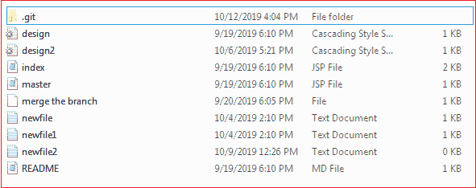

# 去吧，林特克

> 哎哎哎:# t0]https://www . javatppoint . com/git-init

git init 命令是您将在 git 上运行的第一个命令。git init 命令用于创建一个新的空白存储库。它用于将现有项目作为 Git 项目。几个 Git 命令在存储库内部运行，但是 init 命令可以在存储库外部运行。

git init 命令在当前工作目录中创建一个. git 子目录。这个新创建的子目录包含所有必要的元数据。这些元数据可以分为对象、引用和临时文件。它还为存储库的主分支初始化一个 HEAD 指针。

## 创建第一个存储库

Git 版本控制系统允许你在开发者之间共享项目。对于学习 Git 来说，理解如何在 Git 上创建一个项目是至关重要的。存储库是包含所有项目相关数据的目录。单个存储库中也可以有多个项目。

我们可以为空白和现有项目创建一个存储库。让我们了解如何创建一个存储库。

### 为空白(新)项目创建存储库:

要创建一个空白存储库，请在所需的目录中打开命令行，并按如下方式运行 init 命令:

```

$ git init

```

上面的命令将创建一个空的。git 存储库。假设我们想在桌面上创建一个 git 存储库。为此，在桌面上打开 Git Bash 并运行上面的命令。考虑以下输出:


上述命令将初始化一个**。git** 桌面上的储存库。现在，我们可以在这个存储库中创建和添加文件以进行版本控制。

要创建文件，请按如下方式运行 cat 或 touch 命令:

```

$ touch <file Name>

```

要将文件添加到存储库中，请运行 git add 命令，如下所示:

```

$ git add <file name>

```

了解更多关于 git add 命令的信息，请访问 Git Add。

### 为现有项目创建存储库

如果你想在一个版本控制系统上共享你的项目，并且用 git 控制它，那么，浏览你的项目目录，在这里启动 Git 命令行(Git Bash for Windows)。要初始化新的存储库，请运行以下命令:

**语法:**

```

$ git init

```

**输出:**


以上命令将创建一个名为**的新子目录。git** 保存所有必要的存储库文件。那个。git 子目录可以理解为 Git 存储库骨架。请看下图:



一个空仓库。git 被添加到我现有的项目中。如果我们想开始对现有文件进行版本控制，我们必须用 git add 命令跟踪这些文件，然后提交。

我们可以通过 git status 命令列出所有未跟踪的文件。

```

$ git status  

```

考虑以下输出:


在上面的输出中，git status 命令显示了所有未跟踪文件的列表。要了解更多关于状态命令的信息，请访问 [Git Status](https://www.javatpoint.com/git-status) 。

我们可以通过 Git Add 命令跟踪所有未跟踪的文件。

### 一起创建存储库和目录

git init 命令允许我们一起创建一个新的空白存储库和一个目录。空存储库。git 是在目录下创建的。假设我想用一个项目名创建一个空白的存储库，那么我们可以通过 git init 命令来实现。考虑以下命令:

```

$ git init NewDirectory

```

上面的命令将创建一个空的。git 存储库位于名为**的新目录**下。考虑以下输出:


在上面的输出中，创建了目录和存储库。

因此，我们可以使用 git init 命令创建一个存储库。另外两个命令从 git 开始很方便。它们是 [Git Add](https://www.javatpoint.com/git-add) ，和 [Git commit](https://www.javatpoint.com/git-commit) 。

另外，查看存储库的各种操作，参见 [Git 存储库](https://www.javatpoint.com/git-repository)。

* * *