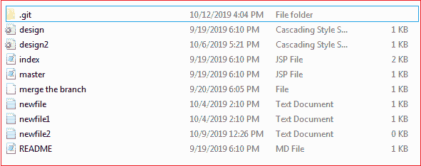
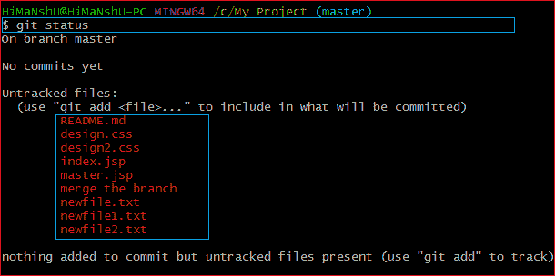
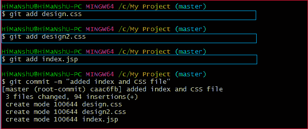

# Git 存储库

> 原文：<https://www.javatpoint.com/git-repository>

在 Git 中，存储库就像 VCS 用来存储一组文件和目录的元数据的数据结构。它包含文件的集合以及对这些文件所做更改的历史记录。Git 中的存储库被认为是您的项目文件夹。存储库拥有所有与项目相关的数据。不同的项目有不同的存储库。

## 获取 Git 存储库

有两种方法可以获得存储库。它们如下:

*   创建一个本地存储库，并将其作为 Git 存储库。
*   克隆远程存储库(已存在于服务器上)。

无论是哪种情况，您都可以开始使用 Git 存储库。

## 初始化存储库

如果你想在版本控制系统上共享你的项目，并且用 Git 控制它。然后，浏览您的项目目录，并在这里启动 git 命令行(适用于 Windows 的 Git Bash)。要初始化新的存储库，请运行以下命令:

**语法:**

```

$ git init

```

**输出:**


上面的命令将创建一个名为。保存所有必需的存储库文件的 git。**。git** 子目录可以理解为一个 git 存储库骨架。请考虑下图:



一个空仓库。git 被添加到我现有的项目中。如果我们想开始对现有文件进行版本控制，我们应该用 git add 命令跟踪这些文件，然后提交。

我们可以通过 git status 命令列出所有未跟踪的文件。

```

$ git status

```

考虑以下输出:



在上面的输出中，git status 命令显示了所有未跟踪文件的列表。为了在版本控制系统上共享这些文件，我们必须用 git add 命令跟踪它，然后提交。要跟踪文件，操作 git add 命令如下:

**语法:**

```

$ git add <filename>

```

要提交文件，请执行 git 提交命令，如下所示:

```

$ git commit -m "Commit message."

```

**输出:**



在上面的输出中，我通过 git add 命令添加了三个现有的文件，并提交给共享。

我们还可以创建新文件。要共享新文件，请按照上述相同的步骤操作；添加并提交以供共享。现在，您可以共享一个存储库。

## 克隆现有存储库

我们可以克隆现有的存储库。假设我们在一个版本控制系统上有一个存储库，比如 subversion、GitHub 或任何其他远程服务器，我们希望与某个人共享它来做出贡献。git clone 命令将为任何用户创建一个副本。

我们可以用 git clone 命令从服务器获取几乎所有的数据。可以通过以下方式完成:

**语法:**

```

$ git clone <Repository URL>

```

假设我的一个朋友在我的 GitHub 账号上有一个存储库，我想贡献给它。所以我要做的第一件事，把这个项目复制到我的本地系统中，以获得更好的工作界面。克隆存储库网址所需的基本元素。我有一个存储库网址“[https://github.com/ImDwivedi1/Git-Example](https://github.com/ImDwivedi1/Git-Example)”。要克隆此存储库，请按如下方式操作克隆命令:

```

$ git clone https://github.com/ImDwivedi1/Git-Example

```

考虑以下输出:


在上面的输出中，存储库 Git-Example 已经被克隆。现在，这个存储库在您的本地存储上可用。您可以提交它，并通过在远程服务器上推送它来为项目做出贡献。

单个存储库可以被克隆任意多次。因此，我们可以在不同的位置和不同的系统上克隆存储库。

欲了解更多关于 Git 克隆的信息，请点击此处

* * *