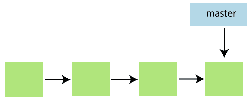
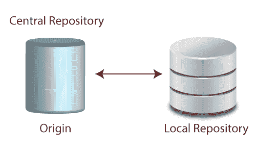

# Git 原产地大师

> 原文：<https://www.javatpoint.com/git-origin-master>

术语“git origin master”用于远程存储库的上下文中。它用于处理远程存储库。术语“起源”来源于存储库原件所在的位置，主代表主分支。让我们详细了解这两个术语。

## Git Master

Master 是 Git 分支的命名约定。这是 Git 的默认分支。从远程服务器克隆项目后，生成的本地存储库只包含一个本地分支。这个分支叫做“主”分支。这意味着“主”是存储库的“默认”分支。



在大多数情况下，主分支被称为主分支。主分支被认为是回购的最终视图。本地存储库的主分支总是与远程存储库的主分支保持同步。

不要惹主人。如果您编辑了组项目的主分支，您的更改将影响其他所有人，并且很快会出现合并冲突。

## 去吧，Origin

在 Git 中，术语起源指的是您想要发布提交的远程存储库。默认的远程存储库被称为**原点**，尽管您可以同时使用多个具有不同名称的远程。据说是系统的别名。



原点是项目最初被克隆的远程存储库的简称。它被用来代替原始的存储库网址。因此，它使得引用更加容易。

起源只是一个标准惯例。尽管保持这个约定不变是很重要的，但是您可以在不损失任何功能的情况下对它进行理想的重命名。

在以下示例中，URL 参数充当克隆的本地存储库的“克隆”命令的来源:

```

$ git clone https://github.com/ImDwivedi1/Git-Example

```

术语“原点”和“主”被广泛使用的一些命令如下:

*   Git 推送原点主文件
*   Git 拉原点主

Git 有两种类型的分支，称为本地分支和远程分支。要使用 git 拉和 git 推，您必须告诉您的本地分支机构哪个分支机构将运行。因此，术语“源主”用于处理远程存储库和主分支。术语**推原点主**用于将更改推送到远程存储库。术语**拉原点主**用于从远程到本地访问存储库。

* * *