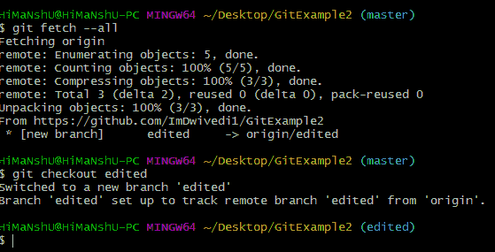

# Git 签出

> 原文：<https://www.javatpoint.com/git-checkout>

在 Git 中，术语 checkout 用于在目标实体的不同版本之间切换的行为。 **git checkout** 命令用于在存储库中的分支之间切换。在分支之间切换时，请小心您的暂存文件和提交。


git checkout 命令操作三个不同的实体，即文件、提交和分支。有时这个命令会很危险，因为这个命令没有撤消选项。

它检查分支并更新工作目录中的文件以匹配该分支中已经可用的版本，并将更新转发给 Git 以保存该分支中的所有新提交。

## Git 结账操作

我们可以通过 git checkout 命令执行许多操作，比如切换到一个特定的分支，创建一个新的分支，签出一个远程分支，等等。 **git 分支**和 **git 结账**命令可以集成。

## 结账处

您可以通过执行 git branch 命令并切换到指定的分支来演示如何查看可用分支的列表。

要演示存储库中的可用分支，请使用以下命令:

```

$ git branch

```

现在，您有了可用分支的列表。要在分支之间切换，请使用下面的命令。

**语法:**

```

$ git checkout <branchname>

```

**输出:**


正如您在给定的输出中看到的，主分支已经切换到测试分支。

## 创建和切换分支

git checkout 命令允许您创建并切换到一个新的分支。您不仅可以创建一个新分支，还可以通过一个命令同时切换它。git checkout -b 选项是一个便利标志，在运行 git checkout <new-branch>之前执行运行 git 分支<new-branch>操作。</new-branch></new-branch>

**语法:**

```

$ git checkout -b <branchname>

```

**输出:**


正如您在给定输出中看到的，分支 3 是从主分支创建和切换的。

## 签出远程分支

Git 允许您通过 git checkout 命令签出远程分支。这是程序员访问同事或合作者的工作进行审阅和协作的一种方式。每个远程存储库都包含自己的一组分支。因此，要检出一个远程分支，您必须首先获取该分支的内容。

```

$ git fetch --all

```

在最新版本的 Git 中，您可以像检查本地分支一样检查远程分支。

**语法:**

```

$ git checkout <remotebranch>

```

**输出:**



在上面的输出中，首先，执行 fetch 命令来获取远程数据；之后，执行 checkout 命令来签出远程分支。

编辑是我的远程分支。在这里，我们已经通过 git 命令行从主分支切换到编辑分支。

Git 的早期版本需要基于远程创建一个新的分支。在早期版本中，下面的命令用于检出远程分支。

```

$ git checkout <remotebranch> origin/<remotebranch>

```

* * *