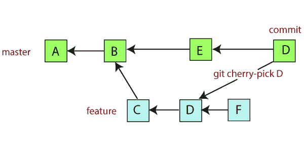
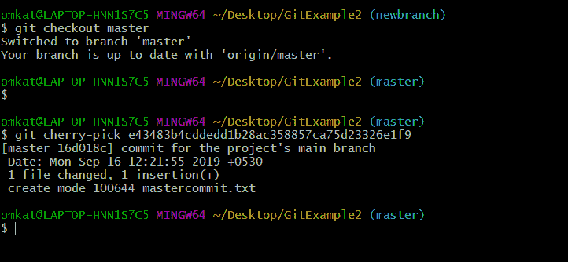

# Git 樱桃采摘

> 原文：<https://www.javatpoint.com/git-cherry-pick>

Git 中的 Cherry-picking 表示将某个提交从一个分支应用到另一个分支。以防你犯了一个错误，犯了一个错误的分支，但不想合并整个分支。您可以恢复提交并将其应用于另一个分支。



挑选的主要动机是应用一些现有提交引入的更改。精选查看存储库历史中的前一次提交，并将上次提交中的更改更新到当前工作树。定义是直截了当的，然而当有人试图从一个提交中挑选，甚至从另一个分支中挑选时，它就更复杂了。

摘樱桃是一个有用的工具，但总是不是一个好的选择。它可能会导致重复提交和一些其他场景，在这些场景中，首选其他合并而不是挑选。在某些情况下，它是一个有用的工具。与**合并**、**重编**命令等不同方式形成对比。合并和重定基础通常可以在另一个分支中应用许多提交。

## 为什么要摘樱桃

假设您正在与一个开发团队合作进行一个大中型项目。另一个团队成员提出的一些更改，您希望将其中一些应用于您的主项目，而不是全部。因为管理几个 Git 分支之间的更改可能会成为一项复杂的任务，并且您不想将一个完整的分支合并到另一个分支中。您只需要选择一两个特定的提交。从其他分支中挑选一些变化到你的主要项目分支中，这叫做樱桃采摘。

**一些可以摘樱桃的场景:**

**场景 1:在错误的分支中意外提交。**

Git cherry-pick 有助于应用在错误分支中意外进行的更改。假设我想在主分支中进行提交，但由于错误，我们在任何其他分支中都进行了提交。请参见下面的提交。


在上面的例子中，我想提交主分支，但是不小心在新分支中提交了。为了将新分支的所有更改都放入主分支，我们将使用 git pull，但是对于这个特定的提交，我们将使用 git cherry-pick 命令。请参见以下输出:


在给定的输出中，我使用了 git 日志命令来检查提交历史。复制您想要在主分支上进行的特定提交 id。现在转到主枝，在那里采摘。请参见以下输出:

**语法:**

```

$ git cherry-pick <commit id>

```

**输出:**



从给定的输出中，您可以看到我已经用 git cherry-pick 命令粘贴了提交 id，并将其提交到我的主分支中。您可以通过 git 日志命令来检查它。

**场景 2:做出了另一个团队成员提出的变更。**

挑选樱桃的另一个用途是做出另一个团队成员提议的改变。假设我的一个团队成员在主项目中做了任何更改，并建议将其用于主项目。你可以在复习后愉快地挑选它。

## 樱桃核的用途

*   是**团队协作**的得心应手的工具。
*   在 **bug 修复**的情况下是必要的，因为 bug 是在开发分支中用它们的提交来修复和测试的。
*   它主要用于**撤销更改和恢复丢失的提交**。
*   您可以通过使用 git cherry-pick 而不是其他选项来避免无用的冲突。
*   当由于不同分支中的版本不兼容而无法进行完全分支合并时，它是一个有用的工具。
*   git cherry-pick 用于访问引入到子分支的更改，而不更改分支。

* * *