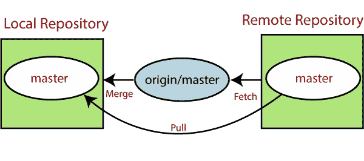
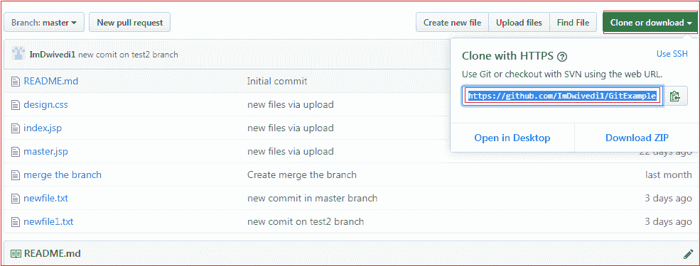
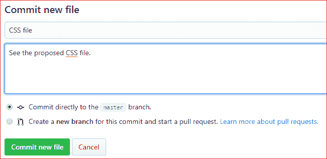
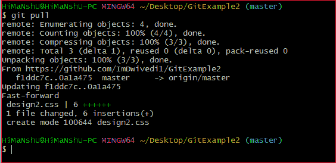
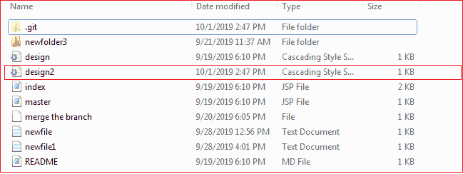
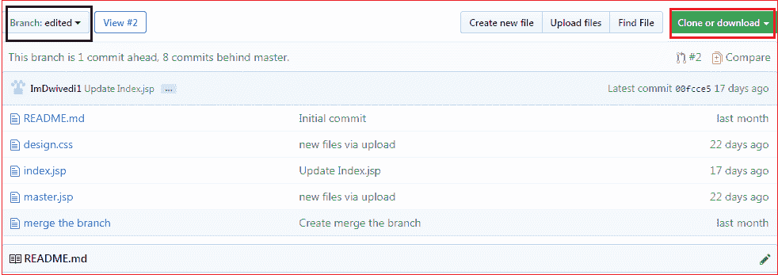
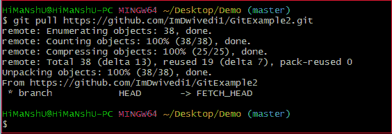
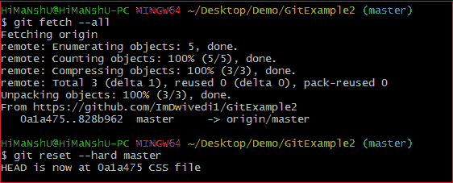
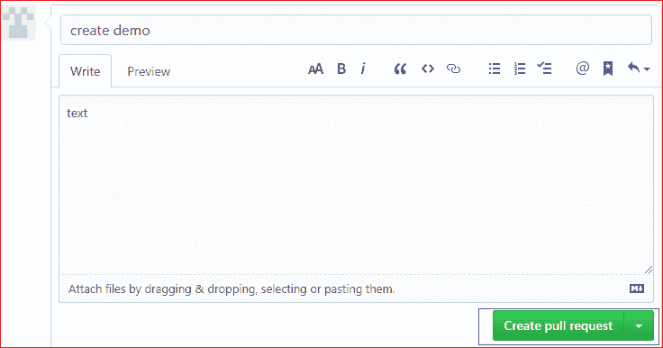

# Git 拉/拉请求

> 原文：<https://www.javatpoint.com/git-pull>

术语 pull 用于从 GitHub 接收数据。它从远程服务器获取更改并将其合并到您的工作目录中。 **git 拉取命令**用于拉取存储库。



拉取请求是开发人员通知团队成员他们已经完成了一个特性的过程。一旦他们的功能分支准备好了，开发人员通过他们的远程服务器帐户提交一个拉取请求。Pull request 通知所有团队成员，他们需要检查代码并将其合并到主分支中。

下图演示了拉操作在不同位置之间的作用，以及它与其他相关命令的相似或不同之处。


## “git pull”命令

pull 命令用于访问从远程存储库到本地存储库的更改(提交)。它用远程跟踪分支更新本地分支。远程跟踪分支是已经被设置为从远程存储库中推送和拉取的分支。通常，它是提取和合并命令的集合。首先，它从远程获取更改，并将其与本地存储库结合起来。

git pull 命令的语法如下:

**语法:**

```

$ git pull <option> [<repository URL><refspec>...]

```

其中:

**<选项> :** 选项为命令；这些命令在特定命令中用作附加选项。选项可以是 **-q** (安静)、 **-v** (啰嗦)、 **-e** (编辑)等等。

**<存储库网址> :** 存储库网址是您的远程存储库的网址，您已经在其中存储了您的原始存储库，如 GitHub 或任何其他 git 服务。此网址看起来像:

```

https://github.com/ImDwivedi1/GitExample2.git

```

要访问此网址，请转到您在 GitHub 上的帐户，并选择您想要克隆的存储库。之后，点击仓库菜单中的**克隆**或**下载**选项。将打开一个新的弹出窗口，从可用选项中选择**用 https 克隆选项**。请看下面的截图:



复制突出显示的网址。此网址用于克隆存储库。

**<引用规范> :** 引用是指提交，例如头(分支)、标签和远程分支。您可以在**查看头像、标签和远程存储库。本地存储库中的 git/ref** 目录。**参考规范**指定并更新参考。

**如何使用拉:**

了解它是如何工作的以及如何使用它是至关重要的。让我们举一个例子来了解它是如何工作的以及如何使用它。假设我在 GitExample2 项目的远程存储库中添加了一个新文件，比如 **design2.css** 。

要先创建文件，请转到在存储库子功能中给出的创建文件选项。之后，选择文件名并根据需要编辑文件。请看下图。


转到页面底部，选择提交消息和文件描述。选择是要创建新分支还是直接在主分支中提交。请考虑下图:



现在，我们已经成功地提交了变更。

要在本地存储库中提取这些更改，请对克隆的存储库执行 git 提取操作。拉命令有许多特定的选项。让我们来看看它的一些用法。

## 默认 git 拉取:

我们可以通过使用 git pull 命令来拉一个远程存储库。这是默认选项。git 拉取的语法如下:

**语法:**

```

$ git pull

```

**输出:**



在给定的输出中，通过 git pull 命令获取存储库中新更新的对象。这是 git pull 命令的默认版本。它将更新本地存储库中新创建的文件 **design2.css** 文件和相关对象。见下图。



正如您在上面的输出中看到的，design2.css 文件被添加到本地存储库中。git 拉指令相当于 **git 取原点头**和 **git 合并头**。头部被称为当前分支的引用。

## Git 拉式远程分支

Git 允许获取特定的分支。获取远程分支是一个类似的过程，如上所述，在 **git pull 命令**中。唯一的区别是我们必须复制我们想要拉的特定分支的网址。为此，我们将选择一个特定的分支。请参见下图:



在上面的截图中，我已经选择了我的名为**的分支编辑了**来复制被编辑的分支的网址。现在，我将从编辑过的分支中提取数据。以下命令用于拉动远程分支:

**语法:**

```

$ git pull <remote branch URL>

```

**输出:**



在上面的输出中，编辑的远程分支**已经复制。**

 **## Git 力拉

Git force pull 允许不惜任何代价来拉你的存储库。假设以下场景:

如果您在本地更新了任何文件，并且其他团队成员在远程更新了该文件。那么，您什么时候获取存储库，这可能会产生冲突。

我们可以说**强制拉**是用来覆盖文件的。如果我们想放弃本地存储库中的所有更改，那么我们可以通过有影响地拉动它来覆盖它。考虑以下流程来强制拉取存储库:

**步骤 1:** 使用 git fetch 命令从远程下载最新更新，无需合并或重定基础。

```

$ git fetch -all

```

**步骤 2:** 使用 git reset 命令用您从远程获取的更新重置主分支。硬选项用于使用远程存储库强制更改本地存储库中的所有文件。

```

$ git reset -hard <remote>/<branch_name>
$ git reset-hard master

```

考虑以下输出:



在上面的输出中，我更新了我的 design2.css 文件，并强制将其拉入存储库。

## Git 拉原点主

还有另一种方法可以提取存储库。我们可以使用 **git pull** 命令来拉存储库。语法如下:

```

$ git pull <options><remote>/<branchname>
$ git pull origin master

```

在上面的语法中，术语**原点**代表远程存储库所在的存储库位置。**大师**被认为是项目的主要分支。

考虑以下输出:


它将使用远程存储库覆盖本地存储库的现有数据。

您可以检查存储库的远程位置。要检查存储库的远程位置，请使用以下命令:

```

$ git remote -v

```

给定的命令将导致如下的远程位置:

```

origin  https://github.com/ImDwivedi1/GitExample2 (fetch)
origin  https://github.com/ImDwivedi1/GitExample2 (push)

```

输出显示获取和推送两个位置。请考虑下图:


## Git 拉取请求

拉取请求允许您宣布您在分支机构所做的更改。一旦拉取请求被打开，您就可以交谈和查看其他人所做的更改。它允许在合并到主分支之前检查提交。

拉取请求是在 GitHub 项目中提交变更时创建的，您希望它被其他成员审查。您可以将更改提交到新分支或现有分支中。

一旦创建了拉请求，就可以从分支推送提交，将它们添加到现有的拉请求中。

### 如何创建拉取请求

要创建拉请求，您需要创建一个文件并将其作为新的分支提交。正如我们在本主题前面提到的，如何提交文件来使用 git pull。选择选项“**为此提交创建一个新分支，并从页面底部开始一个拉取请求**”。给出新分支的名称。选择页面底部的**提议新文件**选项。请看下图。


在上图中，我选择了所需的选项，并将文件命名为 **PullRequestDemo** 。选择建议新文件的选项。它将打开新的一页。选择选项**创建拉取请求**。请看下图:



现在，拉取请求由您创建。人们可以看到这个要求。他们可以通过选择一个合并的拉请求来将这个请求与其他分支合并。

* * ***