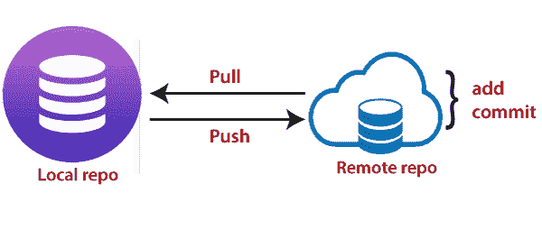
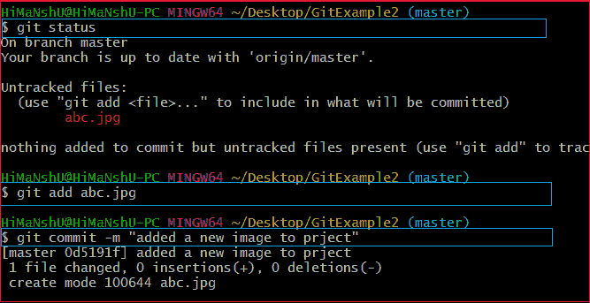
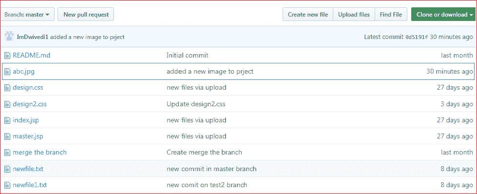
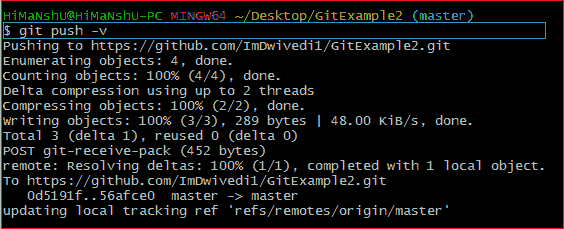

# Git 推送

> 原文：<https://www.javatpoint.com/git-push>

推送术语是指将本地存储库内容上传到远程存储库。推送是将提交从本地存储库转移到远程存储库的行为。推送能够覆盖更改；推的时候要小心。



此外，我们可以说推送用本地引用更新了远程引用。每次您推入存储库时，它都会随着您所做的一些有趣的更改而更新。如果我们不指定一个存储库的位置，那么它会推到**原点主**的默认位置。

“git push”命令用于推入存储库。push 命令可以被视为在本地和远程存储库之间传输提交的工具。基本语法如下:

```

$ git push <option> [<Remote URL><branch name><refspec>...]

```

Push 命令支持许多附加选项。推送标签下的一些选项如下。

## Git 推送标签

**<存储库> :** 存储库是推送操作的目的地。它可以是网址，也可以是远程存储库的名称。

**< refspec > :** 它指定更新源对象的目标引用。

**- all:** 单词“all”代表所有分支。它推动所有的分支。

**-修剪:**删除没有本地对应的远程分支。意思是，如果你有一个远程分支比如 demo，如果这个分支在本地不存在，那么它就会被删除。

**-镜像:**用于将存储库镜像到远程。更新或新创建的本地参照将被推送到远端。它可以在远程端强制更新。删除的参照将从远端移除。

**-试运行:**试运行测试命令。除了最初更新存储库之外，它做了所有这些。

**-标签:**推送所有本地标签。

**-删除:**删除指定的分支。

**-u:** 它创建一个上游跟踪连接。如果你打算第一次推树枝，那就非常有用了。

## Git 推送原点主文件

Git push origin master 是一个特殊的命令行实用程序，用于指定远程分支和目录。当您有多个分支和目录时，这个命令可以帮助您确定主分支和存储库。

一般术语**原点代表**代表远程存储库，master 被认为是主分支。所以，整个声明“ **git 推原点主**”将本地内容推送到了远程位置的主分支上。

**语法:**

```

$ git push origin master

```

让我们用一个例子来理解这个说法。

让我们对我现有的存储库进行新的提交，比如 **GitExample2** 。我已经将一个名为**abc.jpg**的图像添加到我的本地存储库中，并提交了更改。请看下图:

在上面的输出中，我将一张图片附加到了我的本地存储库中。git status 命令用于检查存储库的状态。git 状态命令将按如下方式执行:

```

$ git status

```

它显示未跟踪图像**abc.jpg**的状态。现在，添加图像并提交更改，如下所示:

```

$ git add abc.jpg
$git commit -m "added a new image to project." 

```

图像在本地存储库中被完全跟踪。现在，我们可以把它推给起源大师作为:

```

$ git push origin master

```

**输出:**


文件**abc.jpg**成功推送到原点主。我们可以在远处追踪它。我已将这些更改推送到我的 GitHub 帐户。我可以在我的仓库里找到它。请考虑下图:



在上面的输出中，推送的文件 abc.jpg 被上传到我的 GitHub 帐户的主分支存储库中。

## Git 力推

git force push 允许您将本地存储库推送到远程，而无需处理冲突。它的用法如下:

```

$ git push <remote><branch> -f

```

或者

```

$ git push <remote><branch> -force

```

-f 版本被用作 force 的缩写。远程可以是任何远程位置，如 GitHub、Subversion 或任何其他 git 服务，分支是一个特定的分支名称。例如，我们可以使用 git push origin master -f。

我们也可以省略这个命令中的分支。该命令将按如下方式执行:

```

$git push <remote> -f

```

我们可以省略远程和分支。当远程和分支都被忽略时，默认行为由 git config 的 **push.default** 设置决定。该命令将按如下方式执行:

```

$ git push -f

```

### 如何安全地强制推送存储库:

强制推送一个存储库有几个后果，比如它可能会取代您想要保留的工作。如果远程服务器上有您没有预料到的新提交，使用租约选项强制推送会导致推送失败。如果我们用 git 来表示，那么我们可以说，如果远程包含未跟踪的提交，它将使它失败。它可以执行为:

```

$git push <remote><branch> --force-with-lease	

```

## Git 推送-v/ -详细

v 代表动词。它口头运行命令。它推送了存储库，并给出了关于对象的详细解释。假设我们在本地存储库中添加了一个 **newfile2.txt** 并提交它。现在，当我们在远程推送时，它会给出比默认 git 推送更多的描述。推送的语法如下:

**语法:**

```

$ git push -v

```

或者

```

$ git push --verbose

```

考虑以下输出:



如果我们将上面的输出与默认的 git 选项进行比较，我们可以看到 git verbose 给出了描述性的输出。

## 删除远程分支

我们可以使用 git push 删除远程分支。它允许从命令行删除远程分支。要删除远程分支，请执行以下命令:

**语法:**

```

$ git push origin -delete edited

```

**输出:**


在上面的输出中，git push origin 命令与-delete 选项一起用于删除远程分支。我已经从存储库中删除了我的远程分支**编辑的**。请考虑下图:


它是操作命令之前我的远程存储库的活动分支列表。


上图显示了删除命令后的活动分支列表。在这里，可以看到编辑的分支**已经从存储库中移除。**

* * *