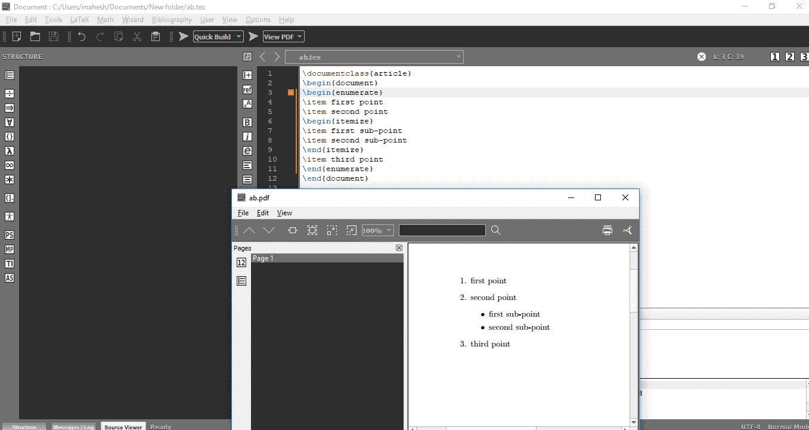
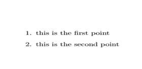
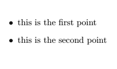
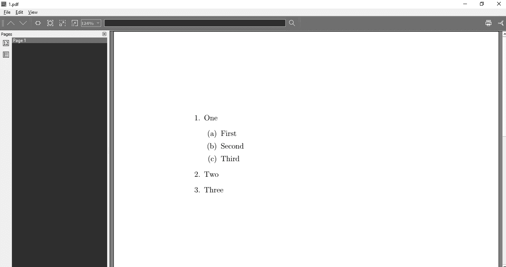
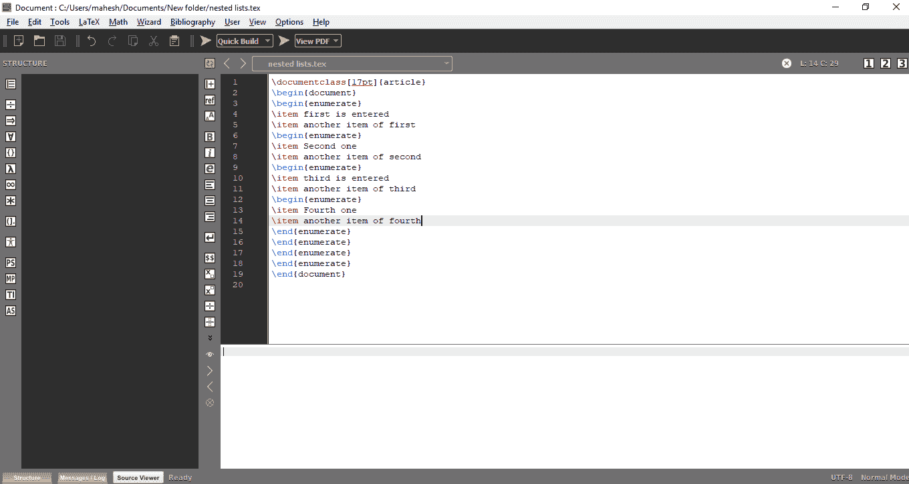
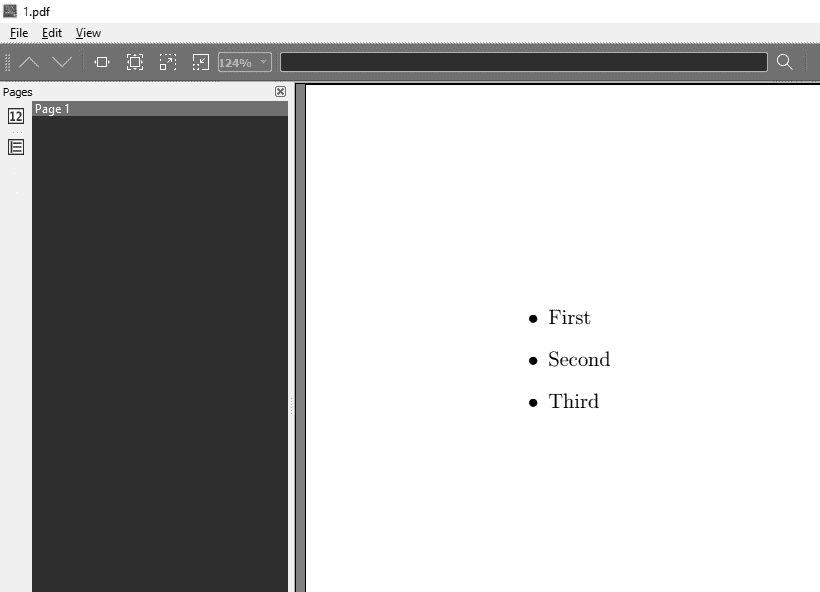
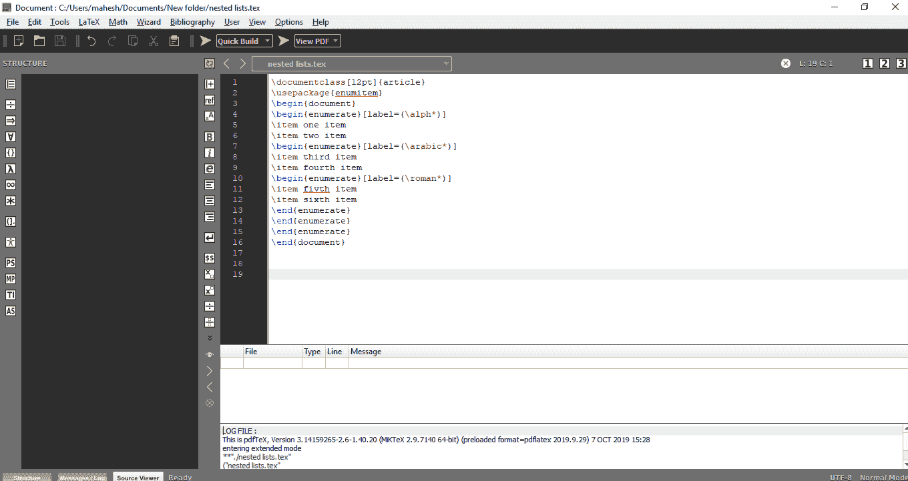
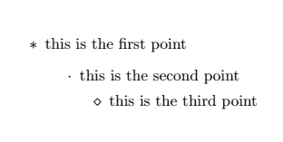
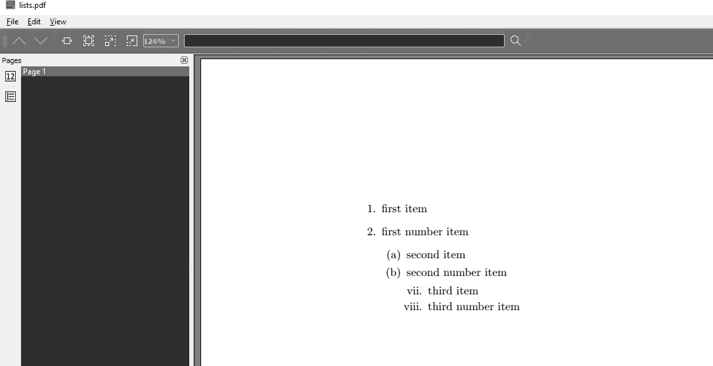

# LATEX列表

> 原文：<https://www.javatpoint.com/latex-lists>

Latex 列表用于添加任何附加包。有三种类型的列表。一个是**枚举**列表，产生编号列表。第二个是**分项**，用于项目符号列表。第三个是**描述列表**，既没有项目符号也没有编号。在 Latex 中，每个列表由**\项**定义。通过这种方法，也可以创建子列表。

列表示例如下所示:

```

\begin{enumerate} 
\item first point
\item second point
\begin{itemize}
\item first sub-point
\item second sub-point
\end{itemize}
\item third point
\end{enumerate}

```

其输出如下图所示:



## 1.列举

它用于创建编号列表。

枚举列表的简单代码如下所示:

```

\documentclass{article}
\begin{document}
\begin{enumerate}
\item this is the first point
\item this is the second point
\end{enumerate}
\end{document}

```

输出如下图所示:



## 2.详细列举

它用于创建未编号的列表。示例如下:

```

\documentclass{article}
\begin{document}
\begin{itemize}
\item this is the first point
\item this is the second point
\end{itemize}
\end{document}

```

输出如下图所示:



## 3.描述

描述列表最不为人知。当您需要解释术语或符号时，会用到它。描述列表的程序或代码如下所示:

```

\documentclass{article}
\begin{document}
\begin{description}
\item[Chemistry] the study of behavior of elements and compounds
\item[History] the study of past
\item[Geology] the study of the solid Earth
\end{description}
\end{document}

```

输出如下图所示:


## 嵌套列表

对于以上所有列表，**嵌套列表**用于创建不同的环境。这也意味着可以为列表中的一个项目创建一个子列表。层数的最大深度为四层。嵌套列表的示例如下所示:

```

\documentclass[12pt]{article}
\begin{document}
\begin{enumerate}
\item One
\begin{enumerate}
\item First
\item Second
\item Third
\end{enumerate}
\item Two
\item Three
\end{enumerate}
\end{document}

```

输出如下图所示:



嵌套列表的编号样式取决于列表的深度。让我们考虑另一个例子:

```

\documentclass[17pt]{article}
\begin{document}
\begin{enumerate}
\item first is entered
\item another item of first
\begin{enumerate}
\item Second one
\item another item of second
\begin{enumerate}
\item third is entered 
\item another item of third
\begin{enumerate}
\item Fourth one
\item another item of fourth
\end{enumerate}
\end{enumerate}
\end{enumerate}
\end{enumerate}
\end{document}

```

在 Texmaker 中编写上述代码后，屏幕将如下图所示:



如前所述，保存文件，然后点击**快速构建**选项来编译程序。输出如下图所示:


你可以注意到，根据列表的深度；编号列表会相应调整。

#### 注意:\ itemsep命令用于控制项目之间的间距。它仅在命令开始后使用。

LATEX列表也根据顺序进行分类，即**有序列表**和**无序列表**。下面给出了这两个列表的示例:

### 1.有序列表

Latex 为有序列表提供了**枚举**环境。让我们考虑一个例子。这里写的代码在 **Texmaker** 中用来产生输出。有序列表的示例如下所示:

```

\documentclass[12pt]{article}
\begin{document}
\begin{enumerate}
\item First
\item Second
\item Third
\end{enumerate}
\end{document}

```

输出如下图所示:


### 2.无序列表

对于无序列表，Latex 提供了**明细**环境。它也可以在没有任何附加包的情况下工作。在下面给出的例子中，代码与有序列表的代码相同，只是代替**列举，逐项使用**。

```

\documentclass[12pt]{article}
\begin{document}
\begin{itemize}
\item First
\item Second
\item Third
\end{itemize}
\end{document}

```

输出如下图所示:



对于这两种环境，Latex 都提供了 **\item** 命令，该命令必须在开始时声明。

### 更改LATEX列表的项目符号和编号模式/格式

有时，有必要更改列表的项目符号和编号，以使用不同的格式。我们知道，对于特殊字符的输入，开头和结尾都使用了$符号。有序列表和无序列表的方法如下:

*   **无序列表**

如果将格式从项目符号更改为破折号，则使用以下命令:

```

\item[--] or \item[$-$]

```

如果将格式从项目符号更改为星号，则使用以下命令:

```

\item[$\ast$]

```

如果将格式从项目符号更改为特定字符，则使用以下命令:

```

\item[$ \Any character$]

```

更改项目符号的程序如下:

```

\documentclass[14pt]{article}
\begin{document}
\begin{itemize}
\item[--] Dash
\item[$-$] Dash
\item[$\ast$] Asterisk
\item[$\#$] hash character used
\end{itemize}
\end{document}

```

Texmaker 中上述代码的输出如下所示:


*   **有序列表**

如果你想改变环境，这是一个棘手的过程。最简单的步骤是使用 **enumitem** 环境。这与像 **usepackage{enumitem}** 这样的 usepackage 命令一起使用。

以下列表的代码如下所示:

```

\documentclass[12pt]{article}
\usepackage{enumitem}
\begin{document}
\begin{enumerate}[label=(\alph*)]
\item one item
\item two item
\begin{enumerate}[label=(\arabic*)]
\item third item
\item fourth item
\begin{enumerate}[label=(\roman*)]
\item fifth item
\item sixth item
\end{enumerate}
\end{enumerate}
\end{enumerate}
\end{document}

```

写完上面的程序后，Texmaker 屏幕将如下图所示:



输出如下所示:


您也可以使用无序列表的**枚举**选项来更改列表中所有项目的符号。

*   **分项**

在这类列表中，renew 命令用于更改不同级别的项目符号大小。让我们通过一个例子来理解这一点。这些命令可用于替换项目符号的格式。示例如下:

```

\documentclass{article}
\begin{document}
\renewcommand{\labelitemi}{$\ast$}
\renewcommand{\labelitemii}{$\cdot$}
\renewcommand{\labelitemiii}{$\diamond$}
\begin{itemize}
\item this is the first point
\begin{itemize}
\item this is the second point
\begin{itemize}
\item this is the third point
\end{itemize}
\end{itemize}
\end{itemize}
\end{document}

```

输出如下图所示:



不同级别使用的标签命令有:

*   1 级标签
*   2 级标签
*   三级标签
*   四级标签

*   **编号列表样式**

编号列表可用的样式如下:

| 密码 | 描述 |
| **\ ALP** | 用于大写字母(甲、乙、丙...) |
| **\ ALP** | 用于小写(a、b、c、d....) |
| **\roman** | 对于小写罗马数字(I，ii，iii，iv...) |
| **\Roman** | 大写罗马数字(一、二、三、四...) |
| **\阿拉伯语** | 用于阿拉伯数字(1，2，3，4，5...) |

要更改开始编号或开始，可以使用枚举类型列表的**\设置计数器**。这种类型的代码如下例所示:

```

\documentclass{article}
\begin{document}
\renewcommand{\labelitemiii}{\Roman{enumiii}}
\begin{enumerate}
\item first item
\item first number item
\begin{enumerate}
\item second item
\item second number item
\begin{enumerate}
\setcounter{enumiii}{6}
\item third item
\item third number item
\end{enumerate}
\end{enumerate}
\end{enumerate}
\end{document}

```

写完上面的代码后，Texmaker 屏幕将如下图所示:


输出如下图所示:



## 间距参数

这些命令用于更改列表的间距参数。根据文档样式和选项，这里常用的 **null{}** 命令将选择默认间距。

这里可以使用的间距命令如下:

*   **\itemsep:** 用于项目之间的额外垂直空间
*   **\右边距:**右边距和环境列表之间的水平距离
*   **\左边距:**左边距和环境列表之间的水平距离
*   **\ topstep:**列表顶部的额外垂直空间
*   **\labelsep:** 项目第一行和包含标签的盒子末端之间的间隔。
*   **\标签宽度:**包含标签的盒子的正常宽度
*   **\parsep:** 项目内段落之间的垂直间距。
*   **\makelabel{label}:** 用于生成标签，由\item 命令打印

* * *