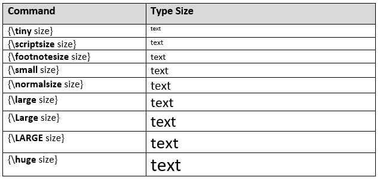
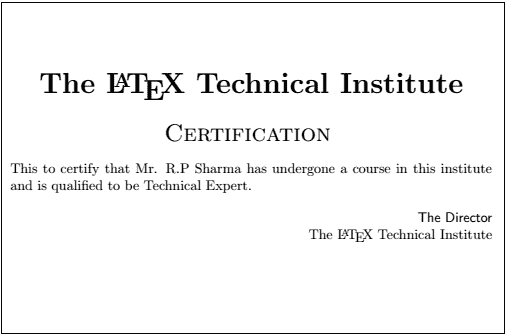
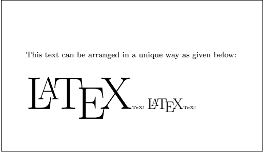

# 乳胶字体大小和样式

> 原文：<https://www.javatpoint.com/latex-fonts-size-and-styles>

## 乳胶来源：

### 乳胶纸尺寸和字体大小

我们通常在方括号[]内定义纸张大小和字体大小。

点的大小可以用**【10pt】**的方式来描述。其他字体大小有 8pt、9pt、10pt、11pt、12pt、14pt、17pt、20pt。

Latex 默认字体大小为 **10pt** 。

纸张类型及其尺寸如下所示:

*   **信纸** (11 x 8.5 英寸)
*   **legalpaper** (14 x 8.5 英寸)
*   **a5 纸** (5.8 x 8.3 英寸)
*   **a4 纸** (8.3 x 11.7 英寸)
*   **执行纸** (10.5 x 7.25 英寸)
*   **b5 纸张** (25 x 17.6 厘米)

## 乳胶类型尺寸

Tex 生成的默认字体大小或字体大小是 10pt。有一些用于更改类型大小的声明。所有类型大小和命令的表格如下所示:



在上面的顺序中，**\微小的**最小，**\巨大的**最大。为了理解这一点，让我们考虑如下所示的示例:

```

\documentclass[a4paper]{letter}
\begin{document}
\begin{center}
 \begin{huge}
 \textbf{The \LaTeX\ Technical Institute}\\
\end{huge}
\begin{LARGE}
\textsc{\\Certification} 
\end{LARGE}  

\end{center}
\noindent This to certify that Mr. R.P Sharma has undergone a course in this institute and is qualified to be Technical Expert.

\begin{flushright}
\textsf{The Director}\\
The \LaTeX\ Technical Institute
\end{flushright} %used for aligning to the right

\end{document}

```

该代码的输出如下图所示:



同样，您可以根据需要更改字体和样式。

## 乳胶风格

款式分为**系列、**和**造型**。输出中的排版样式由这三个特征组成。

**样式**的表格如下:

| 风格 | 命令 |
| 古罗马的 | \ text run { Roman } |
| 打字机 | \ texttt {打字机} |
| 无衬线字体 | \ textsf {无衬线} |

**系列**的表格如下:

| 风格 | 命令 |
| 黑体字 | \textbf{粗体} |
| 媒介 | \ textmd {中} |

**形状**的表格如下:

| 风格 | 命令 |
| 斜体的 | \ text {斜体} |
| 倾斜 | \ textsl {倾斜} |
| 正直的 | \ textup {立式} |
| 小盘 | \ textsc {小帽] |

下面给出了使用这三个类别的方法或步骤:

```

\documentclass{article}
\begin{document}
\textit{\textbf{ the topic discussed is Latex.}}
\textrm{\textsl{ it contains the process and characteristics}}
\end{document}

```

该代码的输出将是:


如果要单独显示以上文字，使用**\换行符**命令，如下图:

```

\documentclass{article}
\begin{document}
\textit{\textbf{ the topic discussed is Latex.}\newline}
\textrm{\textsl{ it contains the process and characteristics}}

\end{document}

```

**输出:**


Latex 替代了电脑上没有的近似字体样式。

还有一个名为 **\emph** 的命令用于造型目的。它使用系列和当前字体。

**\emph** 用于当我们在普通(直立)文本的中间时产生斜体。如果当前的形式是斜体，那么它会切换到直立的形状。

示例如下所示:

```

\documentclass[12pt]{article}
\begin{document}

\textit{ a figure with six sides is called \emph{hexagon} and with five sides is called \emph{pentagon}.}
\end{document}

```

下图显示了上述代码的输出:


你可以看到带有 **\emph** 命令的单词和其他单词的区别。

在另一个例子中，我们用黑体字代替了上面的斜体，如下所示:

```

\documentclass[16pt]{article}
\begin{document}

\textbf{ a figure with six sides is called \emph{hexagon} and with five sides is called \emph{pentagon}.}
\end{document}

```

上面代码的输出如下图所示:


## 文档

### 概观

它包括开始和结束时使用的基本命令。它还包括编写文本的过程。在这个模块中，我们使用了 **TEXMAKER** 来编写代码。乳胶概述如下:

```

\documentclass[a5paper, 14pt]{article}
\begin{document}
The text you type is written here.
\end{document}

```

在 Texmaker 中写入此文档后，您必须在任何特定文档中**保存**此文件。点击菜单栏上的**快速构建**按钮，如下图:


上述文档文件的输出将是:


#### 注意:如果不保存文件或文档，就无法编译代码。因此，确保在编译之前保存您的文档。

下面给出了其他常用的命令，这些命令将在本项目中进一步实现。

*   **flushright 和 flushleft:** 这些命令写成 **\begin{flushright}** 或 **\begin{flushleft}** 。这些用于将文本与文档的左右对齐。
*   **\noindent:** 如果您想开始任何一个没有**缩进的段落**或者想不间断地继续该段落，请使用此命令。

### 解决纷争

在 Latex 中，如果文档文件中有错误，那么编译后会在底部用红色显示所有错误。对错误进行了详细解释。

错误如下图所示:


之后，转到特定的行并删除错误。保存文件，然后可以再次编译。

### 其他字体样式

其他使用的字体样式和相应的代码如下:

*   如果您希望文档有不同的大小，可以使用 extsizes 包。使用的命令是**\ document class[10pt]{ extarticle }**和**\ document class[14pt]{ ext report }**。
*   您也可以用不同的方式设置文本的样式。代码如下:

```

\documentclass[9pt]{extarticle}
\begin{document}

This text can be arranged in a unique way as given below:\\\\

{\fontsize{50}{60}\selectfont \LaTeX}{\fontsize{5}{6}\selectfont TeX!}
{\Huge \LaTeX}{\tiny TeX!}

\end{document}

```

输出如下所示:



使用 **\fontsize** 和 **\selectfont** 命令来修改文本的大小。您可以根据需要设置尺寸。

### 字体系列

常见字体系列如下:

| 字体系列 | 完全形式 |
| **坐标测量机** | 计算机现代斜体 |
| **cmsy** | 计算机现代符号 |
| cmex | 计算机现代扩展 |
| **cmr** | 现代罗马计算机 |
| **cmss** | 计算机现代桑斯 |
| **尺** | 计算机现代打字机 |
| **ptm** | Adobe 时报 |
| **phv** | Adobe Helvetica 字体 |
| **pcr** | Adobe 信使 |

下表列出了字体系列的权重和宽度支持的标准:

**sb-** 半粗体

**ub-** 超加粗

**b-** 粗体

**eb-** 加粗

**ul-** 超轻

**el-** 额外光线

**l-** 光

**sl-** 半光

**m-** 中等(正常)

| 标准 | 完整形式 | 百分比 |
| **uc** | 超浓缩 | 50% |
| **ec** | 额外浓缩 | 62.5% |
| **c** | 浓缩的 | 75% |
| sc | 半浓缩的 | 87.5% |
| **x** | 扩大 | 125% |
| **ex** | 额外扩展 | 150% |
| **ux** | 超膨胀 | 200% |
| **米** | 中等 | 100% |
| **sx** | 半膨胀的 | 112.5% |

* * *