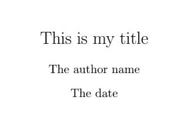
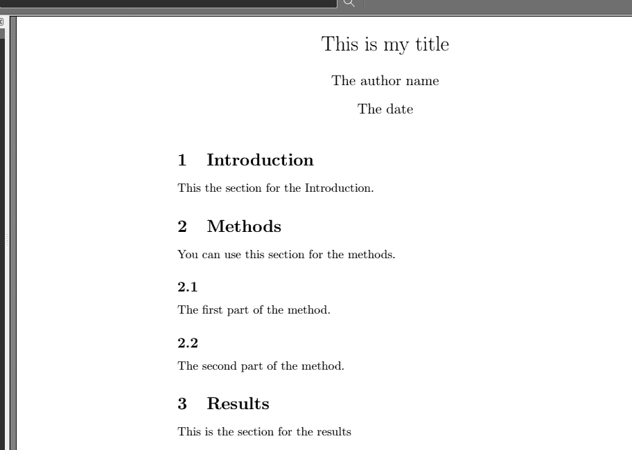
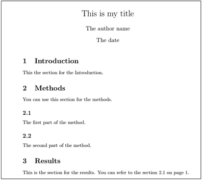
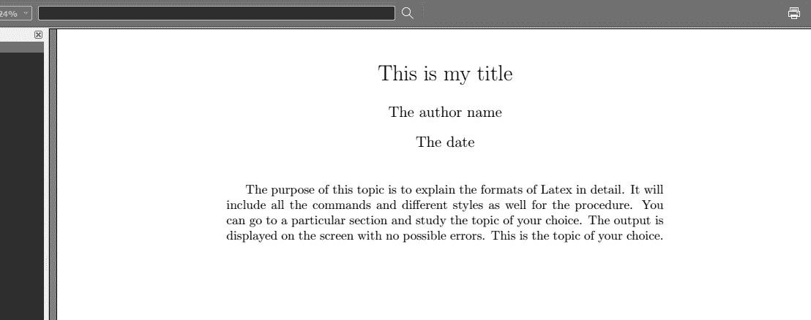
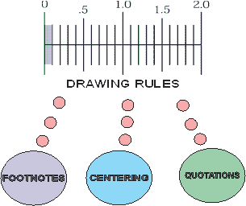
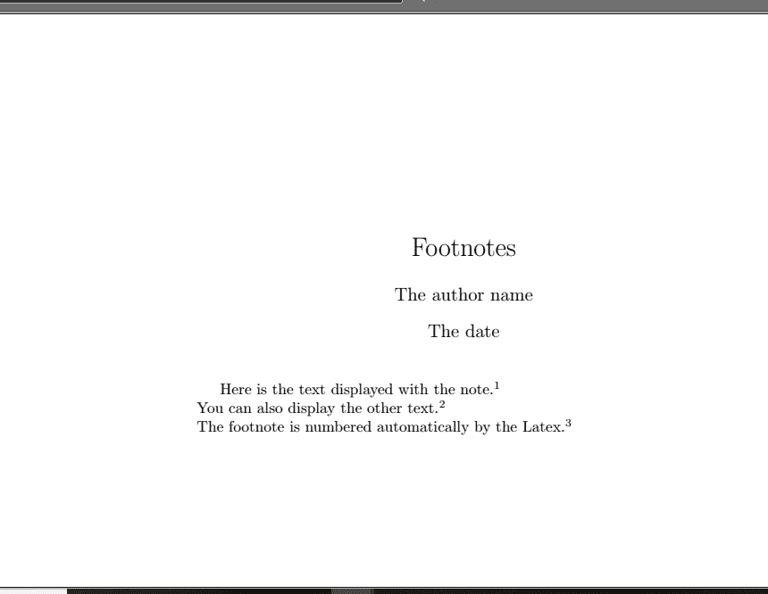
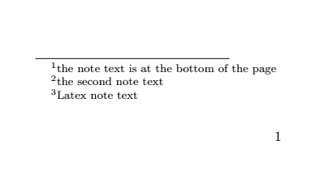

# LATEX 格式

> 原文：<https://www.javatpoint.com/latex-formats>

## 格式化参数

格式化参数用于为文件或文档提供独特的外观。格式化文档有多种方法，如下所示:

## 1.可选参数

流行的可选参数有:

*   **两栏-** 是 2 栏页面
*   **标题页- \maketitle** 生成标题页
*   **openright-** 如果使用双面，则本章从右侧页面开始
*   **景观-** 用于景观展示
*   **legno-** 它把方程号放在左边
*   **flegn-** 左对齐方程与中心
*   **双面-** 它在纸的两面打印。

**a)级**

此处使用的文档类型包括演示文稿和科学期刊中的文章、报告、书籍、幻灯片、A0 海报 proc(基于文章类的类)、信函、beamer(用于撰写演示文稿)等。

类用在程序的开头， **{article}** 是常用的类。

文档类定义了文档的整体布局。

其他类也包含在下面给出的花括号中:

*   **report-** 用于包含较长文档的章节。
*   **论文-** 用 Latex 准备论文。
*   **字母-** 为字母书写
*   **书籍-** 为书籍
*   幻灯片为**-**。

**b)组**

为了将范围和状态限制在局部，可以将特定部分局部地包含在花括号中。但是在某些情况下，如果牙套是不可能的，那么你可以使用**\ b 组**和**\ e 组**分别开始和结束一个组。

例如**正常文字{xyz}更正常的文字**

这可以写成**普通文本\ b 组 xyz \组{}更普通的文本**。

**c)包装**

这是一种向文档提供或添加额外格式功能(如图片、参考书目和链接)的方法。它还为 LATEX 添加了新功能。所有包必须仅包含在序言中。要加载包，使用的命令是:

```

\usepackage{packagename}

```

**也可以作为\ usepackage[options]{ package }**使用

一些常用的软件包有:

*   **颜色:**提供使用颜色的方式。
*   **旋转:**用于旋转，尤其是图形和表格。
*   **fancyhdr:** 它定制页眉和页脚。
*   **graphic xx:**是用来包含图形的命令。
*   **setspace:** 这是一个简单的改变行间距的方法。

## 2.结构格式

*   **标题**

标题用于大多数的论文格式，如信件、文章、报告、书籍类等。要创建标题，您需要为作者、标题和日期指定文本，然后使用 **\maketitle** 命令，由 Latex 生成标题页。起动时必须使用 **\begin{document}** 。用来制作标题的命令是**\制作标题**。创建标题的代码如下所示:

```

\documentclass{article}
\begin{document}
\title{This is my title} % defines the title info
\author{ The author name}  % you can specify any name
\date{ The date} % used to display the date
\maketitle
\end{document}

```

输出如下图所示:



如果你不想要日期，你可以使用 **\date{}** 命令。

要显示当前日期，您可以使用**\ date { today }**命令。

*   **节**

您可以将文档分成多个部分，子部分。用于创建这些部分的命令有:

*   \section{..}
*   \子部分{..}
*   \子部分{..}
*   \段落{..}
*   \分段{..}

这些是文章类的常用命令。也可以使用**\章节{..}** 命令为账本和报表类。

以下部分的代码如下所示:

```

\documentclass{article}
\begin{document}
\title{This is my title} 
\author{ The author name} 
\date{ The date}
\maketitle
\section{Introduction}
This the section for the Introduction.
\section{Methods}
You can use this section for the methods.
\subsection{}
The first part of the method.
\subsection{}
The second part of the method.
\section{Results}
This is the section for the results
\end{document}

```

输出如下图所示:



*   **标注**
    要引用文档的其他部分，可以标注任何一个章节命令。您可以用\label{labelname}标记该节。
    如果要参考标签的章节或页码；您可以使用\ref{labelname}和\pageref{labelname}。
    代码如下所示:

```

\documentclass{article}
\begin{document}
\title{This is my title} 
\author{ The author name} 
\date{ The date}
\maketitle
\section{Introduction}
This the section for the Introduction.
\section{Methods}
You can use this section for the methods.
\subsection{}
\label{sec1}
The first part of the method.
\subsection{}
The second part of the method.
\section{Results}
This is the section for the results. You can refer to the section \ref{sec1} on page \pageref{sec1}.
\end{document}

```

输出



对于多页或文件，可以根据需要方便地参考页码和章节。

*   **目录**

如果要在文档中创建目录，可以键入命令**\目录**。

*   **页码**

这种格式用于在编写文档之前对页面进行编号。它还确保主文档从第 1 页开始。页码可以在罗马和阿拉伯之间切换。用于对页面进行编号的命令是**\页码..}** ，在 **\maketitle** 命令后声明。

上述方法的代码如下:

```

\documentclass{article}
\begin{document}
\title{This is my title} 
\author{ The author name} 
\date{ The date}
\maketitle
\pagenumbering{roman} % you can use \pagenumbering{arabic} if you want in Arabic format     \tableofcontents
\newpage
\end{document}

```

输出如下图所示:


**f .页眉和页脚**

出现在头部或脚部。输出屏幕由头部、身体和脚组成。默认情况下，除了字母之外，所有类别都打印页码。

要修改默认动作，可以使用**\页面样式**命令，该命令位于**\章节**或类似命令之后。

标准页面样式的类型如下:

*   **\页面样式{普通}**
    这是报告类和文章的默认样式。页码列在脚上，而头是空的。
*   **\ pagestyle { heads }**
    在这种风格中，脚是空的。章节标题和页码放在标题里。
*   **\ page style { my headers }**
    指定头部使用的信息；使用以下命令。

```

\markboth{leftheader}{rightheader}
\markright{rightheader}

```

**\markboth** 用于双面文件或文档，而 **\markright** 用于单面文档。

*   **\pagestyle{empty}**
    在这种风格中，头球和脚都是空的。
*   **\此页面样式{style}**
    仅用于更改当前页面的样式。比如 **\thispagestyle{empty}** 用来指脚和头都没有东西。此命令将仅针对当前页面执行，不会影响其他页面。

如果您想以另一种方式格式化或自定义页眉和页脚。您可以使用 **fancyhdr** 命令。Latex 中的该命令用作 **\usepackage{fancyhdr}** 。这里使用的包可以将页眉和页脚向左、向右和居中对齐。您还可以定义多行标题和过滤器、用于偶数页和奇数页的单独标题等。

**\ page style {花式}** 也用在这里。

{}中可以包含以下命令(花括号): **\lhead{}、\chead{}、\rhead{}、\lfoot{}、\cfoot{}、\rfoot{}** 。

如果想隐藏表头下方的水平线，默认情况下是画出来的，可以使用**\ renewcommand【headrulewidth】{ 0pt }**命令。

**g .边距**

这些命令用于手动设置边距。默认情况下，内部边距被视为 **1 英寸**。因此，如果你想设置一个 0.5 英寸的**余量，你必须提到该余量 **-0.5 英寸**。您也可以使用 **textheight** 和 **textwidth** 命令设置文本区域的高度和宽度。**

下表给出了设置边距的可用命令:

| 利润 | 命令 |
| 左边距
(如果使用单面，则为奇数页) | **\页边数** |
| 左边距
(如果使用双面，则为偶数页) | **\ \等边的边的边的边的边的边的边的边的边的边的边的边的边的”**边的边的边的边的边的边的边的边的边的边的边的边的边的边的边的边的边的 |
| 右边距 | \文字宽度 |
| 书眉 | **\顶边饰** |
| 底部边距 | **\textheight** |

用于设置边距英寸数的命令有:

*   要将上边距设置为 0.7 英寸，**\ setlength { \ topmargin } {-0.7 英寸}**
*   要在右页上设置 1 英寸的边距，**\ set length { odd side margin } { 0 in }**
*   要在双面文档的左侧页面上设置 1 英寸的边距，**\ set length \ even side margin } { 0in }**
*   要为右边距留出空间，**\ set length { \ text width } { 0 in }**
*   为文本保留 9 英寸，**\ set length { \ text height } { 9 in }**

**h 段**

要开始一个段落，你可以使用控制序列 **\par** 或者可以留一个空格。默认情况下，段落缩进为 1.5em(当前字体磅值的 1.5 倍)。段落之间没有多余的空格。为了控制段落分离和缩进，使用了命令**\配对**和\ **parskip** 。让我们考虑下面的例子:

这个例子包含一个简单的段落。代码如下:

```

\documentclass{article}
\begin{document}
\title{This is my title} 
\author{ The author name} 
\date{ The date}
\maketitle
The purpose of this topic is to explain the formats of Latex in detail. It will include all the commands and different styles as well for the procedure. You can go to a particular section and study the topic of your choice. The output is displayed on the screen with no possible errors.
This is the topic of your choice.

\end{document}

```

输出如下图所示:



本示例包含带有段落分隔和缩进命令的段落。代码如下:

这个例子包含一个简单的段落。代码如下:

```

\documentclass{article}
\begin{document}
\title{This is my title} 
\author{ The author name} 
\date{ The date}
\maketitle
\parindent=3in
\parskip=15pt % for both the commands you can change the number according to the requirements

 The purpose of this topic is to explain the formats of Latex in detail. It will include all the commands and different styles as well for the procedure. You can go to a particular section and study the topic of your choice. The output is displayed on the screen with no possible errors.

 \parindent=0in
 \parskip=30pt
This is the topic of your choice.
\end{document}

```

输出如下图所示:


你可以注意到上面两个例子的区别。

**一、参考文献**

它也被称为交叉引用，用于截面、图形、方程或表格。使用的命令如下:

*   **\pageref{marker}** 包含与 **\label** 命令相关的页码。
*   **\label{marker}** 用于设置标记以供将来参考。
*   **\ref{marker}** 由节数、图形等组成。与**\标签**命令相关。

## 3.绘图规则



如果要在文档页面上画水平线或垂直线，可以使用 **\rule** 命令。在 Latex 中，它将被写成:

```

\rule[lift]{width}{height}

```

提升是可选参数，即提升到基线以上的量。宽度是水平尺寸，而高度是垂直尺寸。例如，如果您想要绘制下面给出的线:

* * *

您可以使用**\ rule { text width } { 2pt }**命令。

上述示例的代码或程序如下:

```

\documentclass{article}
\begin{document}
\title{This is my title} 
\author{ The author name} 
\date{ The date}
\maketitle
\rule{\textwidth}{1pt}
\section{Introduction}
This the section for the Introduction.
\section{Methods}
You can use this section for the methods.
\subsection{}
\label{sec1}
The first part of the method.
\subsection{}
The second part of the method.
\end{document}

```

输出如下图所示:


可以根据要求画多条线。

例如，要绘制这两条线，下面给出了代码:

```

\documentclass{article}
\begin{document}
\title{This is my title} 
\author{ The author name} 
\date{ The date}
\maketitle
\rule{\textwidth}{1pt} % you can also set the points accordingly
\section{Introduction}
This the section for the Introduction.

\section{Methods}
You can use this section for the methods.
\subsection{}
\label{sec1}
The first part of the method.
\subsection{}
The second part of the method.

\rule{\textwidth}{1pt}
\end{document}

```

上例的输出如下图所示:


*   **脚注**
    LATEX 会自动给脚注编号。命令**\脚注**正好放在您希望脚注出现的位置。**\脚注**命令与其前的文本之间不应有多余的空格。命令写成**\脚注**{此处写注释文本}。
    花括号内的文字显示在底部。例如，考虑下面的代码:

```

\documentclass{article}
\begin{document}
\title{Footnotes} 
\author{ The author name} 
\date{ The date}
\maketitle
Here is the text displayed with the note.\footnote{ the note text is at the bottom of the page}\\
You can also display the other text.\footnote{the second note text}\\
The footnote is numbered automatically by the Latex.\footnote{Latex note text}
\end{document}

```

输出如下图所示:



脚注将出现在底部。对于上述示例，脚注如下图所示:



*   **居中**
    如果你只有一条线要放在中心；然后可以使用**\中心线**命令。例如
    **\中心线** {这里提到的线会显示在中心位置}。
    让我们考虑下面的例子:

```

\documentclass{article}
\begin{document}
\title{This is my title} 
\author{ The author name} 
\date{ The date}
\maketitle
The purpose of this topic is to explain the formats of Latex in detail. It will include all the commands and different styles as well for the procedure.\\\\ % two-time \\ is used to maintain the space.
\centerline{It will make the document attractive.}
\end{document}

```

输出如下图所示:


如果你有几行要显示，那么你可以用下面的方法写。

```

\begin{center}
.........
\end{center}

```

*   **语录**
    这些语录可用于以下环境:

```

\begin{quote}
..........
\end{quote}

```

在段落中，段落中的引号之间没有空行分隔和意图。

* * *