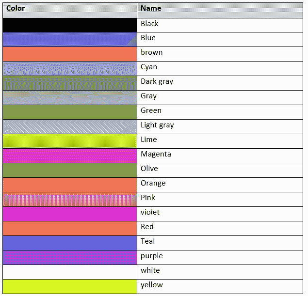
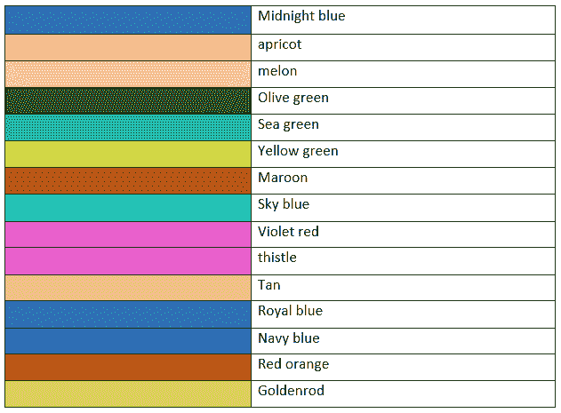
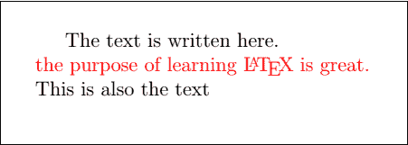
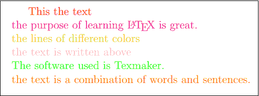
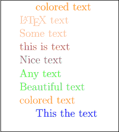
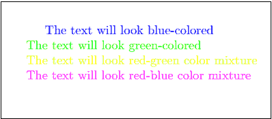
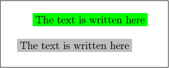
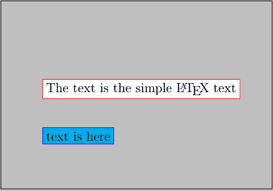
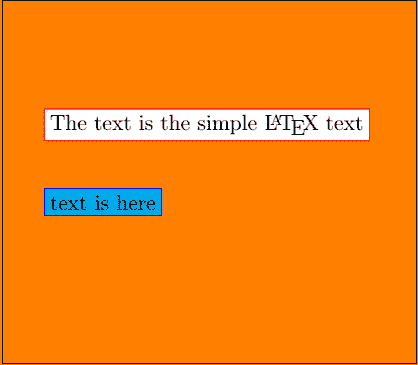
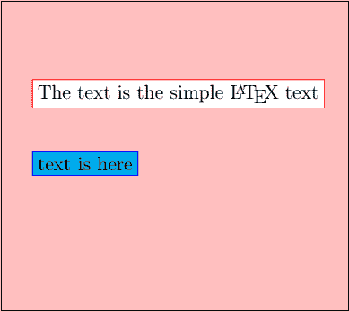

# LATEX 颜色

> 原文：<https://www.javatpoint.com/latex-colors>

xcolor 包支持为文本添加颜色。使用它，您可以设置背景、字体颜色和页面背景。您可以从预定义的颜色中选择颜色，也可以使用 RGB 创建您的颜色。数学公式也可以着色。

在代码或程序中导入的包编写为:

```

\usepackage{xcolor}

```

下面列出了用于访问不同颜色数量的命令:

*   **使用名称:**它允许访问 16 种基本颜色。
*   **dvipsname:**它允许访问 64 种以上的颜色。
*   **svgnames:** 它允许访问大约 150 种颜色。
*   **x11names:** 提供 300 多种颜色。

上面提到的这些命令在代码中声明为:

```

\documentclass[dvipsnames, usenames]{beamer}

```

输入**彩色文本**的命令如下:

有两种方式输入彩色文本。一种是使用 **\textcolor** 命令，另一种是使用 **\color** 命令。

**textcolor** 命令被声明为**\ text color {**-color**} {**text**}**。

color 命令被声明为一些文本。

textcolor 命令用于一个段落中的所有内容，而 color 命令用于文本在其他 tex 环境和多行上运行。

要更改背景颜色，可以使用命令**\页面颜色**{提到的颜色}。该命令为整个页面的背景着色。

要给文本的背景上色，可以使用**\ color box**{提到-color}{text}命令。

如果您想同时更改背景和文本颜色，您可以按照下面提到的方式使用命令:

```

\colorbox{mentioned-color}{text}{\color{mentioned-color}text}

```

随处可见或作为所有颜色之根的原色是红色、黄色和蓝色 T6(RYB)。三种二次色是橙色、紫色和绿色，它们是由两种原色混合而成的。有六种三级色，由原色和二级色混合而成。

下面列出了所有系统上可用的预定义颜色:



下面列出了其他预定义的颜色:



让我们考虑一个简单的例子来给文本上色。代码如下:

```

\documentclass[12pt]{article}
\usepackage[dvipsnames]{xcolor} % declaring the package is necessary to implement colors

\begin{document}
The text is written here.\\
\textcolor{red}{the purpose of learning \LaTeX\ is great.}\\ %this \LaTeX\ pattern is used to print the default layout of the work Latex.
This is also the text
\end{document}

```

**输出:**



不同线条的颜色代码如下所示:

```

\documentclass[12pt]{article}
\usepackage[dvipsnames]{xcolor}

\begin{document}
\textcolor{red}{This the text} \\
\textcolor{magenta}{the purpose of learning \LaTeX\ is great.} \\
\textcolor{yellow}{the lines of different colors}\\
\textcolor{pink}{the text is written above} \\
\textcolor{green}{The software used is Texmaker.} \\
\textcolor{orange}{the text is a combination of words and sentences.}

\end{document}

```

**输出:**



## 新颜色

也有一些颜色。如果这些颜色不够，那么你可以创建你的颜色。

要在包中定义**新颜色**，需要包含 **xcolor** 包。用于创建新颜色的命令是:

```

\definecolor{color name}{prototype}{specifications}

```

这里**规格**表示颜色的描述，原型就是模型。有五种基本模型或原型，分别是**灰色、rgb、RGB、HTML、cmyk** 。不同型号的色调范围以及原型和规格说明如下:

**一、灰色:**灰色的深浅程度介于 **0(黑色)**和 **1(白色)**之间。例如，0.89 将是非常浅的灰色，0.20 将是深灰色。为浅灰色定义的命令将是:

```

\definecolor{light-gray}{gray}{0.92}
\definecolor{dark-gray}{gray}{0.20}

```

**二。rgb:** 它定义了三种颜色，即红色、绿色和蓝色。范围在 0 和 1 之间相同。该命令被写成:

```

\definecolor{orange}{rgb}{1, 0.5, 0}

```

**三。RGB:** 在这个原型中，数量用每种颜色的 0 到 255 之间的数字来表示。该命令被写成:

```

\definecolor{orange}{RGB}{255, 127, 0}

```

**iv。HTML:** 这是以 RRGGBB 格式写的六个十六进制数。格式类似于 HTML 中使用的格式。html 的命令编写如下:

```

\definecolor{orange}{HTML}{FF7F00}

```

**v. cmyk:** 代表青色、品红色、黄色和黑色。颜色的数量表示在 0 和 1 之间。该命令被写成:

```

\definecolor{orange}{cmyk}{0, 1, 0.5,0}.

```

混色命令的代码如下:

```

\documentclass[12pt]{article}
\usepackage[dvipsnames]{xcolor}

\begin{document}
{\color{red!50!yellow}colored text}\\ % it is a mixture of 50 percent red and 50 percent yellow
{\color{pink!80!yellow}\LaTeX\ text}\\
{\color{white!60!red}Some text}\\
{\color{blue!25!orange}this is text}\\ % it is a mixture of 25 percent blue and 75 percent orange
{\color{blue!55!orange}Nice text}\\
{\color{green!70!yellow}Any text}\\
{\color{blue!20!white!30!green}Beautiful text}\\ % it is a mixture of (20*0.3) percent blue, ((100-20)*0.3) percent white and (100-30) percent green
{\color{pink!40!red!50!yellow}colored text}

\textcolor{blue}{This the text} \\
\end{document}

```

**输出:**

您可以注意到新颜色和颜色百分比分布之间的差异。



原型命令的代码如下:

```

\documentclass[14pt]{article}
\usepackage[dvipsnames]{xcolor}
\begin{document}
{\color[rgb]{0,0,1} The text will look blue-colored} \\
\textcolor[rgb]{0,1,0}{The text will look green-colored} \\
{\color[rgb]{1,1,0} The text will look red-green color mixture} \\
\textcolor[rgb]{1,0,1}{The text will look red-blue color mixture} \\
\end{document}

```

**输出:**



您也可以在一行中插入两种或多种颜色。这种类型的代码如下:

```

\documentclass[14pt]{article}
\usepackage[dvipsnames]{xcolor}
\begin{document}
This is the {\color{red!80!yellow}\LaTeX\ text}\\
{\color{blue!70!yellow}This topic contains} {\color{white!60!red}Some text}\\
\end{document}

```

**输出:**


## 文本高亮显示

有用于突出显示文本的命令。根据您的要求，您可以选择任何颜色来突出显示您的文本。你需要一个带有 **xcolor** 包的**灵魂**包来实现高亮文本。

**魂**包写为**\ usepackage {魂}**

高亮文本的命令写成 **\hl{ any text}** 。这里‘**HL**’命令用作高亮字幕。

突出显示文本的简单代码如下所示:

```

\documentclass[12pt]{article}
\usepackage[dvipsnames]{xcolor}
\usepackage{soul}
\begin{document}
\begin{center}

\textbf{\color{red}The highlighted text below :}

\end{center}

The text given here is the \hl{highlighted text.}

\end{document}

```

您可以在上面的示例中看到，我们使用了粗体命令、颜色和高亮命令。

输出如下图所示:


要指定高亮颜色，需要使用\sethlcolor{color name}命令。您也可以在单个程序中使用许多颜色高光。

高亮颜色的代码如下所示:

```

\documentclass[12pt]{article}
\usepackage{xcolor, soul}% you can also write both the packages in this format
\begin{document}
\begin{center}

\textbf{\color{blue}The color highlighted text below :}

\end{center}

\sethlcolor{pink}
The text given here is the \hl{highlighted text in pink.}\\

\sethlcolor{orange}
The text given here is the \hl{highlighted text in orange.}
\end{document}

```

**输出:**


## 文本背景

您可以使用**\ fcolorbox**{任何框架颜色} {任何背景颜色}{text}命令更改文本背景颜色以及该背景的框架/边界颜色。可以使用**\颜色框** {anycolor}{text}命令更改文本背景。

要更改文本背景，下面给出了代码:

```

\documentclass[12pt]{article}
\usepackage{xcolor, soul}
\begin{document}

\colorbox{green}{The text is written here}\\ \\
\colorbox{lightgray}{The text is written here}
\end{document}

```

**输出:**



要更改文本背景和框架，下面给出了代码:

```

\documentclass[12pt]{article}
\usepackage{xcolor, soul}
\begin{document}

\fcolorbox{red}{white}{The text is the simple \LaTeX\ text}\\ \\
\fcolorbox{red}{pink}{This is the normal text}\\ \\
\fcolorbox{blue}{cyan}{text is here}% you can choose any color of your choice
\end{document}

```

**输出:**


## 页面背景颜色

您可以使用 **\pagecolor** {color name}命令更改页面的背景颜色。改变背景颜色的代码如下:

```

\documentclass[12pt]{article}
\usepackage{xcolor, soul}
\begin{document}
\fcolorbox{red}{white}{The text is the simple \LaTeX\ text}\\ \\

\pagecolor{lightgray}

\fcolorbox{blue}{cyan}{text is here}
\end{document}

```

这里，我们选择了**浅灰色**颜色。你可以根据自己的要求改变颜色。

**输出:**



现在让颜色变成**橙色**。输出将是:



如果选择**粉色**颜色，那么输出会是:



## 彩色线条

您可以在文档的任何地方绘制彩色线条。线的宽度可以根据需要设置。代码如下:

```

\documentclass{article}
\usepackage[dvipsnames]{xcolor}
\colorlet{LightRubineRed}{RubineRed!70!}
\colorlet{Mycolor1}{green!40!orange!60!}
\begin{document}

```

\LaTeX 的彩色线条如下: **\\**

```

\noindent
{\color{LightRubineRed} \rule{\linewidth}{1mm} }\\

\noindent
{\color{Mycolor1} \rule{\linewidth}{1mm} }
\end{document}

```

在这里，我们首先创建了颜色，然后进一步用于绘制彩色线条。

**输出:**


* * *