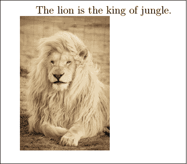
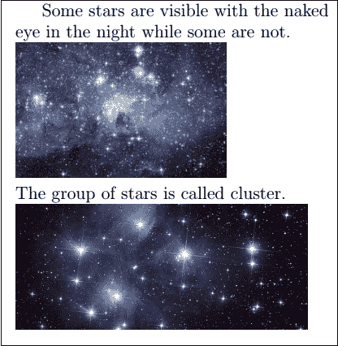
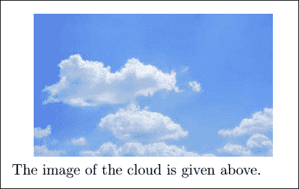
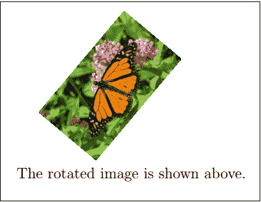
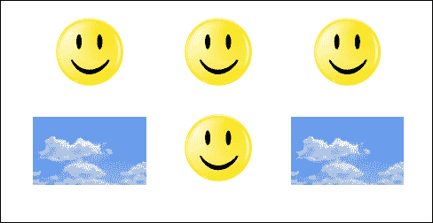

# LATEX 图像

> 原文：<https://www.javatpoint.com/latex-images>

图像用于增强文档或任何文件中的信息。在大多数科学文献中，图片是必不可少的。在 Latex 中，您可以放大、缩小、旋转，并可以设置文档中图像的参考。

LATEX 不会插入图片本身。

插入图像的基本要求是:

*   包括**图形**包。该命令将被写成**\ usepackage { graphics }**。
*   您需要从浏览器下载特定的图像，并将该图像保存在 Latex 文件所在的文件夹中。否则，Latex 无法访问这些图像。在保存特定图像时，请在您提到的代码或程序中提及相同的内容。

让我们考虑一个插入图像的简单例子。代码写在下面:

```

\documentclass[12pt]{article}
\usepackage{graphicx}
\begin{document}

The lion is the king of jungle.\\
\includegraphics[scale=0.1]{lion}

\end{document}

```

**输出:**



根据需要，您可以在文档中插入许多图片。

插入两幅图像的代码如下所示:

```

\documentclass[12pt]{article}
\usepackage{graphicx}
\begin{document}

Some stars are visible with the naked \\ eye in the night while some are not.\\
\includegraphics[scale=0.5]{star}\\ % star and star1 are the images saved with these names.
The group of stars is called cluster.\\
\includegraphics[scale=0.25]{star1}

\end{document}

```

**输出:**



## 路径说明

有时，您的计算机上的不同文件夹中存在大量图像。要将这些图像直接插入到您的 Latex 文档中，您可以使用 **\graphicspath** {{ path}}命令指定路径。

让我们考虑一下**路径图像**。该命令将被写成**\图形路径{ { images } }**。您需要创建一个名为“图像”的文件夹，这样 Latex 就可以通过这个路径轻松地将图像或图片插入到文档中。

示例如下:

```

\documentclass[12pt]{article}
\usepackage{graphicx}
\begin{document}
\graphicspath{ {images/} }
\includegraphics[scale=0.65]{cloud}\\
The image of the cloud is given above.
\end{document}

```

我们首先在 Latex 文件所在的位置创建了图像文件夹。您可以在该文件夹中保存多个图像，并可以直接访问这些图像。

**输出:**



如果系统中指定了文件的确切位置，也可以指定绝对路径。这种类型的例子如下:

```

\documentclass[12pt]{article}
\usepackage{graphicx}
\begin{document}

\graphicspath{ {c:/images1/} }
\includegraphics[scale=0.35]{butterfly}\\
The image of the butterfly is given above.
\end{document}

```

这里，我们在 C:驱动器中创建了“images1”文件夹，并因此指定了路径。同样，即使图像存在于子文件夹中，也可以指定路径。

**输出:**


## 更改图像的大小

您可以根据需要指定图像的高度和宽度。示例如下:

```

\documentclass[12pt]{article}
\usepackage{graphicx}
\begin{document}

\graphicspath{ {images/} }
\includegraphics[width=6cm, height=4cm]{smiley}\\
The image of a smiley is given above.

\end{document}

```

**输出:**

在这里，您可以根据需要使用任何路径和尺寸。


## 图像的旋转

您可以通过在 **\includegraphics** 命令中指定角度来旋转任何图像。让我们考虑一张蝴蝶的图片。

下面的示例给出了这种类型的代码:

```

\documentclass[12pt]{article}
\usepackage{graphicx}
\begin{document}

\graphicspath{ {images/} }
\includegraphics[scale=0.2, angle=50]{butterfly}\\
The rotated image is shown above.

\end{document}

```

**输出:**



## 图像对齐

在图像对齐中，使用了两个命令。第一个命令是**\ baseline kip**，用于生成垂直线间距。第二个命令是**\四**，用来维持水平空间。它只有一个宽度。

如果你想对齐矩阵形式的图像，那么要确保所有照片的宽度相等。

以矩阵形式排列六幅图像的代码如下:

```

\documentclass{article}
\usepackage{graphicx}

\begin{document}
\begin{center}
\graphicspath{ {images/} }
\includegraphics[width=.2\linewidth]{smiley}\quad
\includegraphics[width=.2\linewidth]{smiley}\quad
\includegraphics[width=.2\linewidth]{smiley}
\\[\baselineskip]% adds vertical line spacing
\includegraphics[width=.2\linewidth]{cloud}\quad
\includegraphics[width=.2\linewidth]{smiley}\quad
\includegraphics[width=.2\linewidth]{cloud}
\end{center}
\end{document}

```

**输出:**



如果你想把一个页面的所有图片都包含在一个框架中，那么你需要使用 **showframe** 包。该命令将被写成 **\usepackage{showframe}** 。

* * *