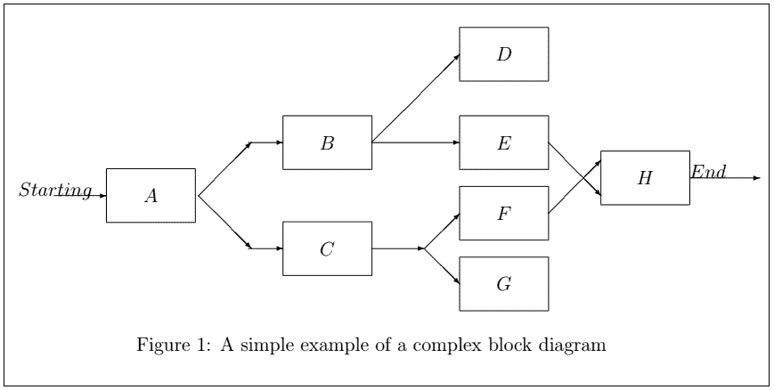

# LATEX块结构

> 原文：<https://www.javatpoint.com/latex-block-structures>

Latex 图形和图形是使用图形环境创建的，该环境用作:

```

\begin{figure}
.....
\end{figure}

```

同样，也使用图形环境创建块。

你一定为了不同的目的学习了不同学科的各种框图。

该框图包含几个不同大小的方框。你可以在盒子里提到任何文字。这也是表示类似于图表的信息的有效方法。你可以使用箭头等。以确定从一个盒子到另一个不同长度的盒子的方向。

用于在 Latex 中表示盒子的命令是:

```

\framebox{x_dimension, y_dimension}[position]{text}

```

这里，x 和 y 维度表示盒子在 x 和 y 轴上的尺寸。该位置用于确定要显示的**文本**的位置。

如果要为特定程序设置公共单位长度，可以使用 **\setlength** 命令。该命令写成**\ set length { 0.23 in }**。

定位像素的命令是**\放**。

该命令写成**\放{x 坐标，y 坐标} {图元}** 。

绘制块结构有两种方法。第一种是使用标准命令，另一种是使用 **Tikz 环境**。

## 标准命令方法:

此方法仅包含标准命令的使用。没有任何环境或不同命令的单独使用。这些步骤相当棘手，但是一旦概念清晰，这个过程就很容易理解和实现。

你可以根据你的设计或模式制作任何框图。

让我们考虑一个简单的框图示例。

每个命令的解释在相应的命令前面解释。

```

\documentclass[12pt]{article}
\begin{document}
\begin{figure}[h]
\setlength{\unitlength}{0.14in} % used to set the unit length
\centering % used for centering Figure
\begin{picture}(30,16) % these are the dimension of the picture environment having 32 length units width and 15 units height.
\put(0,5){\framebox(8,3){$Transformer$}}
\put(12,5){\framebox(6,3){$Rectifier$}} % the distance between the point on the x-axis is used to determine the gap between the particular block
\put(22,5){\framebox(6,3){$Smoothing$}} % the point on x-axis is the distance from the origin of a particular framebox
\put(31,5){\framebox(6,3){$Regulator$}}
\put(-3,6.5){\vector(1,0){3}}\put(8,6.5){\vector(1,0){4}} % here, the x and y-axis point in the put command is used to fix the arrow on the particular block
\put(18,6.5){\vector(1,0){4}}\put(28,6.5){\vector(1,0){3}}% spacing between the arrow and the block can be adjusted according to the x and y-axis coordinate on both the put commands
\put(37,6.5){\vector(1,0){4}} \put(-9,6.5) {$230V AC Mains$} \put(38,7.5) {$Regulated$} 
\put(38,6.5) {$5V DC$} 
\end{picture}
\caption{A Block diagram of regulated power supply} % title of the Figure containing blocks or the title of a whole diagram of blocks
\label{fig:block} % label to refer figure in text
\end{figure}
\end{document}

```

写在%之后的文字只是为了让你更好的理解。Latex 忽略写在%字符后的文本。

**输出:**

上述代码的输出是如下所示的框图:


现在考虑使用上述方法的复杂框图。

该示例的代码如下所示:

```

\documentclass[12pt]{article}
\begin{document}
\begin{figure}[h]
\setlength{\unitlength}{0.15in} 
\centering 
\begin{picture}(30,16)

\put(0,5){\framebox(5,3){$A$}} % the place of the block is at the origin
\put(10,8){\framebox(5,3){$B$}}
\put(10,2){\framebox(5,3){$C$}} 
\put(20,13){\framebox(5,3){$D$}} 
\put(20,8){\framebox(5,3){$E$}} 
\put(20,4){\framebox(5,3){$F$}}
\put(20,0){\framebox(5,3){$G$}} 
\put(28 ,6){\framebox(5,3){$H$}} % here, the position of block finishes 
\put(-3,6.5){\vector(1,0){3}} % from here the location and distance of arrow are specified
\put(5.2,6.5){\vector(1,-1){3}}\put(5.2,6.5){\vector(1,1){3}} % here the value after the vector command, i.e., {3}, signifies the length of the arrow. The higher the value, the higher will be the size of the arrow
\put(8,3.5){\vector(1,0){2}} \put(8,9.5){\vector(1,0){2}} % the position of points is adjusted according to the distance from the origin, i.e., block A
\put(15,3.5){\vector(1,0){3}} % arrow commands from block C
\put(18,3.5){\vector(1,-1){2}} \put(18,3.5){\vector(1,1){2}} % arrow commands from the arrow from block C
\put(15,9.5){\vector(1,0){5}} \put(15,9.5){\vector(1,1){5}} % arrow commands from block B
% the value of less than 1 on the y-axis in vector command is not specified here
\put(25,9.5){\vector(1,-1){3}} % arrow from block E to block H
\put(25,5.5){\vector(1,1){3}} % arrow from block F to block H
\put(33,7.5){\vector(1,0){4}}\put(-5,6.5) {$Starting$} \put(33,7.5) {$End$} 

\end{picture}\\
\caption{A simple example of a complex block diagram} 
\label{fig:block} 
\end{figure}
\end{document}

```

对于特定的箭头和块，您可以使用上述命令制作任何框图。您也可以根据需要调整箭头和块的大小、尺寸和距离。

**输出:**



您可以使用上述命令在块内或箭头上插入任何文本，并可以指定写入特定文本的距离。

* * *