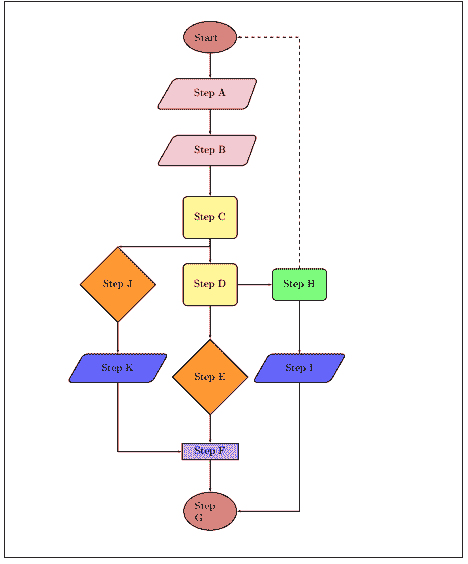

# 使用 Tikz 的胶乳流程图

> 原文：<https://www.javatpoint.com/latex-flow-diagrams-using-tikz>

流程图是概述算法的方法。它被广泛用于有效地表示信息。它是执行特定过程所需的步骤和决策的可视化表示。

流程可以快速查看，步骤可以从头到尾进行。图表中使用的不同形状被称为流程图符号。

同样，在 latex 中，您可以使用一些命令在任何地方插入任何流程图或图表。

让我们用一个例子来理解它。这里的主题将为您提供创建流程图的想法。您可以创建图表的类型和样式。

第一个图将为您提供简单流程图的基本概念，而第二个示例将是复杂的流程图。

**1。**第一个例子的代码如下:

```

\documentclass{article}

\usepackage{tikz} % the tikz package
\usetikzlibrary{shapes.geometric,arrows} % to implement the corresponding shapes and arrows, these are used.
\begin{document}

% the commands given below are used to define the styles for particular blocks. You can modify the dimensions, texture, etc. according to the requirements.

\tikzstyle{block} = [rectangle, draw, fill=yellow!50, 
    text width=4.5em, text centered, rounded corners, minimum height=4em] % the width signifies the width of the box. You can change the width accordingly, while the height will be adjusted according to the text.
    % it signifies that for the Block section, the Rectangle shape will be used. The color or shape can be modified.
    % here, distance is the distance between the corresponding block
\tikzstyle{line} = [draw, -latex']
\tikzstyle{cloud} = [draw, ellipse,text width= 2.9em, fill=red!50, node distance=2cm, minimum height=3em]
% the greater the value of the larger, the darker the color.
% the shapes that are determined above with the width, and the color will only be used further. The shapes not declared here, will not be recognized by the Latex.
 \tikzstyle{io} = [trapezium, draw, trapezium right angle=110, rounded corners, fill=red!20, node distance=1.9cm, minimum height=2.9em]  
 % the draw command here is used to draw the boundary of mentioned shape.
% you can add more parameters to the tikzstyle according to the requirements.
\begin{tikzpicture}[node distance = 1.8cm, auto] % the command node distance is important as it determines the space or the length of the arrow between different blocks.
    % the command given below are the place of nodes
    \node [cloud] (init) {Start};
    \node [io, below of= init](ReadA){Read A};
    \node [io, below of= ReadA](ReadB){Read B};
    \node [block, below of = ReadB](Sum){Sum = A+B};
    \node [block, below of = Sum](P){Print Sum};
    \node [cloud, below of = P](Out){End};
    \path [line] (init) -- (ReadA); 
    \path [line] (ReadA) -- (ReadB); 
    \path [line] (ReadB) -- (Sum); 
    \path [line] (Sum) -- (P); 
    \path [line] (P) -- (Out); 

\end{tikzpicture}
\end{document}

```

**输出:**


**2。**第二个例子的代码如下:

```

\documentclass{article}

\usepackage{tikz} % the tikz package
\usetikzlibrary{shapes.geometric, arrows} 
\begin{document}

\tikzstyle{decision} = [diamond, draw, fill=orange!80, 
    text width=5.0em, text centered, node distance=3.1cm,] 
    \tikzstyle{document} = [rectangle, draw, fill=blue!30, 
    text width=4.7em, text centered, node distance=2.5cm,] 
   \tikzstyle{block1} = [rectangle, draw, fill=green!50,  %here, we have chosen another block for the different color
    text width=4.5em, text centered, rounded corners, node distance= 3cm, minimum height=3em] % you can create as many different shapes to make your diagram more creative and attractive, depending on the requirements
\tikzstyle{block} = [rectangle, draw, fill=yellow!50, 
    text width=4.5em, text centered, rounded corners, node distance=2.25cm, minimum height=4em]
\tikzstyle{line} = [draw, -latex']
\tikzstyle{cloud} = [draw, ellipse,text width= 2.9em, fill=red!50, node distance=2cm, minimum height=3em]

\tikzstyle{ioi} = [trapezium, draw, trapezium right angle=120,rounded corners, fill=blue!60, node distance=2.8cm, minimum height=2.7em]
 \tikzstyle{io} = [trapezium, draw, trapezium right angle=110,rounded corners, fill=red!20, node distance=1.9cm, minimum height=2.9em]   % the draw command here is used to draw the boundary of mentioned shape.
\begin{tikzpicture}[node distance = 1.8cm, auto] % the command node distance is important as it determines the space or the length of the arrow between different blocks.
    % the command given below are the place of nodes
    \node [cloud] (init) {Start};
    \node [io, below of=init](A){Step A};
    \node [io, below of=A](B){Step B};
    \node [block, below of = B](C){Step C};
    \node [block, below of = C](D){Step D};
    \node [decision, below of = D](E){Step E};
    \node [document, below of = E](F){Step F};
    \node [cloud, below of = F](G){Step G};
    \node [block1, right of = D](H){Step H};
    \node [ioi, below of = H](I){Step I};
    \node [decision, left of = D](J){Step J};
    \node [ioi, below of = J](K){Step K};
    \path [line] (init) -- (A); 
    \path [line] (A) -- (B); 
    \path [line] (B) -- (C); 
    \path [line] (C) -- (D); 
    \path [line] (D) -- (E); 
    \path [line] (E) -- (F); 
    \path [line] (F) -- (G); 
    \path [line] (D) -- (H); 
    \path [line] (H) -- (I); 
    \path [line] (I) |- (G.east); % |- is used for making the rectangular arrow
    \path [line] (C) |- (J.north); % to position the arrow, you can use north, south, east, and west directions
    \path [line] (J) -- (K); 
    \path [line] (K) |- (F.west); 
    \path [line, dashed] (H) |- (init.east); % the dashed command is used to create the dashed line

\end{tikzpicture}
\end{document}

```

**输出:**



* * *