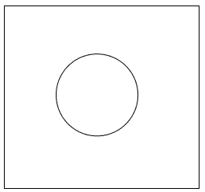
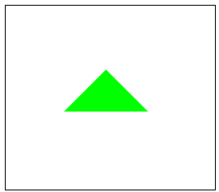
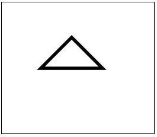
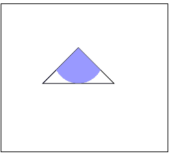
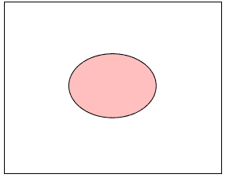
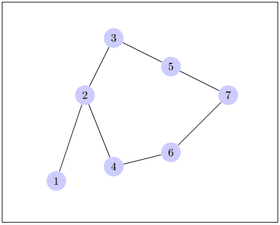
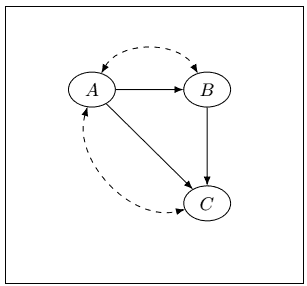

# 使用 Tikz 的乳胶节点图

> 原文：<https://www.javatpoint.com/latex-node-graphs-using-tikz>

也可以使用 tikz 环境绘制节点图。

可以在顶点周围画圆，也可以直接使用。用于样式的命令不同于框图或流程图中的命令。绘制顶点的命令由**节点**命名，绘制边的命令由**边**命名。

Latex 中使用的命令大部分来自于常用词，这些词很容易理解并在代码中实现。

在开始形状之前，您需要提到一些环境。您必须仅在这些环境中包含您的文本和命令，如下所示:

```

\documentclass[10pt]{article} % you can change the point size according to the requirements
\usepackage{xcolor} % package crucial to implement colors
\usepackage{tikz} % package used for the tikz
\begin{document}
\begin{tikzpicture} % tikz environment 
....................
\end{tikzpicture}
\end{document}

```

通过使用 x 轴和 y 轴上的点，您可以绘制任何形状。使用 Tikz 的乳胶中使用的常见形状如下所示:

*   **圆圈**

用来画圆的命令是**\画(1，1)圆(1)**；

这里，(1，1)是 x 轴和 y 轴上的点，而(1)是圆的半径。

上面圆圈的输出将如下图所示:



*   **三角形**

用于绘制三角形的命令如下所示:

```

  \path[draw] (2,2) -- (3,3)--(4,2)--cycle;

```

**输出:**


您可以根据需要更改 x 轴和 y 轴的点的位置。

您也可以使用下面给出的命令填充三角形内部的颜色:

```

 \path[fill=green] (2,2) -- (3,3) -- (4,2) -- cycle; 

```

**输出:**



要增加三角形的宽度，可以使用下面给出的命令:

```

 \path[draw, line width=3pt] (2,2) -- (3,3)--(4,2)--cycle; 

```

**输出:**



您也可以使用下面给出的命令在三角形内部绘制颜色图案:

```

\path[clip, draw] (2,2)--(3,3)--(4,2)--cycle;
\path[fill=blue!40] (3, 2.7) circle (.7);

```

**输出:**



你也可以用任何形状来代替三角形。

*   **椭圆**

要绘制椭圆，您需要使用以下命令:

```

\draw[fill=pink] (0,0)
ellipse (30pt and 22pt);

```

这里，(0，0)是原点的点，30pt 和 22pt 是画椭圆的尺寸。

**输出:**



您也可以相应地混合两种颜色。

该示例的命令编写如下:

```

\draw[fill=blue!50!white] (0,0)
ellipse (30pt and 22pt);

```

**输出:**


使用这些方法，您可以根据自己的选择创建任何形状。

让我们从**节点图**开始。

下面给出了创建简单节点图的代码:

```

\documentclass{article}
\usepackage{tikz}
\begin{document}

\begin{tikzpicture}
  [scale=.9,auto=center,every node/.style={circle,fill=blue!20}] % here, node/.style is the style pre-defined, that will be the default layout of all the nodes. You can also create different forms for different nodes.

  \node (a1) at (1,2) {1};
  \node (a2) at (2,5)  {2}; % These all are the points where we want to locate the vertices. You can create your diagram first on a rough paper or graph paper; then, through the points, you can create the layout. Through the use of paper, it will be effortless for you to draw the diagram on Latex.
  \node (a3) at (3,7)  {3};
  \node (a4) at (3,2.5) {4};
  \node (a5) at (5,6)  {5};
  \node (a6) at (5,3)  {6};
  \node (a7) at (7,5)  {7};

  \draw (a1) -- (a2); % these are the straight lines from one vertex to another
  \draw (a2) -- (a3);
  \draw (a2) -- (a4);
  \draw (a4) -- (a6);
  \draw (a3) -- (a5);
  \draw (a6) -- (a7);
  \draw (a5) -- (a7);

\end{tikzpicture}

\end{document}

```

**输出:**



您也可以将图表的边缘弯曲一定的角度。

创建带有弯曲边的节点图的代码如下所示:

```

\documentclass[10pt]{article}
\usepackage{color}
\usepackage{tikz}

% the settings of tikz is used for the optimization of the graphs
\usetikzlibrary{shapes, arrows, calc, arrows.meta, fit, positioning} % these are the parameters passed to the library to create the node graphs
\tikzset{
    -Latex,auto,node distance =1.5 cm and 1.3 cm, thick,% node distance is the distance between one node to other, where 1.5cm is the length of the edge between the nodes
    state/.style ={ellipse, draw, minimum width = 0.9 cm}, % the minimum width is the width of the ellipse, which is the size of the shape of vertex in the node graph
    point/.style = {circle, draw, inner sep=0.18cm, fill, node contents={}},
    bidirected/.style={Latex-Latex,dashed}, % it is the edge having two directions
    el/.style = {inner sep=2.5pt, align=right, sloped}
}
\begin{document}

\begin{tikzpicture}
    % a is the name of the node and A is the text inside the node/vertex
    \node[state] (a) at (0,0) {$A$}; % here, state signifies that the shape of the node will be the shape declared in the above state/.style command.

    % you can mention any location such as right, left, above, below, etc.

    \node[state] (b) [right =of a] {$B$};
    \node[state] (c) [below =of b] {$C$};
    \path (a) edge (b); % it is the path of the edge from one node to another

    % Bidirected edge
    \path[bidirected] (a) edge[bend left=60] (b); % this is the basic command in this code. It is used to draw the curved edge with a certain angle. You can change the angle according to the requirements.

    \path (a) edge (c);
     \path[bidirected] (a) edge[bend right=60] (c);
     \draw (b) -- (c);

\end{tikzpicture}
\end{document}

```

**输出:**



* * *