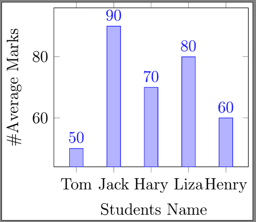
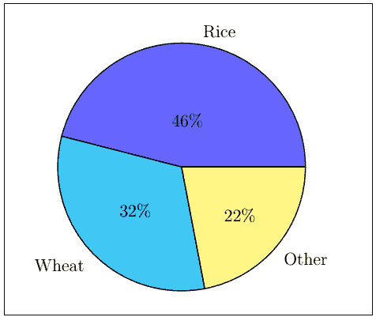
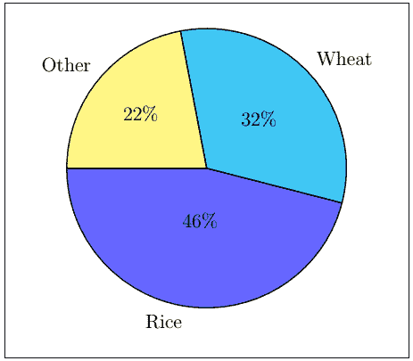
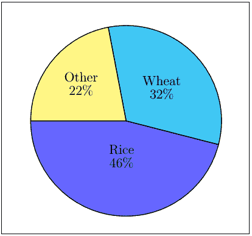
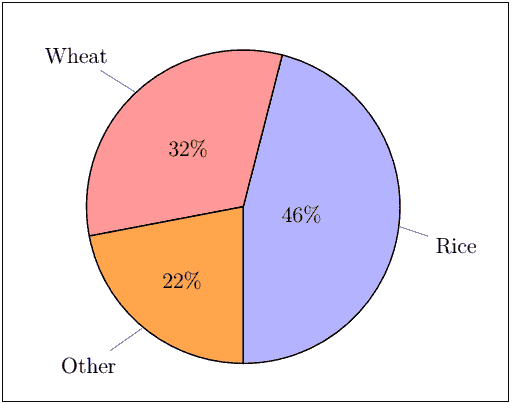
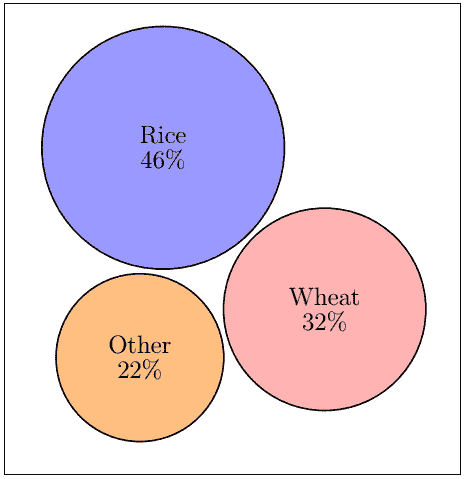
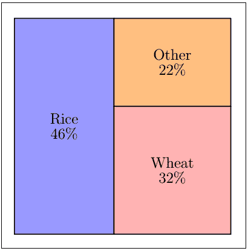
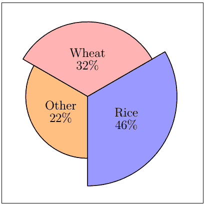
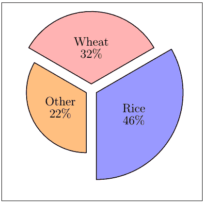

# 使用 Tikz 的 LATEX 条形图和饼图

> 原文：<https://www.javatpoint.com/latex-bar-graphs-and-pie-charts-using-tikz>

## 条形图

条形图是用矩形条表示信息的图形或图表，矩形条的高度或宽度对应于它们呈现的数据值。条形图通常有两种类型，垂直条形图和水平条形图。它显示了离散类别之间的比较。一些图表还显示了聚类条，这些聚类条被分组并显示了多个测量变量的值。

Tikz 是 Latex 中用来创建图形元素的最强大、最复杂的工具。在使用 tikz 的 Latex 中，可以有效地创建条形图。

让我们考虑一个创建条形图的简单示例。

下面给出了这样一个例子的代码:

```

\documentclass[12pt]{standalone}
\usepackage{pgfplots}
\pgfplotsset{width=6.6cm,compat=1.7}
\begin{document}
\begin{tikzpicture}

\begin{axis}
[
    ybar,
    enlargelimits=0.15,
    ylabel={\#Average Marks}, % the ylabel must precede a # symbol.
    xlabel={\ Students Name},
    symbolic x coords={Tom, Jack, Hary, Liza, Henry}, % these are the specification of coordinates on the x-axis.
    xtick=data,
     nodes near coords, % this command is used to mention the y-axis points on the top of the particular bar.
    nodes near coords align={vertical},
    ]
\addplot coordinates {(Tom,50) (Jack,90) (Hary,70) (Liza,80) (Henry,60) };

\end{axis}
\end{tikzpicture}
\end{document}

```

**输出:**



让我们考虑另一个例子。它比第一个稍微复杂一点，但是容易理解。

下面给出了这样一个例子的代码:

```

\documentclass[12pt]{standalone} % the standalone environment is used to display the pictures.
\usepackage{pgfplots} % package used to implement the plot
\pgfplotsset{width=6.5cm, compat=1.6}
\begin{document}
\begin{tikzpicture}
\begin{axis}
[
    ybar, % ybar command displays the graph in horizontal form, while the xbar command displays the graph in vertical form.
    enlargelimits=0.15,% these limits are used to shrink or expand the graph. The lesser the limit, the higher the graph will expand or grow. The greater the limit, the more graph will shrink. 
    legend style={at={(0.4,-0.25)}, % these are the measures of the bottom row containing surplus (wheat, Tea, rice), where -0.25 is the gap between the bottom row and the graph. 
      anchor=north,legend columns=-1},   
      % here, north is the position of the bottom legend row. You can specify the east, west, or south direction to shift the location. 
    ylabel={\#Annual Growth Percentage}, % there should be no line gap between the rows here. Otherwise, latex will show an error.
    symbolic x coords={2016, 2017, 2018},
    xtick=data,
    nodes near coords,
    nodes near coords align={vertical},
    ]
\addplot coordinates {(2016, 75) (2017, 78) (2018, 80)}; % these are the measures of a particular bar graph. The tick marks of the y-axis will be adjusted automatically according to the data values entered in the coordinates.
\addplot coordinates {(2016, 70) (2017, 63) (2018, 68)};
\addplot coordinates {(2016, 61) (2017, 55) (2018, 59)};
\legend{Wheat, Tea, Rice}

\end{axis}
\end{tikzpicture}
\end{document}

```

**输出:**


## 饼图

饼图是一个统计图，形状为圆形。该图被进一步分成定义数字比例的切片。

饼图用于表示整个关系的一部分。图表的所有部分加在一起呈现 100%。每个类别饼图中的部分与整个班级的分数成比例。

创建简单饼图的代码如下所示:

```

\documentclass[12pt]{article}
\usepackage{pgf-pie} % the package used to implement the pie charts
\begin{document}
\begin{tikzpicture} % Tikz environment

\pie
 {46/Rice,
     32/Wheat, 22/Other} % it is essential to recheck that the sum of all the components mentioned should be 100%. Otherwise, Latex will leave the left percentage, blank.

\end{tikzpicture}
\end{document}

```

**输出:**



如果要将图表旋转任意角度，需要使用**旋转**命令。

下面给出了该示例的代码:

```

\documentclass[12pt]{article}
\usepackage{pgf-pie} 
\begin{document}
\begin{tikzpicture} 

\pie[rotate=180]
 {46/Rice,
     32/Wheat, 22/Other}

\end{tikzpicture}
\end{document}

```

**输出:**



如果你想把文本放在饼图里面，那么你需要使用 **text=inside** 命令。代码如下:

```

\documentclass[12pt]{article}
\usepackage{pgf-pie} 
\begin{document}
\begin{tikzpicture} 

\pie[rotate=180, text=inside]
 {46/Rice,
     32/Wheat, 22/Other}

\end{tikzpicture}
\end{document}

```

**输出:**



上图中显示的颜色是 Latex 的默认颜色。您也可以修改颜色。其他可用于进一步修改的命令如下:

*   **text=pin:** 它通过一条线连接文本，在特定切片旁边。
*   **text=legend:** 它产生一个单独的图例。
*   **颜色= {蓝色！30，红色！20、橙色}:** 它为三个切片分别设置具体的颜色。
*   **pos= 3，4:** 它根据提到的 x 和 y 顶点定位图表。饼图的默认位置是(0，0)。
*   **sum=auto:** 用于根据切片的值计算总和。

#### 注意:所有额外的参数都应该在\pie 命令之前的方括号内传递。

让我们考虑一个修改**颜色**和改变文本格式的例子。

下面给出了这样一个例子的代码:

```

\documentclass[12pt]{article}
\usepackage{pgf-pie} 
\usepackage{xcolor} % package used to implement colors
\begin{document}
\begin{tikzpicture} 

\pie[rotate=270, text=pin, color={blue!30, red!40, orange!70}]
 {46/Rice,
     32/Wheat, 22/Other}

\end{tikzpicture}
\end{document}

```

**输出:**



还有其他三种类型的图表，即**方形**图表、**云**图表以及饼图类别中的极坐标图表。

*   **云图**

通过将云命令包含在**\饼图**中，可以创建云图表。

代码与**饼图**相同。不同的是，只有**云**包含在**\派**命令中。

代码如下:

```

\documentclass[12pt]{article}
\usepackage{pgf-pie} 
\usepackage{xcolor} % package used to implement colors
\begin{document}
\begin{tikzpicture} 

\pie[cloud, rotate=270, text=inside, color={blue!40, red!30, orange!50}]
 {46/Rice,
     32/Wheat, 22/Other}

\end{tikzpicture}
\end{document}

```

**输出:**



## 方形图

方块图可以通过在**\饼图**中包含方块命令来创建。

代码将与饼图中的代码相同。这里的区别在于 **\pie** 命令中只包含了正方形。

代码如下:

```

\documentclass[12pt]{article}
\usepackage{pgf-pie} 
\usepackage{xcolor} % package used to implement colors
\begin{document}
\begin{tikzpicture} 

\pie[square, rotate=270, text=inside, color={blue!40, red!30, orange!50}]
 {46/Rice,
     32/Wheat, 22/Other}

\end{tikzpicture}
\end{document}

```

**输出:**



*   **极坐标图**

极坐标图可以通过在**\饼图**中包含极坐标命令来创建。

代码将与饼图中的代码相同。这里的区别在于 **\pie** 命令中只包含极坐标。

代码如下:

```

\documentclass[12pt]{article}
\usepackage{pgf-pie} 
\usepackage{xcolor} % package used to implement colors
\begin{document}
\begin{tikzpicture} 

\pie[polar, rotate=270, text=inside, color={blue!40, red!30, orange!50}]
 {46/Rice,
     32/Wheat, 22/Other}

\end{tikzpicture}
\end{document}

```

**输出:**



您也可以使用**分解**命令来探索图表的切片。

分解极坐标图切片的代码如下所示:

```

\documentclass[12pt]{article}
\usepackage{pgf-pie} 
\usepackage{xcolor} % package used to implement colors
\begin{document}
\begin{tikzpicture} 

\pie[explode=0.2, polar, rotate=270, text=inside, color={blue!40, red!30, orange!50}] % you can modify the explode distance according to the requirements.
 {46/Rice,
     32/Wheat, 22/Other}

\end{tikzpicture}
\end{document}

```

**输出:**



* * *