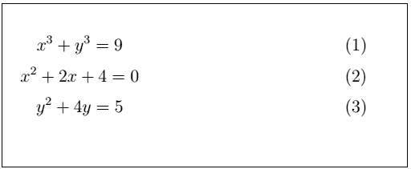
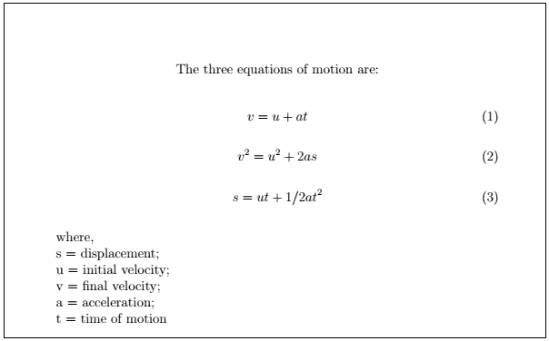
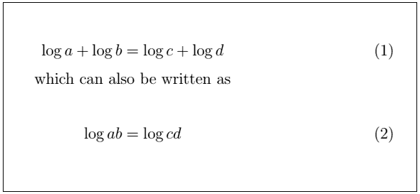

# LATEX数学方程

> 原文：<https://www.javatpoint.com/latex-mathematical-equations>

这些公式在文档中使用，无论是在微软的 Word 中还是在 Latex 中。在 Latex 中，您可以使用命令轻松编写等式。您可以使用简单的文本快速插入此类命令，在文档之间或文档中的任何位置书写公式。您不需要搜索菜单栏上的公式或符号。

用于实现数学命令和方程的环境如下所示:

```

\begin{equation}
...........
\end{equation}

```

用于实现数学命令和方程的包如下所示:

```

\usepackage{amsmath}

```

或者

```

\usepackage{mathtools} 

```

**数学工具**包也加载**数学工具**包。因此，从以上两个包中，任何一个都可以使用。

让我们用一个简单的等式 **x + y = 4** 的例子来理解。

下面给出了这样一个例子的代码:

```

\documentclass[12pt]{article}
\usepackage{mathtools}
\begin{document}
\begin{equation}
x + y = 4 % there should be no gap between any of the two rows
\end{equation}
\end{document}

```

**输出:**


你也可以写出任意阶的方程。

编写二阶方程的代码如下:

```

\documentclass[12pt]{article}
\usepackage{mathtools}
\begin{document}
\begin{equation}
x^2 +2x+ 6 = 0             
\end{equation}
\end{document}

```

**输出:**


让我们考虑另一个例子来写方程。代码如下:

```

\documentclass[12pt]{article}
\usepackage{mathtools}
\begin{document}
\begin{equation}
x^3 - y^2 = 23             
\end{equation}
\end{document}

```

**输出:**


如果你要写数字，等等。在无穷级数或有限级数格式中，您可以使用下面代码中给出的命令:

```

\documentclass[12pt]{article}
\usepackage{mathtools}
\begin{document}
\begin{equation}
1, 2, 3, 4, 5, 6........... \infty          
\end{equation}
\end{document}

```

**输出:**


你也可以用不同的格式写一个简单的方程。下面给出了这样一个例子的代码:

```

\documentclass[12pt]{article}
\usepackage{mathtools}
\begin{document}
\begin{equation}
10 \text{oranges} \times 2 \text{dozens of oranges} = 120 \text{oranges}     
\end{equation}
\end{document}

```

**输出:**


根据需要，您还可以在文档中编写几个公式。方程式编号将根据方程式自动调整。但是你需要为每个方程使用一个单独的环境。

这类例子的代码如下:

```

\documentclass[12pt]{article}
\usepackage{mathtools}
\begin{document}

\begin{equation} % to implement equations more than one, you need to use a separate equation environment for every equation.
x^3 + y^3 = 9 
\end{equation}
\begin{equation}
x^2 + 2x + 4 = 0 
\end{equation}
\begin{equation}
y^2 + 4y = 5 
\end{equation}
\end{document}

```

**输出:**



您也可以使用前面讨论的命令在文档的任何地方执行推导。

让我们用一个简单的例子来理解推导的概念。

例子是牛顿运动方程。

下面给出了此类示例的代码:

```

\documentclass[12pt]{article}
\usepackage{mathtools}
\begin{document}

\begin{center}
The three equations of motion are: \\
\end{center}

\begin{equation} % to insert extra space between equations, you can leave space between the equation environments. But you should not leave space inside any environment.
v = u + at
\end{equation}

\begin{equation}
v^2 = u^2 + 2as
\end{equation}

\begin{equation}
s = ut + 1/2at^2
\end{equation} \\
where,\\
s = displacement; \\    
u = initial velocity; \\
v = final velocity; \\
a = acceleration; \\
t = time of motion

\end{document}

```

**输出:**



## 经营者

算子定义为一个函数，以**对数**函数、**三角**函数、**指数**函数和极限的形式书写。

让我们考虑上面三个函数的一个例子。

Latex 介绍了一种使用三角函数、指数函数和对数函数并以方程形式显示的简单方法。

1)让我们考虑三角函数的两个例子。

第一个示例的代码如下所示:

```

\documentclass[12pt]{article}
\usepackage{mathtools}
\begin{document}

\begin{equation}
\cos^2 \theta + \sin^2 \theta = 1
\end{equation}

\end{document}

```

**输出:**


第二个例子的代码如下:

```

\documentclass[12pt]{article}
\usepackage{mathtools}
\begin{document}

\begin{equation}
cos2 \theta = 1 - 2sin^2\theta % you can specify any equation according to the requirements.
\end{equation}

\end{document}

```

**输出:**


2)让我们考虑两个**对数**函数的例子。

第一个示例的代码如下所示:

```

\documentclass[12pt]{article}
\usepackage{mathtools}
\begin{document}

\begin{equation}
\log a = \log b
\end{equation}

\end{document}

```

**输出:**


第二个例子的代码如下:

```

\documentclass[12pt]{article}
\usepackage{mathtools}
\begin{document}

\begin{equation}
\log a + \log b = \log c + \log d
\end{equation}

\centering 
which can also be written as\\

\begin{equation}
\log ab = \log cd
\end{equation}

\end{document}

```

**输出:**



3)让我们考虑两个**指数**函数和**极限**的例子。

第一个示例的代码如下所示:

```

\documentclass[12pt]{article}
\usepackage{mathtools}
\begin{document}

\begin{equation}
\lim\limits_{x \to n-1} \exp(x) = 0
\end{equation}

\end{document}

```

**输出:**


第二个例子的代码如下:

```

\documentclass[12pt]{article}
\usepackage{mathtools}
\begin{document}

\begin{equation}
\lim\limits_{x \to \infty} \Sigma f(x) = 0
\end{equation}

\centering
where,

\begin{equation}
f(x) = 3x^3 + 2x^2 - 4ax +2 = 0
\end{equation}

\end{document}

```

在这里，您还可以根据需要组合不同形式和类型的数学方程。

**输出:**


## 权力与指数

幂和指数被认为类似于标准文本中的上标和下标。

花括号 **{}** 用来括一位数以上的幂。

在 Latex 中，下标符号用下划线符号( **_** )表示。

您也可以使用 **|** 符号在方程中插入竖线。

让我们用一些例子来理解它。

第一个示例的代码如下所示:

```

\documentclass[12pt]{article}
\usepackage{mathtools}
\begin{document}

\begin{equation}
k_n = k_{n-1} + k_{n-2}
\end{equation}

\end{document}

```

**输出:**


第二个例子的代码如下:

```

\documentclass[12pt]{article}
\usepackage{mathtools}
\begin{document}
\begin{center}

\begin{equation}
a^{12} \times a^{22} = a^{34}
\end{equation}
where,\\
12 + 22 = 34 \\
equation 1 signifies that the powers are added when multiplied.

\begin{equation}
b^9 \div b^4 = b^5
\end{equation}
where,\\
9 - 4 = 5 \\
equation 2 signifies that the powers are subtracted when divided.

\end{center}
\end{document}

```

**输出:**


第三个例子的代码如下:

```

\documentclass[12pt]{article}
\usepackage{mathtools}
\begin{document}
\begin{center}

\begin{equation}
f(x) = x^3 + 2x^2 + 4x + 2 |_{x = -2}
\end{equation}

\end{center}
\end{document}

```

**输出:**


* * *