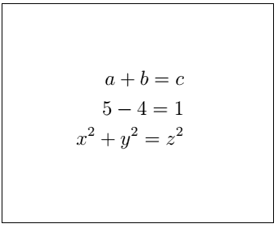
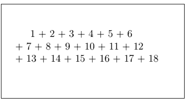
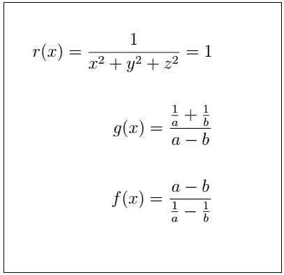
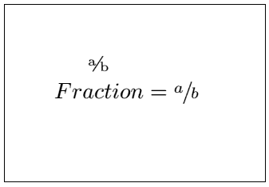
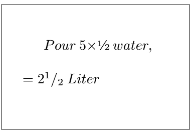
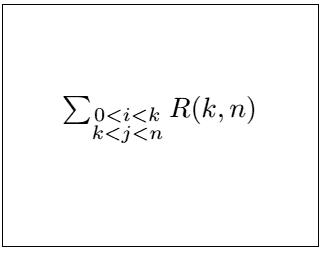

# 胶乳部分

> 原文：<https://www.javatpoint.com/latex-fractions>

分数被定义为以分子和分母形式表示的数值。

分数是使用以下命令创建的:

```

\frac{numerator}{denominator}

```

## 对齐环境

**对齐**环境也用于实现分数，如下所示:

```

\begin{align*}
.......
\end{align*}

```

声明**对齐**环境来对齐方程。不可能在一个环境中写两个方程。为了克服这一点，星号( ***** )与**对齐**命令一起使用。带有 align 的 ***** 符号表示在该环境中输入的方程没有编号。

下面给出了使用 align 环境的代码:

```

\documentclass[12pt]{article}
\usepackage{mathtools}
\begin{document}

\begin{align*}
a + b = c \\
5 - 4 = 1 \\
x ^2 + y^2 = z^2
\end{align*}

\end{document}

```

输出将在单独的行中显示上面代码中列出的三个方程，这在使用**方程**环境时是不可能的。您需要为每个方程使用单独的方程环境。

您可以注意到以下输出:



对齐环境类别中通常有两种环境。

下面列出了两种对齐环境:

1)使用**标记**环境来对齐边距两侧的文本。

下面给出了这样一个例子的代码:

```

\documentclass[8pt]{article}
\usepackage{mathtools}
\begin{document}

\begin{flalign}
a & = b &   % for the elements of the first column, two ampersand symbols are inserted.
12 & = 21 \\
ABC & = DEF &
c & = e + d
\end{flalign}

\end{document} 

```

**输出:**


**多对齐**环境用于对齐不同行的长文本。否则文本将无法正确对齐。

让我们考虑一个例子。

*   使用**多向**

这类例子的代码如下:

```

\documentclass[12pt]{article}
\usepackage{mathtools}
\begin{document}

\begin{multline}
1 + 2 + 3 + 4 + 5 + 6 \\
+ 7 + 8 + 9 + 10 + 11 + 12 \\
+ 13 + 14 + 15 + 16 + 17 + 18
\end{multline}

\end{document}

```

**输出:**


*   不使用**多向**

这类例子的代码如下:

```

\documentclass[12pt]{article}
\usepackage{mathtools}
\begin{document}

1 + 2 + 3 + 4 + 5 + 6 \\
+ 7 + 8 + 9 + 10 + 11 + 12 \\
+ 13 + 14 + 15 + 16 + 17 + 18

\end{document}

```

**输出:**



## 分数类型

让我们用几个例子来理解分数。

**示例-1** :第一个示例的代码如下:

```

\documentclass[12pt]{article}
\usepackage{mathtools}
\begin{document}

\begin{align*}
\frac{a}{b} = \frac{c}{d}
\end{align*}

\end{document}

```

**输出:**


**示例-2:第二个示例的代码如下:**

```

\documentclass[12pt]{article}
\usepackage{mathtools}
\begin{document}

\begin{align*}
r(x) = \frac{1}{x^2 + y^2 + z^2} = 1 \\ \\ % you can insert any type of fraction according to the requirements.
g(x) = \frac{\frac{1}{a}+\frac{1}{b}}{a - b} \\ \\
f(x) = \frac{a - b}{\frac{1}{a} - \frac{1}{b}} \\
\end{align*}

\end{document}

```

**输出:**



## 倾斜分数

分数通常在分子和分母之间有一条直线。但是为了在分子和分母之间创建斜线，使用了 **\sfrac** 命令。

**\sfrac** 命令用于创建斜线，而 **\frac** 命令用于创建分子和分母之间的直线。

要实现 **\sfrac** ，我们需要使用 **xfrac** 包。包装上写着 **\usepackage{xfrac}** 。

**数学**环境用于实现这样的命令。环境被写成:

```

\begin{math}
..................
\end{math}

```

让我们用几个例子来理解。

**示例-1** :第一个示例的代码如下:

```

\documentclass[8pt]{article}
\usepackage{mathtools}
\usepackage{xfrac}
\begin{document}

\begin{math}
 $\sfrac{a}{b}$  \\
% the slanted fraction is first declared inside the math mode first
Fraction = \sfrac{a}{b} 
 % after the declaration, you can use the above command anywhere in your document  
\end{math}

\end{document}

```

**输出:**



**例-2** :第二个例子的代码如下:

```

\documentclass[8pt]{article}
\usepackage{mathtools}
\usepackage{xfrac}
\begin{document}

\begin{math}
 Pour \: 5 \times $\sfrac{1}{2}$ \: water, \\ \\
 = 2{}^1/_2 \: Liter  
 % we have used \: to maintain space between the words. You can use anywhere in your document, where you required to add more space between the words in a sentence.
\end{math}

\end{document}

```

**输出:**



### 二项式

二项模式通常用于阶乘。 **\binom** 命令用于以二项式形式表示变量。

让我们用一个例子来理解。

代码如下:

```

\documentclass[8pt]{article}
\usepackage{mathtools}
\usepackage{xfrac}
\begin{document}

\begin{align*}
The \: formula \: for \: the \:Combination \:in \:Permutation \: and \: Combination \: is: \\
\frac{n!}{r!(n-r)!} = \binom{n}{r} 
% there is no spacing between the words by default. To maintain spacing, \: is used after every word in Latex.
\end{align*}

\end{document}

```

**输出:**


### 根

根在数学中被广泛使用。 **\sqrt{** 表达式 **}** 命令用于创建根。它被称为平方根。花括号内的表达式是词根下的术语。如果我们想改变根的大小，那么我们需要使用 **\sqrt[** 大小**{**表达式 **}** 命令。

让我们用几个例子来理解。

第一个示例的代码如下所示:

```

\documentclass[8pt]{article}
\usepackage{mathtools}
\usepackage{xfrac}
\begin{document}

\begin{align*}
\sqrt{9} \\ \\
\sqrt{1 + x^2 + 2xy} \\ \\
\sqrt{\frac{a + b}{c - d}}
\end{align*}

\end{document}

```

**输出:**


第二个例子的代码如下:

```

\documentclass[8pt]{article}
\usepackage{mathtools}
\usepackage{xfrac}
\begin{document}

\begin{align*}
\sqrt[a]{d} \\ \\
\sqrt[4]{16} = 2 \\ \\
\sqrt[3]{27} = 3
% the above examples are the roots of the changing magnitude. You can set the value of magnitude according to the requirements.
\end{align*}

\end{document}

```

**输出:**


### 连分式

连续分数以阶梯或连续形式表示。这些分数通常用于各种学科或主题的阶梯结构中。

**\cfrac** 命令用于执行**续**分数。

我们可以使用方程环境来创建连续分数。

让我们用一个例子来理解。下面是代码:

```

\documentclass[8pt]{article}
\usepackage{mathtools}
\usepackage{xfrac}
\begin{document}

The continue fraction is written as: \\
\begin{equation}
x = b_0 + \cfrac{1}{b_1 + \cfrac{1}{b_2 + \cfrac{1}{b_3 + \cfrac{1}{b_4 + \cfrac{1}{ b_5 + \cfrac{1}{b_6} } } } } } 
\end{equation}
% you can add any numbers of fractions depending on the requirements.
% above is just an example for your better understanding.
\end{document}

```

**输出:**


### 总额

sum 命令用于插入求和符号。我们可以指定求和符号的范围和界限。

sum 命令写成:

```

\sum{value at bottom of symbol}^{value at top of the symbol} text

```

我们用两个例子来理解。

第一个例子的代码如下:

```

\documentclass[12pt]{article}
\usepackage{mathtools}
\begin{document}

\begin{math}
\sum_{i=0}^{N - 1} a_i % you can modify the values according to the requirements
\end{math}

\end{document}

```

**输出:**


第二个例子的代码如下:

```

\documentclass[10pt]{article} % we can also modify the point size 
\usepackage{mathtools}
\begin{document}

\begin{math}
\sum_{\substack{  % the \substack command is used to display the limits in multiple lines.
   0<i<k \\
   k<j<n
  }} 
 R(k,n) % you can modify the values according to the requirements
\end{math}

\end{document}

```

**输出:**



* * *