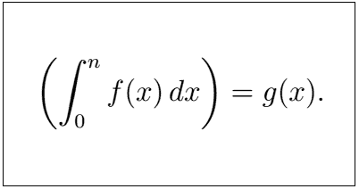
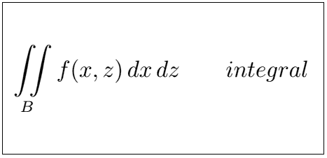
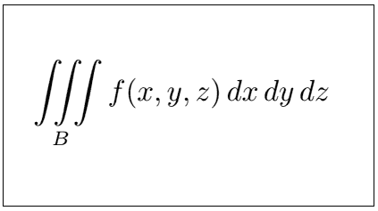
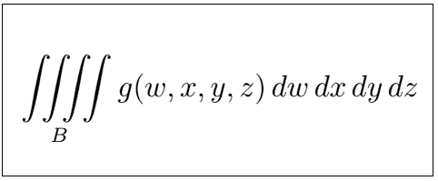
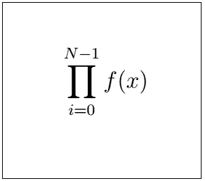

# LATEX 积分

> 原文：<https://www.javatpoint.com/latex-integral>

积分在数学中被广泛使用。在积分部分，我们可以使用分数、单变量和导数。积分是微积分的基本对象。

积分主要用于求体积、面积等。

**\int** 是用于积分符号( **∫** )的命令。

例如，

**\int x** 的输出为 **∫x**

**\mathrm** 命令用于编写导数函数。其内容如下:

```

\mathrm{d}y

```

其中 **d** 是函数 **y** 的导数。我们也可以根据需求改变变量。

**\mathrm{d}x** 的输出将是 **∫dx。**

**\quad** 命令用于保持文本和数学变量之间的距离。下面列出了基于四边形的其他间距命令:

*   **\；**

它用于创建大的空间距离。

*   **\:**

它用于创建中等空间距离。

*   **\，**

它用于创建小的空间距离。

*   **\！**

它用于创建负空间距离。

让我们用一个例子来理解。这个例子由积分方程及其相应的极限组成。您可以根据需要修改方程式和限值。

下面给出了这样一个例子的代码:

```

\documentclass[12pt]{article} 
\usepackage{mathtools}
\usepackage{xfrac}
\begin{document}

\[
  \left( \int_{0}^{n} f(x)\,dx\right)=g(x).
\]

\end{document}

```

**输出**



要在上面的等式中插入导数，我们必须添加导数的命令。

下面给出了这样一个例子的代码:

```

\documentclass[12pt]{article} 
\usepackage{mathtools}
\usepackage{xfrac}
\begin{document}

\[
  \frac{d}{dy}\left( \int_{0}^{y} f(x)\,dx\right)=g(y).
\]

\end{document}

```

**输出**


我们也可以根据需要修改支架类型。

* * *

## 多重积分

多重积分用于数学，如各种定律、定理的推导等。

让我们用一个例子来理解所有的多重积分。

1)插入**二重积分**的代码如下:

```

\documentclass[12pt]{article} 
\usepackage{mathtools}
\usepackage{xfrac}
\begin{document}

\[
  \iint\limits_B f(x,z)\,dx\,dz\qquad integral% the \qquad 
  symbol provides the space of 2em between the variables, while \quad leaves the space of 1em.
\]

\end{document}

```

**输出**



2)添加**三元组积分**的代码如下:

```

\documentclass[12pt]{article} 
\usepackage{mathtools}
\usepackage{xfrac}
\begin{document}

\[
  \iiint\limits_B f(x,y,z) \, dx \, dy \, dz
\]

\end{document}

```

**输出**



3)一次插入积分**四次**的代码如下:

```

\documentclass[12pt]{article} 
\usepackage{mathtools}
\usepackage{xfrac}
\begin{document}

\[
  \iiiint\limits_B g(w,x,y,z) \, dw \, dx \, dy \, dz
\]

\end{document}

```

**输出**



### 制品

产品符号也用于数学。 **\prod** 命令用于在 Latex 中指定产品符号。

我们用一个例子来理解。

代码将与上述示例相同。区别在于 **\prod** 命令及其范围。

下面给出了这样一个例子的代码:

```

\documentclass[12pt]{article} 
\usepackage{mathtools}
\usepackage{xfrac}
\begin{document}

\[
 \prod_{i=0}^{N - 1} f(x)
\]

\end{document}

```

**输出**



也可以根据需要修改上面的公式和范围。

* * *