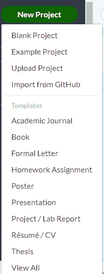
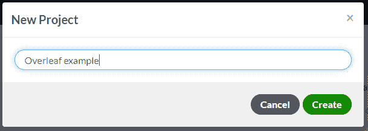
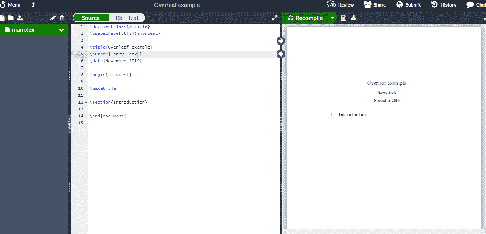
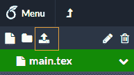
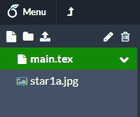
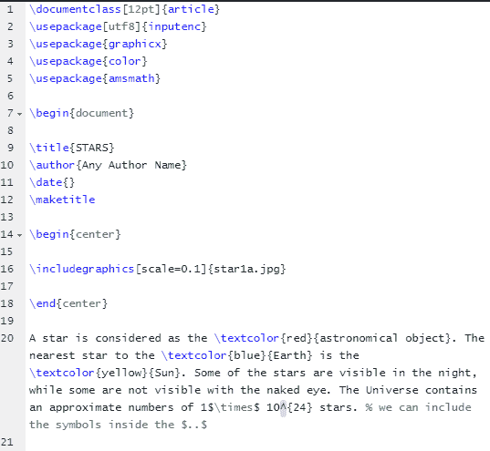
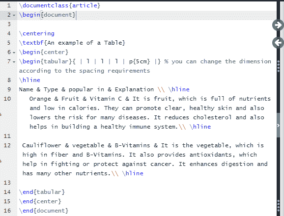
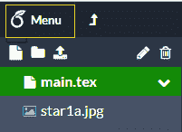
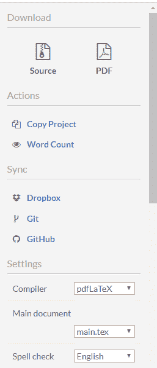

# LATEX 背页

> 原文：<https://www.javatpoint.com/latex-overleaf>

Latex 是一个免费的数学排版软件，可以通过不同的方式获得。这里使用的背页是一个基于云的系统，我们可以在线进行文字处理，并可以下载 PDF 格式的输出文件。

让我们从背页开始。

步骤如下:

1)打开浏览器或任意搜索引擎，输入**overleaf.com**。

2)页面将打开，如下图所示:

3)根据您的要求点击注册选项。注册选项将如下图所示:

4)注册后，将出现背面屏幕。点击“**新项目**”选项。只要你点击？新项目？选项，将出现下拉列表。您可以从下拉列表中为文档选择所需的格式。屏幕将如下图所示:

5)在这里，我们选择了“空白页”选项您可以根据需要选择任何选项。

6)输入文档的项目名称。图像如下所示:

我们可以用任何合适的名字创建我们的项目。你可以根据要求修改标题。

7)点击“**创建**选项。

8)加载将开始，背页默认屏幕如下图所示:

9)我们将在左侧屏幕上为我们的文档编写代码。右侧屏幕将显示左侧代码的输出。

10)右侧屏幕顶部的“**重新编译**”选项将编译代码并显示输出。

## 图像插入

要在背面插入任何图像，我们需要点击屏幕左侧的**上传**图标。图标如下图所示:

我们现在可以选择要上传的图像。图像将保存在 main.tex 下方。

要在文档中插入，我们需要指定所需的图像及其扩展名。

示例-**star1a.jpg**

上图图标将显示在背面，如下所示:

您可以在文档中插入任何具有特定名称的图像。

必须声明**图形**包才能显示图像。

让我们从我们的项目开始。

下面显示的例子将是主题为“**星星**”的文章。

当您开始键入时，包的类型和其他选项将在下拉列表中提供。

代码如下图所示。

文本将打印在屏幕的左侧，而输出显示在右侧。

上面的屏幕显示了打印在上面的代码。

输出或文档将如下图所示:

上面显示的右侧显示了写在左侧屏幕上的代码的输出。

让我们考虑另一个例子来更好地理解背页的模式。

下面显示的示例将是创建表的方法。

输出或文档将如下图所示:

* * *

## PDF 或文件保存

要使用源代码或制作该文件的 PDF，步骤如下:

1)点击左下角的“**菜单**选项，如下图:

2)之后，列表将如下图所示:

3)我们可以根据需求选择想要的选项。

* * *