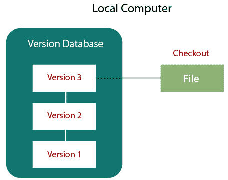
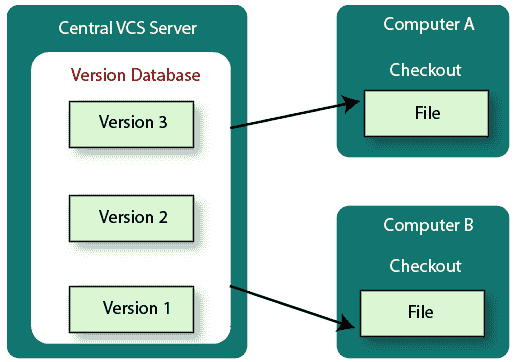
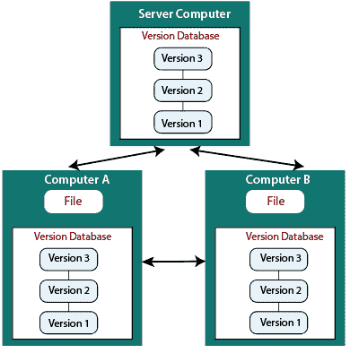

# 什么是版本控制系统？

> 原文：<https://www.javatpoint.com/svn-version-control-system>

版本控制系统是一种软件，它跟踪文件或文件集随时间的变化，以便您可以在以后调用特定的版本。它还允许您与其他程序员一起工作。

版本控制系统是帮助团队管理源代码变更的软件工具的集合。它使用一种特殊的数据库来跟踪代码的每次修改。

开发人员可以将早期版本的代码与早期版本的代码进行比较，以修复错误。

## 版本控制系统的优势

版本控制系统在软件开发中非常有用和有益；不使用版本控制开发软件是不安全的。它为不确定性提供了备份。版本控制系统为开发人员提供了一个快速的界面。它还允许软件团队根据团队规模保持效率和敏捷性，以包括更多的开发人员。

版本控制系统的一些主要好处如下。

*   文件的完整更改历史记录
*   同时工作
*   分支和合并
*   可追踪性

## 版本控制系统的类型

*   本地化版本控制系统
*   集中式版本控制系统
*   分布式版本控制系统

### 本地化版本控制系统

本地化版本控制方法是一种常见的方法，因为它简单。但是这种方法导致出错的几率更高。在这种方法中，您可能会忘记自己在哪个目录中，并意外地写入错误的文件或复制您不想要的文件。

为了解决这个问题，程序员开发了具有简单数据库的本地 VCS。这种数据库将文件的所有更改都置于修订控制之下。本地版本控制系统保存文件的本地副本。

本地 VCS 的主要缺点是它只有一个失败点。

### 集中式版本控制系统

开发人员需要在其他系统上与其他开发人员协作。在这种情况下，本地化版本控制系统失败。为了解决这个问题，开发了集中式版本控制系统。

这些系统有一个包含版本化文件的服务器，以及一些从中心位置签出文件的客户端。

集中式版本控制系统有很多好处，尤其是相对于本地 VCS。

*   系统中的每个人都有关于其他人在项目中所做工作的信息。
*   管理员可以控制其他开发人员。
*   与本地化版本控制系统相比，处理集中式版本控制系统更容易。
*   本地版本控制系统便于存储和管理不同版本文件的服务器软件组件。

它还具有与本地版本控制系统相同的缺点，即它也有单点故障。

### 分布式版本控制系统

集中式版本控制系统使用中央服务器来存储所有数据库和团队协作。但是由于单点故障，也就是中央服务器的故障，开发者并不喜欢。接下来，开发了分布式版本控制系统。

在分布式版本控制系统(如 Git、Mercurial、Bazaar 或 Darcs)中，用户拥有一个存储库的本地副本。因此，客户端不仅可以检查文件的最新快照，甚至可以完全镜像存储库。本地存储库包含主存储库中的所有文件和元数据。

DVCS 允许自动管理分支和合并。除了推拉，它加快了大多数操作。DVCS 增强了脱机工作的能力，并且不依赖单一位置进行备份。如果任何服务器停止运行，其他系统通过它进行协作，那么任何客户端存储库都可以由该服务器恢复。每次签出都是所有数据的完整备份。

这些系统不一定依赖中央服务器来存储项目文件的所有版本。

* * *