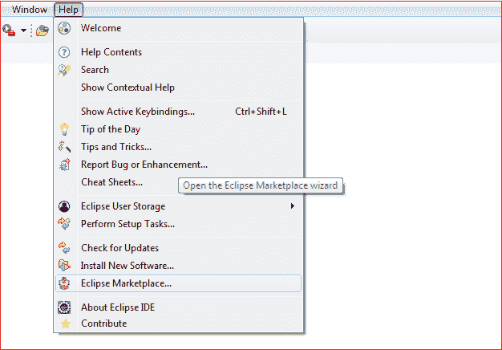
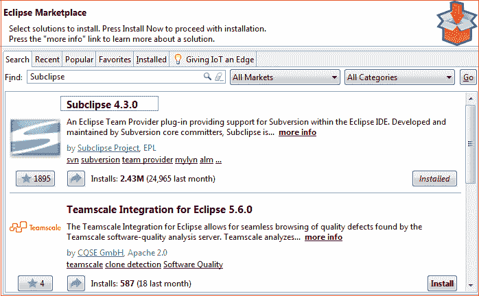
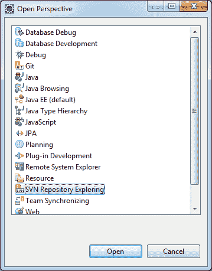

# 日食的 SVN

> 原文：<https://www.javatpoint.com/svn-for-eclipse>

Eclipse 是一个**开源且免费的**，基于 java 的开发平台。众所周知，它的**优秀插件**允许开发人员开发和测试用不同编程语言编写的代码。

Eclipse IDE 支持 Subversion 的内置集成。它通过名为 **Subclipse** 的第三方插件提供支持。它由 Subversion 核心提交者开发和管理。Subclipse 始终提供与最新 Subversion 功能和版本的同步。

它包含**协作网合并客户端**，该客户端最初是作为**协作网桌面- Eclipse 版**的一部分开发的。协作网合并客户端提供强大的**图形合并功能**，控制合并跟踪功能。

要在 Eclipse 中使用 SVN，我们必须有以下工具:

*   SVN 服务器-( [知道如何安装](https://www.javatpoint.com/svn-installation-for-windows))
*   SVN 客户端-( [知道如何安装](https://www.javatpoint.com/tortoisesvn))
*   JDK 1.8 -( [知道如何安装](https://www.javatpoint.com/javafx-how-to-install-java))
*   Eclipse IDE -( [知道如何安装](https://www.javatpoint.com/javafx-how-to-install-eclipse))

## SVN 与 Eclipse 的集成

只要我们有所有必要的工具来支持 SVN，就按照下面的步骤在 Eclipse 中使用 SVN:

打开月食**导航**至**帮助- >月食市场**。

打开 Eclipse Marketplace 并搜索**子组件**。请看下图。

选择**子菜单 4.3.0** ，点击**安装**。遵循一些基本步骤，为 Subversion 安装 Subclipse 集成工具。重新启动 Eclipse，探索 Eclipse 中的 SVN 存储库。

我们已经成功地将 SVN 工具与 Eclipse 集成在一起。现在，我们可以探索 Eclipse 中的 SVN 功能。

## 在 Eclipse 中测试 SVN 存储库

在 Eclipse 中成功集成 SVN 工具之后，有必要验证集成并探索 SVN 存储库。

要确认安装，**打开**月食，**导航至窗口- >打开视角- >其他**。请考虑下图:

点击**其他**选项，滚动菜单，选择 **SVN 仓库探索**。

现在，我们可以探索 SVN 存储库。在这里，我们可以创建、签出和探索 Eclipse 中的现有存储库。

* * *