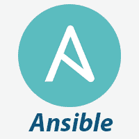

# 辅助教程

> 原文：<https://www.javatpoint.com/ansible>

Ansible 教程提供了 Ansible 的基本和高级概念。我们的 Ansible 教程是为初学者和专业人士设计的。

Ansible 是一个开源的 IT 引擎，它自动化了 IT 工具，如服务内编排、应用部署、云供应等。

## 什么是 Ansible？

Ansible 是一个开源的 IT 引擎，可自动执行应用部署、云资源调配、服务内编排和其他 IT 工具。

Ansible 易于部署，因为它在客户端不使用任何**代理**或**自定义安全**基础架构，并且通过将模块推送到客户端。这些模块在客户端本地执行，输出被推回到 Ansible 服务器。

它可以使用 **SSH 密钥**轻松连接到客户端，简化了整个过程。客户端详细信息，如**主机名**或 **IP 地址**和 **SSH 端口**存储在文件中，这些文件称为清单文件。如果您创建了一个清单文件并填充了它，那么 Ansible 可以使用它。

Ansible 用剧本描述自动化作业，剧本用简单的语言，即 **YAML** 。YAML 是一种人类可读的数据序列化语言&，通常用于配置文件，但它可以在许多存储数据的应用中使用。

一个显著的优势是，即使是信息技术基础设施支持人员也可以阅读和理解剧本，并在需要时进行调试。

Ansible 专为多层部署而设计。Ansible 不是一次管理一个系统，它通过描述您的所有系统是相互关联的来建模 it 基础架构。Ansible 是完全无代理的，这意味着 Ansible 通过 **SSH** 连接你的节点工作(默认)。Ansible 为您提供了另一种连接方法的选项，如 **Kerberos** 。

Ansible 在连接到您的节点后推送小程序，这些节点被称为“ **Ansible Modules** ”。Ansible 在您的节点上运行该模块，并在完成后删除它们。Ansible 以简单的文本文件(这些是主机的文件)管理清单。Ansible 使用主机文件，在该文件中可以对主机进行分组，并可以控制行动手册中特定组的操作。

## 为什么使用 Ansible

以下是使用 Ansible 的一些重要原因，例如:

*   每个人都可以免费使用 Ansible。
*   Ansible 是非常一致和轻量级的，不存在关于操作系统或底层硬件的约束。
*   由于其无代理功能和开放的 **SSH** 安全特性，它非常安全。
*   Ansible 不需要任何特殊的系统管理员技能来安装和使用它。
*   Ansible 具有由全面的文档决定的平滑学习曲线，并且易于学习结构和配置。
*   它在**插件、库存、模块、**和**剧本**方面的模块化使 Ansible 成为大型环境的完美伴侣。

## 可翻译的历史

以下是 Ansible 历史上的一些要点，例如:

*   **Michael DeHaan** 开发了 Ansible，Ansible 项目始于【2012 年 2 月。
*   **皮匠**和**功能**的创造者也是**软呢帽统一**网络的控制者。
*   **红帽**在 2015 年收购了 Ansible 工具。
*   Ansible 作为 Linux 的 **Fedora 发行版**的一部分。
*   Ansible 还可通过企业 Linux 的额外软件包 **(EPEL)** 和 **Ubuntu** 以及其他操作系统用于**红帽企业 Linux、Debian、CentOS、Oracle Linux、**和**科学 Linux** 。

## 先决条件

要学习 Ansible，您需要在 Linux 外壳中运行命令的实践经验。这将有助于你更好地完成任务。

## 观众

我们的 Ansible 教程旨在帮助初学者和专业人士。

## 问题

我们保证您在本教程中不会发现任何问题。但如果有任何错误或差错，请在联系表中注明。

* * *